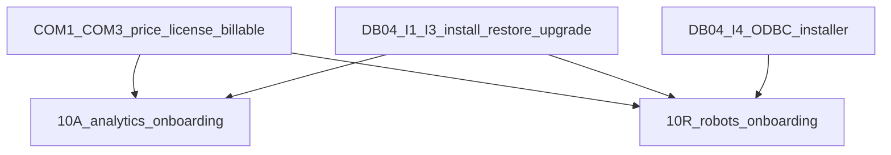

# AI-10 — коммерческая готовность: packaging, license, billable, onboarding

Чтение: [ROADMAP AI-10](ROADMAP.md), [DEPLOYMENT-LICENSING](DEPLOYMENT-LICENSING.md), [AI-02](AI-02-PLAN.md) (lock order: wallet перед quota), [AI-06](AI-06-PLAN.md), [AI-08](AI-08-PLAN.md), [AI-09](AI-09-PLAN.md), [DB-04](DB-04-PLAN.md), product-access A2. Требования PL-01/07/08/09; AN-11/12 operational; VR-01/10/11 и hardening VR-06/12; DEP-01…08 в пределах packaging/license/onboarding. Окончательная нагрузка/пилот — AI-11.

Этот файл — task-level design. Код, миграции, flip `productRuntime` и живые списания реальных тенантов **не** входят в запись документа. Назначать через [EXECUTION](EXECUTION.md) по одному срезу. Порядок исполнения: **COM1–COM3 параллельно DB-04 I1–I3; COM4 пересекается с DB-04 packaging; 10A после COM+DB-04 core; 10R после COM+DB-04 core (PBX I4 только для встроенной/роботной поставки); AI-11 не планируется этим срезом.**

## Что уже есть и нельзя дублировать

1. Кошелёк один: `BillingBalanceService.charge` уже принимает `operationKey` → `external_id`. Не второй wallet, не emulated-wallet как production settlement.
2. Usage: `money_policy` = `shadow | local_byok | cloud_wallet`; `assertCloudWalletDisabled` ещё бросает до COM2.
3. Лицензия коробки: `license-verifier.ts` + таблицы `ai_local_license_*` (A2). Нет issuance/packaging/offline renewal UX.
4. Runtime: health/capabilities зашиты `productRuntime: 'not-installed'`, `usable: false` в standalone-capabilities и analytics/robot health. Community честно отдаёт `community-core`.
5. Процессы: `ai-api` / `ai-worker` / `media-worker` (D5). Standalone provision CLI есть; installer/backup — DB-04.
6. Запрет ROADMAP: автоматические денежные списания во время обычной разработки; смена `DB_DIALECT` не миграция данных.
7. Общие правила: один schema writer; additive SQL если понадобится — следующий номер **0020**, не 0019; ipbx disposable only; `xray-ui` не трогать; autodial чужой.

## COM1 — price book / trial / SKU

**Вход:** AI-02 D4 shadow ledger + immutable price contract; AI-01 marketplace/catalog foundations. **Owned paths:** `ai-usage` price revisions / trial policy snapshots, `product-access` / marketplace catalog offers, bounded Hub offers UI/API, shared DTO/locales/tests. Schema writer один — additive **0020** только если publication/trial fields ещё нет в reviewed schema.

Публикация SKU отдельно от `app enable`. Marketplace checkout активирует entitlement; enable без покупки/лицензии не даёт processing admission. Quotas server-side (concurrent jobs/sessions, storage, audio ms, tokens). Trial/limits живут в signed policy / server snapshot, не только в UI. BYOK/`local_byok` не создают фиктивный provider fee и не зовут wallet. SaaS charge path отделён от локального metering.

Неpublished / draft / revoked SKU нельзя купить даже direct API. Tenant A/B isolation на catalog, purchase, entitlement, quota rows. Price edit создаёт new revision; принятые jobs/sessions сохраняют immutable price snapshot из AI-02.

**Приёмка:** unpublished SKU → purchase denied; enable без покупки → processing deny; trial limits enforced server-side; BYOK path zero wallet debit; tenant A не видит/не покупает offers tenant B; concurrent purchase+enable race не обходит publication.

## COM2 — billable switch

**Вход:** COM1 published SKUs; AI-02 D4; existing `BillingBalanceService.charge` + `usageChargeOperationKey` / `idempotent-charge`. **Owned paths:** `shadow-settlement.ts`, usage engine / money_policy wiring, bounded billing adapter tests, disposable-tenant harness. **Не** списывать боевые кошельки в CI/обычных tests.

Default policy остаётся `shadow`. `cloud_wallet` включается только явным installation/tenant flag на disposable fixture. Settlement вызывает единственный `BillingBalanceService.charge` с `usageChargeOperationKey` → `external_id`. Replay того же operation key → 0 второго debit. Reconcile shadow→billable: один debit на reservation/settle; unknown outcomes держат bounded reserve до reconciliation, не double-debit.

Lock order из AI-02: wallet перед tenant quota. `local_byok` не вызывает wallet lookup. Emulated wallet остаётся test double, не production path. Invoice/export lines, rounding, reserves/refunds — append-only ledger; JS float запрещён.

**Приёмка:** shadow без charge; billable один debit на reservation; replay 0 второго debit; concurrent settle race → один ledger row; `local_byok` zero wallet; CI suite asserts no real-tenant debit; MySQL/PG parity disposable.

## COM3 — license lifecycle + honest runtime flag

**Вход:** A2 `license-verifier` + `ai_local_license_*`; standalone capabilities/health. **Owned paths:** `product-access` import/verify/renewal/expiry, `standalone-capabilities.service.ts`, analytics/robot health, bounded UI states, docs. Reuse A2 crypto; не второй verifier.

Выдача/renewal/expiry; grace=0 v1 (expired → stop new work immediately); key rotation через import нового signed document. **Нет** mandatory heartbeat для выбранного offline профиля (DEP-05). Offline install не узнаёт об отзыве без нового файла — отразить в коммерческих условиях, не маскировать online revoke.

`productRuntime` / `usable` становятся функцией `(schema ready ∧ workers configured ∧ entitlement.allowed ∧ не expired)`, не константой `not-installed`. Состояния: entitled+not-installed vs entitled+installed vs expired vs community-core. Expiry стопает новые jobs/sessions, не гасит community-core и не удаляет данные/assets. Community `usable` не зависит от AI SKU.

**Приёмка:** invalid / expired / wrong-install / replay import denied; renewal replaces binding; key rotation accept; entitled+not-installed ≠ entitled+installed; expiry blocks admission, keeps data; community smoke без AI SKU; no mandatory outbound heartbeat in offline profile.

## COM4 — packaging overlap с DB-04

**Вход:** AI-01-C community composition; DB-04 I1 preflight assumptions. **Owned paths:** docs/scripts границ community vs commercial (уже `test:community:composition`), preflight checklist, env/key custody runbook, bounded package manifests. Не менять MIT лицензию исходников. Точный public distro manifest — явное решение владельца, не выдуманный SPDX.

Community artifact без `speech-analytics` / `ai-voice` runtime imports. Commercial profiles (`analytics-api`, `robot-api`, `full-pbx`) не стартуют без matching `DB_SCHEMA_PROFILE` и schema readiness. Preflight: dialect pin, profile, encryption keys present, workers roles declared. Key custody: publisher private key никогда в customer install; customer holds data-at-rest keys separately (связка с DB-04 I2).

**Приёмка:** community composition test зелёный без commercial modules; commercial boot refuse wrong/missing profile; preflight checklist documented; no MIT license rewrite; packaging docs link DB-04 install/restore/upgrade без дублирования SQL runner ownership.

## 10A — аналитика onboarding и operational gates

**Вход:** COM1–COM3; DB-04 I1–I3 для analytics-api profile; AI-06A reports. **Не** требует DB-04 I4 ODBC. **Owned paths:** analytics onboarding UX/API, retention/delete/export/offboarding jobs, OpenAPI/curl public analysis docs, standalone analytics composition checks, DEP-02/03 evidence harness.

Onboarding: project → integration key → sample upload → result. PBX-поля скрыты в standalone (DEP-03). Retention/delete/export/offboarding: server policy + receipts; export не расширяет ACL. OpenAPI/curl для public analysis; credential rotation documented. SaaS: два tenant, разные SKU, no cross-tenant (DEP-02). Self-hosted analytics-only без PBX/AMI/ARI.

**Приёмка:** single-product analytics account проходит onboarding без robots/PBX/КЦ; SaaS A/B isolation; self-hosted analytics-only smoke; retention/delete/export fail-closed; OpenAPI examples match live disposable API; COM2 billable path optional flag, default shadow в CI.

## 10R — роботы onboarding и operational gates

**Вход:** COM1–COM3; DB-04 I1–I3; AI-08+AI-09; для native/full-pbx дополнительно DB-04 I4. **Owned paths:** robots onboarding UX/API, SIP profile publish gates, drain-on-expiry, `/api/v1/ai-voice` docs, standalone robot composition checks, DEP-04 evidence harness.

Onboarding: provider → prompt → test → SIP profile → publish. Drain in-flight на expiry/disable; новые sessions denied, уже принятые завершаются по policy. Docs `/api/v1/ai-voice`. Self-hosted robots-only без analytics entitlement (DEP-04). Неподдерживаемый SIP profile disabled с reason — не «готово». Не включает MET5 holdout, TLS/SRTP/NAT certification как closed без отдельного evidence; `liveMcp=true` не объявляется этим планом.

**Приёмка:** single-product robots account проходит onboarding без analytics; unsupported SIP disabled; expiry drains/stops new; robots-only smoke; docs match scopes; native PBX path gated on I4 evidence when claiming CDR/queue_log install.

## Definition of done AI-10 (design + later implementation)

Плановые tasks COM1–4 / 10A / 10R имеют owned paths, gates и приёмку. Implementation assignment закрывает evidence отдельно; запись этого файла не закрывает DEP-01…08 и не flip'ает production billing. Далее AI-11A/R для нагрузки/пилота.
