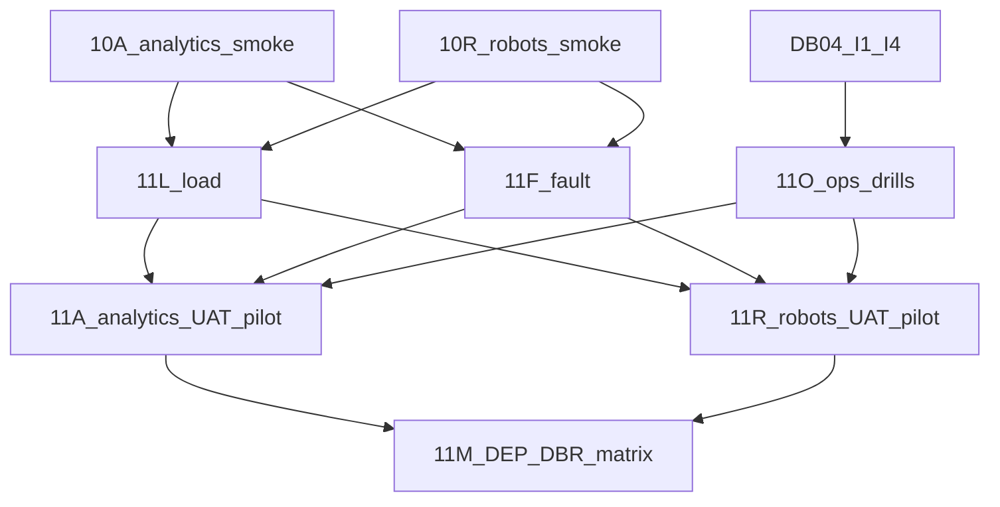

# AI-11 — приёмка, нагрузка, пилот и эксплуатация

Чтение: [ROADMAP AI-11](ROADMAP.md), [DEPLOYMENT-LICENSING](DEPLOYMENT-LICENSING.md) DEP-01…08, [DATABASE-PORTABILITY](DATABASE-PORTABILITY.md) DBR-06…08, [AI-10](AI-10-PLAN.md), [DB-04](DB-04-PLAN.md), evidence [10A](evidence/10a/REMOTE-MATRIX.md) / [10R](evidence/10r/REMOTE-MATRIX.md) / [i1–i4](evidence/i1/REMOTE-MATRIX.md). Требования PL-02/05/07/09/10/12; AN-11/12 и VR-10/11 в пределах UAT/pilot; DEP-01…08 и DBR-06/08 как release matrix.

Этот файл — task-level design. Код, миграции, flip `productRuntime`, живые списания реальных тенантов, overwrite Adaptive ODBC, `xray-ui` и autodial **не** входят в запись документа. Назначать через [EXECUTION](EXECUTION.md) по одному срезу. Порядок исполнения: **11L и 11F параллельно** после evidence 10A/10R; **11O** после DB-04 I2/I3 (wrap, не rewrite); **11A** после 10A + 11L/11F/11O core; **11R** после 10R + тот же core (native Asterisk live — подсрез, не блокер robots-only); **11M** последним. AI-12 не планируется этим срезом.

## Что уже есть и нельзя дублировать

1. Analytics-only live smoke: I1 `analytics-api` + project→key→upload→run ([evidence/10a](evidence/10a/REMOTE-MATRIX.md)). Не второй installer.
2. Robots-only live smoke: I1 `robot-api` + publish→browser_test→SIP→drain ([evidence/10r](evidence/10r/REMOTE-MATRIX.md)).
3. DB-04 I1–I4: clean install / backup-restore / upgrade / ODBC generate на disposable MySQL 8.4.11 и PG 17.11. Host unixODBC / Asterisk `module reload` и live Adaptive DSN **не** claimed I4.
4. Dual-DB contracts through additive **0020**; COM1–COM4 local. Следующий schema номер **не** планировать заранее; если gap — один writer, следующий свободный.
5. Workers `ai-api` / `ai-worker` / `media-worker` (D5). I3 runbook: backup→migrate→readiness→drain→admit. Auto `--rollback` запрещён.
6. MixMonitor/CDR lab на **test** Asterisk, isolated context; `nativeCaptureApply` env-gated. Customer `custom/routes` не переписывать.
7. Default env: `productRuntime` remains `not-installed` until an assignment explicitly enables the computed flag on a disposable fixture. `cloud_wallet` off unless both COM2 flags on disposable tenant. Боевые кошельки запрещены.
8. Harness reuse: `run-10a-smoke.cjs`, `run-10r-smoke.cjs`, `clean-install.cjs`, backup-restore / upgrade / odbc-installer, `run-contracts.cjs`. AI-11 добавляет load/fault/UAT wrappers, не второй installer.
9. Стенд: только `root@ipbx.krasterisk.ru`, disposable Testcontainers / isolated Asterisk. Local Docker не использовать. Не production cutover.
10. Не закрывать mock-ом: MET5 holdout, TLS/SRTP/NAT certification, `liveMcp=true`, измеренный real local STT/LLM/TTS hardware profile. Fake provider не обещает локальный AI (DEP). Cross-engine data transfer (DBR-07) out of scope.

## 11L — load profile

**Вход:** evidence 10A и 10R; AI-00 capacity notes; workers D5. **Owned paths:** disposable load harness на ipbx (wrap 10A/10R smoke / job admission), метрики admission/latency/error/queue depth, docs профиля. Не обещать product SLA.

Лестница **1→5→20** concurrent (calls и/или analysis jobs) как измерение, не лимит продукта. Media-worker отдельно от batch; queue fairness; max file/duration; storage pressure. Отказ по quota fail-closed. MySQL и PG disposable.

**Приёмка:** опубликованный профиль + команды/логи на обеих СУБД; media не голодает из-за batch; quota/admission fail-closed; no live tenant debit; no `xray-ui`/autodial.

## 11F — fault injection

**Вход:** AI-02 outbox/jobs/idempotency; COM2 shadow default. **Owned paths:** fault harness поверх outbox/jobs/API/worker restart, disposable Redis/API kill scripts, docs matrix сценариев.

Сценарии: restart API/worker/Redis; duplicate events; packet jitter/loss (lab); long tool; provider rate-limit stub; clock/timezone; DB deadlock/retry; storage unavailable. Accepted job не теряется. Replay того же operation key → 0 второго debit (shadow path в CI; billable только disposable flag).

**Приёмка:** каждый named fault имеет pass/fail log; job recovery без silent drop; replay zero second debit; dirty/unavailable fail-closed; MySQL/PG parity disposable.

## 11O — ops drills (DEP-07 wrap)

**Вход:** DB-04 I2/I3; COM3/COM4 key custody. **Owned paths:** AI-11 drill scripts/docs wrapping I2/I3 (не копировать SQL runner ownership), key rotation rehearsal, runbook probe checklist. Automatic `--rollback` запрещён; recovery = restore from backup / forward repair.

Drill: backup→restore→upgrade→worker drain→admit traffic. Missing encryption key fail-closed. Dashboards/alerts/runbooks — docs + probe, не новый APM stack. I3 runbook executed as **named AI-11 evidence**, не «уже было в I3».

**Приёмка:** MySQL+PG disposable drill green; post-restore invariants (schema version, ledger sums, job/asset IDs, license bindings); missing-key fail-closed; dialect-switch refuse still documented; no production DB.

## 11A — analytics UAT / pilot

**Вход:** 10A smoke; 11L/11F/11O core; DEP-02/03. **Owned paths:** LIVE-UAT analytics harness/docs, pilot tenant fixtures, published eval report template (env/model/versions). **Не** требует I4 / AMI / ARI.

SaaS A/B isolation; analytics-only install onboarding (reuse 10A). Retention/export/offboarding fail-closed под нагрузкой и fault. Pilot: один disposable tenant, затем два с параллельными данными. Fake STT не закрывает real local-AI promise — named remaining gate.

**Приёмка:** LIVE-UAT analytics artifact; A/B no cross-tenant; analytics-only без PBX fields; pending local-AI/MET5 named; no community requirement for 11A alone.

## 11R — robots UAT / pilot

**Вход:** 10R smoke; 11L/11F/11O core; DEP-04; для native PBX — явный host-module evidence (I4 generate ≠ host load). **Owned paths:** LIVE-UAT robots harness/docs, SIP/drain fault scenarios, optional isolated Asterisk lab apply (не overwrite live Adaptive DSN).

Robots-only без analytics entitlement (reuse 10R). Drain-on-expiry / `admissions_stopped` под fault. Unsupported SIP остаётся `disabled` + reason. Native PBX CDR/`queue_log`: isolated `[krasterisk-ai-lab]` **после** host unixODBC/module evidence; иначе `native_pbx_gated`. Не dump/overwrite `/etc/asterisk` / `/etc/odbc.ini` на действующем DSN. TLS/SRTP/NAT и `liveMcp=true` **не** closed этим планом.

**Приёмка:** LIVE-UAT robots artifact; robots-only без analytics; unsupported SIP disabled; drain stops new admissions; native path separately named or gated; no autodial/`xray-ui`.

## 11M — CI/UAT matrix (DEP-01…08, DBR-06/08)

**Вход:** 11A + 11R evidence; community composition; DB-04 profiles; contracts. **Owned paths:** matrix runner/docs aggregating profile×engine evidence, version-skew policy note, RELEASE checklist. Lint/backend/frontend — gate **implementation** release branch, не записи этого PLAN.

Профили: community-core (DEP-01), SaaS two-tenant (DEP-02), analytics-only (DEP-03), robots-only (DEP-04), оба продукта на full-pbx composition где уместно. Engines MySQL **8.4.11** и PostgreSQL **17.11**. Offline license / no undeclared egress (DEP-05/06). Ledger/outbox concurrency на обеих БД (DBR-05/08). SQL-only не заменяет Asterisk live (ссылка на 11R native). Version-skew policy documented (DEP-08). Cross-engine transfer remains out of scope (DBR-07).

**Приёмка:** матрица с командами/логами; все pending checks названы (MET5, TLS/SRTP/NAT, `liveMcp`, real local-AI hardware, host ODBC load if not done); no silent «mock passed».

## Definition of done AI-11 (design + later implementation)

Плановые tasks 11L / 11F / 11O / 11A / 11R / 11M имеют owned paths, gates и приёмку. Implementation assignment закрывает evidence отдельно: `IMPLEMENTATION` / `VERIFICATION` / `LIVE-UAT` / `RELEASE`. Запись этого файла не flip'ает production billing, не объявляет commercial readiness и не стартует 11L без явного EXECUTION assignment.
