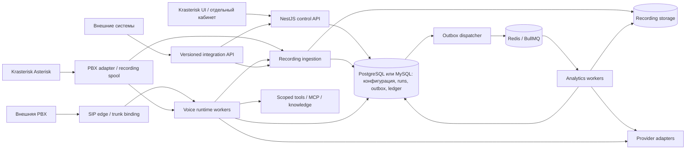

# AI-продукты Krasterisk: целевая архитектура

Дата: 2026-09-18. Статус: проектное решение для поэтапной реализации, не описание уже работающих продуктов. Источники фактического состояния: [аудит Krasterisk](KRASTERISK-REUSE-AUDIT.md), [роботы aiPBX](AIPBX-ROBOTS-AUDIT.md), [аналитика aiPBX](AIPBX-ANALYTICS-AUDIT.md). Детальные требования: [ROBOTS-SPEC](ROBOTS-SPEC.md), [ANALYTICS-SPEC](ANALYTICS-SPEC.md).

## 1. Границы продуктов

| Объект | Назначение | Отдельная лицензия | Связь с существующим кодом |
|---|---|---|---|
| Сценарные голосовые роботы | Детерминированные сценарии, переходы, классификация фраз | Существующая политика | `voice-robots` / `voiceRobots` остаются самостоятельными |
| AI-роботы | Свободный голосовой диалог, realtime или каскад, tools, знания | `ai_voice_robots` | Использовать подходящие media-примитивы; развить/мигрировать существующую конфигурацию `ai-agents` |
| Речевая аналитика | Записи → транскрипт → метрики → контроль качества/отчёты | `speech_analytics` | Новый домен; использовать providers, отчётные и UI-паттерны |
| PBX AI-assistant | Помощник администратора по управлению АТС | Существующая политика; отдельный SKU не предполагается | `ai-chat`, `ai-platform`, MCP; не становится телефонным роботом |

Module key, право доступа, лицензия и пункт меню — разные понятия. Два новых продукта доступны отдельно или пакетом. Пакет даёт два entitlement, не вводит скрытую зависимость одного продукта от другого. Общие провайдеры доступны из настроек обоих продуктов без покупки административного AI-чата.

Текущая проверка `mode != CLOUD → true` и aliases `voice_robot/cc_ai_voice → ai` не обеспечивают эти границы. AI-01 определяет явную политику CLOUD/BOX/OPENSOURCE для новых SKU, совместимость оплаченных legacy прав и матрицу robot-only/analytics-only/both/neither. Сценарная лицензия сама по себе не открывает новый AI runtime. BOX tenant 0 — реальный tenant, не глобальный шаблон.

Встроенный режим показывает подраздел «AI-роботы» в привычной AI-навигации и самостоятельный вход продукта из Hub. Аналитика имеет собственную поверхность «Речевая аналитика»; текущие CDR-отчёты продолжают работать. Ссылки в КЦ/автообзвоне/маршрутах ведут в один и тот же продукт, без копий экранов.

## 2. Режимы эксплуатации

По уточнению пользователя **SaaS и self-hosted поддерживаются как равноправные поставки, базовый модуль OpenSource**. Полный контракт: [DEPLOYMENT-LICENSING](DEPLOYMENT-LICENSING.md). Deployment kind отделяется от product entitlements; community core собирается без коммерческих AI-пакетов, общие recording/event/provider interfaces не создают обратную зависимость. Точные юридические условия лицензий этим планом не изменяются.

| Режим | Телефония | Аналитика | Что покупает клиент |
|---|---|---|---|
| Krasterisk PBX + AI | Текущий Asterisk через доверенный PBX-adapter | Внутренний recording event | Любой модуль независимо |
| Внешняя PBX + AI-роботы | SIP-транк внешней PBX на ограниченный SIP edge сервиса | Опциональная отправка записей робота | Только роботы; лицензия PBX и КЦ не нужна |
| Внешняя PBX + аналитика | Управление PBX отсутствует | HTTPS upload/API, callback или polling | Только аналитика; Asterisk не нужен |
| Оба AI-продукта без PBX-пакета | SIP edge для роботов | Тот же ingestion API + внутренние записи роботов | Пакет из двух модулей |

«Самостоятельный продукт» означает независимые onboarding, права, API, тариф и эксплуатацию на общем ядре Krasterisk в SaaS и self-hosted. Отдельный форк приложения не нужен. Коробка использует reproducible package/profile, локальные данные и metering, проверяемую локально лицензию; работа с local providers не требует постоянной связи с нашим SaaS. Матрица конкретных ОС/провайдеров/изолированных сетей подтверждается измерениями. Недоступность AMI/ARI не должна мешать analytics-only стартовать и обрабатывать файлы.

## 3. Общая схема

Начальный deployment: модульный NestJS API, отдельно запускаемые процессы media-runtime и analytics-worker, **PostgreSQL или MySQL по выбору установки**, обязательный для новых фоновых работ Redis и storage adapter. Sequelize остаётся ORM. Поддержка двух СУБД распространяется на core, оба AI-продукта и внутренние Asterisk CDR/queue_log/realtime; это общий платформенный контракт [DATABASE-PORTABILITY](DATABASE-PORTABILITY.md). Не разбивать каждый домен в отдельный сетевой микросервис. Отдельные процессы нужны для изоляции event loop звонков от CPU/диска ffmpeg и анализа; договоры между ними стабильны уже в MVP.

Одна установка выбирает один SQL engine; переключение существующих данных требует отдельной миграции, а не замены environment variable. Одновременная запись в MySQL и PostgreSQL не требуется. SQL migrations, raw queries, locks, ODBC drivers и backup/restore проверяются для обоих dialect. Переключатель Sequelize сам по себе не означает готовую поддержку PostgreSQL.

Нужны отдельные composition roots `control-api`, `media-runtime`, `analytics-worker` и назначенный владелец scheduler jobs. Нельзя запускать полный нынешний `AppModule` во всех процессах: его ARI listeners, voicemail scanners, billing cron и bootstrap могут дублироваться. Organization signup отделяется от PBX Context provisioning; analytics-only запускается без PBX realtime tables. Общие identity/product таблицы остаются обязательными. Проверки: два workers не удваивают periodic jobs; независимый профиль проходит signup→project→upload.

Зависимости `bullmq`, `@nestjs/bullmq`, `ioredis` уже есть, но регистрация рабочих очередей и эксплуатационные гарантии ещё нужны. Текущий null-Redis fallback недопустим для подтверждённой приёма аналитической задачи, budget reservation и distributed session ownership. При недоступном Redis SQL может принять durable job в `pending_dispatch` с честным статусом; worker readiness красный. Лимит заполнения SQL/spool ограничен, переполнение возвращает 503/429, а не мнимый успех.

## 4. Правила владения и изоляции

1. Внутренний UI/API использует JWT и текущий `req.user.vpbx_user_uid`. Для новых AI-таблиц выбран **Sequelize attribute `user_uid` → physical column `vpbx_user_uid`**, как у текущих `CcAiAgent/CcAiProvider`; ниже имена полей таблиц логические. Это явно фиксируемое ADR-11 из-за расхождения исторических frontend/backend правил; существующие таблицы не переименовываются. Trusted event contract получает валидированный TenantContext, а не альтернативные fallback поля. Не создавать второй tenant directory. Идентификатор клиента в JSON/заголовке не устанавливает tenant; tenant 0 проверяется явно, без truthiness/default owner.
2. Внешний API получает principal из отдельного API credential: `user_uid`, scopes, разрешённые проекты/роботы, квоты. Ключ хранится как digest с индексируемым prefix, показывается один раз; ротация, отзыв, last-used и audit обязательны. Пользовательские refresh-токены не использовать как бессрочные integration credentials.
3. SIP tenant выводится из доверенной привязки аутентифицированного транка/endpoint и разрешённых DID. `From`, caller ID и произвольный SIP-header не выбирают tenant/robot. Нужны ACL, предел CPS/concurrency/duration, запрет произвольного dial-out и trunk-specific transfer allowlist.
4. Каждый асинхронный message содержит tenant + entity + version + correlation; worker заново проверяет принадлежность ссылок. Queue ID, object key, cache key, SSE room, vector collection/filter включают tenant.
5. Новый runtime не имеет fallback на default tenant при отсутствии доверенного контекста. Существующие public standalone endpoints не использовать для новых продуктов.
6. Права разделяются: product admin, designer, operator/reviewer, read-only analyst, integration service. Прослушивание оригинала, redacted transcript, экспорт, переанализ и управление ключами — самостоятельные permissions.
7. Административные AI tools для настройки продукта идут через текущие адаптеры/`AgentDiffProposal`/confirmation. Phone runtime имеет отдельный principal и небольшой разрешённый набор бизнес-действий. Звонящий не получает admin JWT или полный каталог `McpToolsService`.

До внешнего открытия продукта AI-01 закрывает/изолирует legacy `public/voice-robots` и public recording surface на том же API. Сначала inventory v3 consumers, затем scoped-auth compatibility adapter либо отключение в новом product profile; отрицательные HTTP-тесты обязательны. Просто «не пользоваться старым endpoint» недостаточно. Также устранить допуск provider owner `[0, userUid]`: publish/admission требуют фактического владельца, enabled и capability; глобальные templates имеют отдельный тип и не равны tenant 0.

## 5. Контракты и данные общего уровня

Provider catalog/credentials, capability contracts и общие media interfaces принадлежат нейтральному core/connectivity модулю, а не коммерческому robot aggregate. Текущие зависимости voicemail/ai-chat от `AiAgentsModule` ради providers нужно разорвать в AI-01/02: извлечь shared provider module с compatibility facade и сохранить один источник данных/секретов. Core-only build проверяется без commercial source tree; исключить лишь пункт меню недостаточно.

Предлагаемые имена уточняются в миграционном плане; таблицы ниже ещё не созданы.

| Агрегат | Основные поля/инварианты |
|---|---|
| `integration_credentials` | uid, user_uid, prefix, secret_digest, scopes, resource_bindings, expires_at, revoked_at |
| `media_assets` | uid, user_uid, storage_key, sha256, state, codec, sample_rate, channels, duration_ms, original_asset_uid, retention_until |
| `recording_segments` | asset_uid, call correlation, node_id, uniqueid, linkedid, started_at, role_mapping + provenance, channel/participant intervals |
| `outbox_events` | event_id, schema_version, tenant, aggregate_id, aggregate_version, event_type, payload, published_at; event_id UNIQUE |
| `integration_deliveries` | event_id, destination_id, state, attempt, next_retry_at, response_code; независимы от analysis run |
| `usage_events` | immutable source operation/attempt ID, dimensions, quantity, unit, cost snapshot, currency, billable flag |
| `usage_reservations` | tenant, product, operation, amount/units, status, expiry; atomic reserve/settle/release |
| `usage_ledger_entries` | immutable debit/credit, operation key UNIQUE, price_version; correction отдельной записью |
| `provider_capabilities` | capability snapshot/revision; streaming-STT/TTS, realtime, tools, structured output, audio formats, region/locality |

UUID/ULID/иной устойчивый серверный ID допустим; в wire-contract использовать opaque string. Tenant uid сохраняет существующий тип. В domain FK и запросах проверять пару tenant/entity; внешние IDs никогда не являются глобально доверенными ключами.

Согласованность:

- `asset.ready` публикуется после закрытия/проверки файла, сохранения manifest и durable регистрации. CDR completion не является доказательством готовности файла.
- Изменение состояния job/run и outbox происходит в одной транзакции выбранной SQL-БД (PostgreSQL/MySQL). Dispatcher работает at-least-once; каждый consumer имеет уникальный бизнес-ключ и compare-and-set/lease. Обещания exactly-once доставки отсутствуют. Конкурентность и crash recovery доказываются на обоих engines.
- Queue retry повторяет **попытку стадии**, не создаёт незаметно новый analysis run. `reanalyze` — новый run с явной стоимостью и ссылкой `supersedes_run_uid`.
- Provider timeout после отправки запроса — `outcome_unknown`; retry по поддерживаемому provider idempotency/request lookup. Если такой возможности нет, фиксировать возможный повторный upstream cost, а не гарантировать его отсутствие. Клиентское списание защищено собственным ledger key.
- История результатов неизменна: snapshot версий метрик, prompt, pipeline, модели, prices, tool/KB release; UI выбирает опубликованный/current run явно.

## 6. Голосовой runtime

Один session coordinator управляет событиями звонка, состояниями `admitting → connecting → listening/speaking/tool_wait → transferring → ending → ended/failed`, deadline, cleanup и usage. На каждом звонке закреплены published robot version, tenant, transport, provider capability snapshot и allowed tools.

Две стратегии:

- **Cascade:** media → VAD/endpointing → streaming STT → LLM/tool loop → последовательный streaming TTS → playback. VAD анализирует речь, STT распознаёт, TTS синтезирует. Они не взаимозаменяемы.
- **Realtime:** аудио ↔ realtime adapter; тот же session coordinator, authorization, transfer, usage и observability. Native/provider VAD и local VAD выбираются политикой, чтобы два независимых детектора не прерывали реплики конфликтно.

Media bridge не следует размещать внутри административного `ai-chat`. Зафиксировать интерфейсы `MediaTransport`, `VoiceModelSession`, `StreamingStt`, `StreamingTts`, `CallControl`, `ToolExecutor`, `KnowledgeRetriever`; внедрять их по необходимости в вертикальных срезах, без универсального SDK на все будущие модели.

Рекомендуемый транспорт — `chan_websocket` после проверки возможностей конкретной сборки. Он снимает часть самостоятельного RTP timing/framing; документация описывает начало поддержки в 20.16/21.11/22.6/23.0. Это не доказательство наличия драйвера на используемом сервере. Для другого поддерживаемого профиля нужен отдельно испытанный ARI RTP/AudioSocket adapter. [Источник Asterisk](https://docs.asterisk.org/Configuration/Channel-Drivers/WebSocket/).

Direct SIP к голосовому провайдеру оставить альтернативным adapter, а не единственным способом подключения внешней PBX: иначе recording ownership, переносимость моделей и transfer зависят от одного поставщика. OpenAI документирует и прямой SIP, и server audio bridge; schema/event names зависят от выбранного voice API. В spike закрепить конкретный API/модель и версию, не смешивать Realtime и GPT-Live события. [Документация подключения](https://developers.openai.com/api/docs/guides/voice-sip).

При SIP/WebRTC provider-side управлении возможен серверный sideband для tools/session control; права, секреты и single-executor ownership остаются у нашего backend. Это не заменяет собственные persisted session/usage records. [Server controls](https://developers.openai.com/api/docs/guides/voice-server-controls).

Обязательная инженерная дисциплина: per-session VAD state; audio generation epoch; отмена предыдущей assistant LLM/TTS generation и очистка её playback buffer при barge-in. Новая речь caller и pre-roll сохраняются: STT не закрывается вслепую; при rebind входной buffer передаётся без потери реплики. Учитывать услышанную, а не только сгенерированную реплику; ordered TTS; bounded queues; no stale callbacks после hangup; cleanup on ARI/WS disconnect; monotonic duration; lease owner и drain при deploy. После потери media нельзя обещать бесшовное восстановление разговора: fallback/перевод либо завершение с понятным итогом.

## 7. ARI и существующие модули

Перед новым runtime устранить пересечение обработчиков Stasis. Предлагаемый диспетчер разбирает версионированный namespace: scripted / autodial / ai-voice / external-media. Legacy numeric args проходят explicit adapter. Неподходящее событие не передаётся всем владельцам и не приводит к чужому hangup.

На одном PBX node выбран один ingress/dispatcher для общего ARI app; он направляет session определённому worker owner. Альтернативное разделение ARI apps допустимо по ADR после spike, но запрещён broadcast mutating consumers на всех workers. Mapping node/channel/session/owner и lease исключает double answer/hangup. Проверить два runtime workers одновременно со scripted+autodial и drain одного владельца.

Создавать собственный state machine AI-робота; не добавлять «LLM-узел» как скрытое переключение сущности сценарного робота. Общие codec/media/call-control primitives выделять малыми изменениями с regression tests.

`ai-agents` уже содержит realtime/cascade конфигурацию. Фаза foundation обязана дать inventory используемых записей и migration map. Предлагаемая стратегия: использовать её как исходную конфигурацию для нового `AiVoiceRobot` aggregate, добавив immutable versions и отдельный execution context; совместимость `/ai-agents` сохранять adapter/redirect. Запрещены две одновременно редактируемые конфигурации одного робота. Создавать новую таблицу вместо расширения существующей только после проверки схемы и безопасного backfill, с mapping UID и обратимым переключением read-path.

Интеграция КЦ: разрешённый transfer target, warm/blind semantics по capability, сводка оператору и ссылка на сессию; существующая маршрутизация и смена операторов остаются источником правды. Автообзвон владеет pacing, retry contacts, расписанием и номером назначения; AI runtime исполняет принятый вызов и возвращает outcome. Второй диалер не создавать.

## 8. MCP, tools и знания

- Переиспользовать schema-validation/audit/provider credential primitives, но не открывать телефонии весь административный MCP-server.
- Outbound MCP connector — новая tenant-owned сущность; URL/redirect/DNS проверки, TLS, scoped credential, deadlines, ограничение response bytes, tool allowlist + versioned schema. Локальный stdio с пользовательской командой в SaaS не поддерживать.
- Business writes только через policies и operation idempotency. Настройка робота определяет, какие действия допустимы; голосовое «да» не повышает права caller. Опасные действия требуют отдельной проверки бизнес-идентичности или handoff, а не административного confirm UI посреди звонка.
- Knowledge base: tenant/document ACL, asynchronous parse→chunk→embed→index, immutable publication, sources/citations, проверка актуальности, удаление с очисткой индекса. Snapshot release фиксируется в звонке.
- Retrieval не исполняет инструкции из документов. Tool output — недоверенные данные, размер и последовательность tool loop ограничены. По умолчанию не журналировать секреты и полный raw payload.
- Выбор vector store после небольшого измерения корпуса/латентности в профильной фазе. PostgreSQL уже является поддерживаемым SQL engine; pgvector может быть опциональным adapter, но MySQL-установка должна получать тот же KB product contract через проверенный альтернативный adapter. Второй SQL engine не становится скрытой обязательной зависимостью. Нужны воспроизводимые retrieval/tenant-filter/delete tests для обоих deployment profiles.

## 9. Аналитика

Домен анализа не зависит от ARI, внутренних номеров или локального CDR. `Conversation` ссылается на необязательный PBX-origin и один/несколько media assets. Внешняя PBX может передать external_call_id, direction, participants, agent/team references, tags и произвольные разрешённые metadata.

Pipeline: validate/probe → normalize → channel strategy → STT → transcript normalization/redaction → deterministic audio metrics → structured LLM metrics → validation/ограниченный repair → aggregate/report → finalize/usage/outbox. Низкое качество аудио даёт `unscorable/partial`, не нулевую оценку сотрудника. Политика воспроизводимого scoring и denominator описана в ANALYTICS-SPEC.

Поток результатов на UI: persisted status + SSE/poll fallback, task details, объяснение ошибки и безопасный retry. Результат публикации и delivery webhook имеют разные состояния. Ошибка webhook не запускает STT/LLM повторно.

## 10. Коммерция и контроль стоимости

Использовать существующие tenant balance/subscription и marketplace как оболочку; добавить общий usage ledger обоих продуктов. Не создавать отдельные несогласованные кошельки внутри новых модулей.

| Слой | Предлагаемая модель |
|---|---|
| Entitlement | Активность продукта, trial, срок, concurrency/minutes/storage limits |
| Metering | Реальные единицы STT/audio/LLM/TTS, media duration, storage; supplier cost независимо от клиентского тарифа |
| Price book | Immutable version + currency + effective dates; стоимость за минуту/пакет/overage по продуктовому тарифу |
| Admission | Всегда entitlement + resource/quota admission; money hold только если активная billing policy предусматривает денежное списание за эту работу |
| Settlement | Actual usage once; release remainder; provider-cost reconciliation отдельно |
| Коррекция | Credit/refund отдельной записью, audit reason; историю не редактировать |

Деньги — DECIMAL/minor units по валюте, не JS floating-point для расчёта счёта. Правила округления фиксируются на billable operation, не на каждом retry/segment. Запись из двух каналов не означает автоматически две оплачиваемые клиентом минуты. Supplier стоимость двух STT jobs видна отдельно. Отдельный анализ записи робота оплачивается только при включённой аналитике; transcript reuse не должен порождать фиктивный STT charge.

Транзакции и блокировки выбранной SQL-БД (PostgreSQL/MySQL) — единственный источник истины финансовых reservations, balance и settlement. Различия isolation/deadlock/unique conflicts нормализуются repository contract и проверяются конкурентными тестами на каждой СУБД. Redis leases/concurrency ограничивают runtime resources; их expiry не возвращает автоматически деньги за выполненную услугу. Потеря Redis не теряет SQL hold; reconciliation различает незавершённую услугу, неопределённый provider outcome и освобождение worker slot.

Указанные money reservations условны по billing policy. Чистая коробка с local/BYOK provider проверяет product license, concurrency/resource quotas и сохраняет usage, но **не требует SaaS-кошелька или положительного облачного баланса**. BYOK стоимость provider может быть estimate, не debit. Общий ledger contract допускает non-billable usage; если подключён наш managed service, authoritative remote charge ID согласуется с локальным журналом без двойного debit.

При исчерпании лимита аналитика ставится на hold/rejected с причиной; звонок принимает решение до answer/admission, а во время разговора использует установленный лимит и graceful fallback. Выключение продукта блокирует новые admissions, не удаляет результаты. In-flight операции завершаются в пределах уже зарезервированного бюджета; аварийный kill-switch отдельно отменяет их. Доступ к истории при истечении подписки определяется тарифом и retention, не физическим удалением в момент expiry.

Реальное взимание оплаты/подключение платёжного провайдера — отдельный коммерческий release gate. На этапе разработки ledger работает в test/shadow mode; этот документ не активирует платные API или списания.

В self-hosted metering остаётся локальным. BYOK/local AI не создают фиктивного повторного supplier charge; наш managed AI включается отдельным соединением. Подписанная offline license задаёт продукты/лимиты/срок, без обязательного постоянного cloud heartbeat. Renewal/grace/revocation и legacy paid rights описываются до выпуска; expiry не выключает community core и не удаляет историю.

## 11. Эксплуатация и безопасность продукта

Metrics: concurrent sessions, media underrun/queue depth, end-of-turn→first-audio, barge-in stop latency, tool failures, queue age, transcription realtime factor, analysis completion, uncertain provider outcome, reservation leaks, webhook lag. Labels не содержат caller phone/transcript. Correlation: tenant + internal call/session/run ID; внешние номера редактируются по политике.

Storage lifecycle раздельный: оригинал, derived audio, transcript, result, embeddings, export, debug traces, temporary uploads. Удаление запроса/тенанта каскадно закрывает jobs, signed URLs, storage objects, search/vector entries; финансовые записи сохраняют минимальные сведения по настроенной политике. Сроки и юрисдикция — продуктовые настройки до коммерческого запуска, правовые обещания здесь не делаются.

Test environments: отдельные PostgreSQL+Redis и MySQL+Redis jobs с одинаковыми storage/contract fixtures для restart/failure tests; отдельный Asterisk harness с обоими ODBC profiles и двумя доверенными SIP principals для media и cross-tenant сценариев. Unit mocks и SQLite не заменяют реальные dialect tests и не считаются доказательством SIP, двух дорожек, качества STT или задержек.

## 12. Реестр общих решений

| ID | Решение | Статус/проверка |
|---|---|---|
| ADR-01 | Два коммерческих entitlement и отдельные доменные сущности | Предлагается; соответствует запросу |
| ADR-02 | Common platform + отдельные worker processes, без fork aiPBX | Предлагается |
| ADR-03 | SQL state/outbox + BullMQ, at-least-once и idempotent effects | Проверить restart в AI-02 |
| ADR-04 | Lossless recording original + отдельный playback derivative | Проверить stereo/retention в AI-03 |
| ADR-05 | Analytics имеет API-first core без зависимости от PBX | Проверить analytics-only startup в AI-01/04 |
| ADR-06 | AI telephone tools отделены от admin AI authority | Проверить negative permissions в AI-07/09 |
| ADR-07 | Capability-driven transport/providers | Выбрать проверенный профиль в AI-00/08 |
| ADR-08 | Доверенная SIP/API identity, без default-tenant public paths | Admission/ownership tests |
| ADR-09 | Usage ledger + reservation до коммерческого запуска | AI-02/10/11 |
| ADR-10 | GSD-совместимые документы, один Codex orchestrator | См. DELIVERY-WORKFLOW |
| ADR-11 | Новые AI-модели: attribute user_uid → column vpbx_user_uid; tenant 0 не общий | Проверить модели/миграции и documented canonical delta в AI-00/01 |
| ADR-12 | OpenSource base + SaaS/self-hosted, deployment отдельно от лицензий | Пользователь задал направления; детали proposed в DEPLOYMENT-LICENSING |
| ADR-13 | PostgreSQL и MySQL как равноправные варианты установки; Sequelize + dialect-aware migrations/queries + Asterisk ODBC | Обязательная поддержка задана пользователем; DB-01…04 и gates DBR-01…08 в DATABASE-PORTABILITY |

ADR описывают проектные решения, не live-verified факты. Направления ADR-01 (два продукта), ADR-12 (OpenSource/SaaS/self-hosted), ADR-13 (две СУБД) и параллельное развитие заданы пользователем; конкретные механизмы остаются авторскими предложениями до реализации/проверки.
