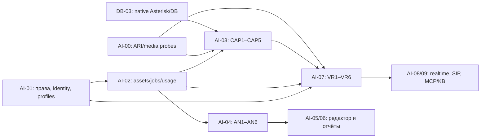

# Контракты следующих продуктовых срезов

Ревизия **2026-09-18-r2**, planning-only. Детальные планы: [AI-03](AI-03-PLAN.md), [AI-04](AI-04-PLAN.md), [AI-07](AI-07-PLAN.md). Уточняет прежние proposed SPEC и AI-01/02, не заменяет их общей второй архитектурой. Контракты ещё не опубликованы внешним клиентам; изменения ниже не являются миграцией действующего public API.

## Зависимости и порядок

CAP1 и VR1 domain/schema contracts можно исполнять после их узких prerequisites, не дожидаясь live native PBX; вся фаза CAP/VR не закрывается до runtime gates. Аналитика AN не ждёт CAP или Asterisk. Product streams независимы по функционалу; общие migrations/shared DTO/registries имеют одного writer, parallel development не разрешает одновременное редактирование этих файлов. Пользователь просит проектирование: никакие workers, calls или migrations здесь не запускаются.

17 новых tasks: CAP1–5, AN1–6, VR1–6. Вместе с предыдущими20 — 37. Это не оценка PR count: VR runtime и capture допускают дополнительные bounded assignments внутри task с одним owner и обязательной общей приёмкой.

## Решения на границах

| Граница | Каноническое решение / изменение |
|---|---|
| Идентичность | B1 TenantContext; Sequelize `user_uid` → `vpbx_user_uid`; tenants.id не owner UID; tenant0 валиден. Manifest/SIP metadata не заменяют authentication |
| API scopes | B2 `analytics:upload/read/transcript/audio/cancel`. Старые proposed `recordings:write`, `results:read` и т.п. не вводить вторым набором. Upload scope включает первый imported analysis; reanalysis отдельный будущий scope |
| Upload vs analysis | Complete подтверждает/ожидает asset readiness, не создаёт run. `POST analysis-runs` создаёт run/job/reservation/outbox atomic. UI orchestration использует те же operations |
| Durable states | Asset/job/stage platform states — AI-02. Analytics API state — projection: accepted(queued), processing(running), retry_wait, awaiting_reconciliation, completed, partial, failed, cancelled, skipped. Partial/unscorable domain outcome не переписывает инфраструктурный job status произвольно |
| Result visibility | `analytics:read` — ids/status, typed metric values и quality codes. Все free-text summary/rationale/quotes/transcript/participant labels требуют transcript permission; audio — отдельно. UI permissions эквивалентны scopes, без утечки через список/callback/error |
| Business dedupe | В AI-04 tuple включает tenant, stable principal, project, externalCallId, sourcePart. Idempotency receipt AI-02 не заменяет business uniqueness. Same audio ≠ same call. Новая явная reanalysis не маскируется под retry |
| Capture | AI-03 создаёт asset, не требует analytic project/license. Media readiness не равна call ended или наличие CDR. Native policy controls в RouteFormModal остаются AI-06P |
| Node auth | Machine node principal с server-owned binding и expiry; не tenant API key для всех клиентов узла. Callback и upload secrets разные |
| Robot config | `cc_ai_agents` editable draft один; immutable version/deployment/session новые. Numeric agent UID остаётся, stable robot UUID добавляется без второго CRUD хранилища |
| Voice execution | SQL milestones/quotas/usage долговечны; live PCM и VAD session-local. BullMQ batch jobs не являются transport для каждого аудиофрейма |
| Provider operations | Нейтральные revision/adapters AI-01/02. Test doubles доступны CI; real speech/model quality отдельный gate. Не копировать provider-specific DTO во все domains |
| AutoDial | Attempt owner инициирует один звонок; робот не занимается pacing/DNC/retries. Handoff и typed outcome с устойчивыми IDs, отдельное app только для service family |
| Licensing/billing | Robot recording не требует analytics; shadow usage без debit; local/BYOK без SaaS-wallet и скрытого egress; отдельный коммерческий выпуск каждой ветки |

## Additive extensions к AI-01/02

1. B2 production resource resolvers появятся в AN1 (project) и VR1 (deployment). До этого отсутствие resolver означает deny. Отдельный infrastructure node principal из CAP1 не заменяет B2 client identity.
2. AI-02 admission/terminalization предоставляет **transaction-aware API**: domain rows, job, idempotency, reservation и outbox commit вместе. Вложенная независимая Sequelize transaction не подходит; callback получает тот же transaction и lock order. Domains не вставляют job SQL в обход общего service.
3. D1 jobs snapshots содержат opaque domain/version refs с schema version; AN1/VR1 реализуют resolvers. Pending jobs после upgrade поддерживают предыдущую schema version в оговорённом compatibility window; unsupported version →blocked, не запуск с latest config.
4. Voice metering D4 расширяется subject kind `voice_session`, parent reservation owner `session:<uuid>`; job_id для такого parent nullable, session_id обязательный, CHECK ровно одного subject (job либо session). `ai_provider_operations` получает voice_session_id/input_turn_id/output_epoch/stage_role; прежний stage_id для voice nullable, CHECK ровно один owner: batch stage или voice session. Non-null operation_owner_key (`stage:<uuid>` либо `session:<uuid>:turn:<id>:epoch:<n>:role:<stt|llm|tts>`) + ordinal UNIQUE заменяет зависимость dedupe от nullable stage_id. Backfill batch keys без изменения operation IDs; старые stage unique constraints можно сохранить дополнительно. Child reservations сохраняют тот же parent subject и общую settlement логику. Создать typed `UsageSubject` repository вместо второго voice ledger; additive schema в VR1 до первых звонков, backfill job subjects без изменения их IDs. Документ D4 описывает текущий batch вариант, а не запрет voice subject.
5. Capture source identity/digest и webhook delivery tables добавляются CAP1/AN4, не дублируют outbox/storage. Migration manifest имеет одного owner; номер выбирается при assignment, не зарезервирован в этих документах.
6. C2 minimal analytics schema не требует `cc_ai_agents`; robots-only profile добавляет существующий agent/table component и новые version/session tables с теми же именами. Full-pbx baseline уже владеет legacy cc tables: не выполнять повторный CREATE и не переписывать applied baseline. Profile extension reviewed отдельно от env-переключателя.

## Проверка планов и границы готовности

Self-review текущим coordinator, не независимый reviewer. Сверены исходники record hooks, `cc_ai_agents`, scripted session/RTP и voicemail LLM helper. Они дают reuse точки, но не доказательство готового LLM runtime/analytics. Исправлены scope naming, business-dedupe project boundary, transaction ownership и batch-vs-live media semantics. Provider/model default не выбран без eval.

До исполнения каждого task: re-read EXECUTION, свежий diff, уточнить фактические exports AI-01/02, PLAN SHA-256/paths/checks. Если реализация foundation отличается, обновить конкретный contract delta и потребителей до code changes. Предварительное проектирование разрешено сейчас; upstream acceptance остаётся обязательным. Ближайшее implementation задание по-прежнему A1, не CAP/AN/VR автоматически.

Приёмка этих документов: относительные links существуют, task IDs уникальны, dependencies/spec references согласованы, новые code/runtime результаты не заявлены. Runtime suites не запускались: текущие изменения документационные. Implementation checks по AGENTS и реальная MySQL/PG матрица обязательны при исполнении; remote tests только `root@ipbx.krasterisk.ru`, без local Docker.

Фактический итоговый check r2: Node проверил 16 документов, 158 относительных links, 37 уникальных task headings и 5 SHA-256 в EXECUTION; exit0, errors=[]. `git diff --check -- .planning/initiatives/ai-products` — exit0, только предупреждения принятой Git-конвертации LF/CRLF. Untracked планы включены в Node check отдельно. Код приложения и стенд не изменялись; runtime readiness этим не доказана.

Продолжение r3: подробные AI-05/06 и AI-08/09 уже подготовлены, их согласования — [ADVANCED-PRODUCT-CONTRACTS](ADVANCED-PRODUCT-CONTRACTS.md). Публичные API/provider contracts сверяются перед исполнением; commercial release gates AI-10/11 и DB-04 сохраняются. Проверка r2 выше является исторической, число17 новых/37 общих относится к той ревизии.
