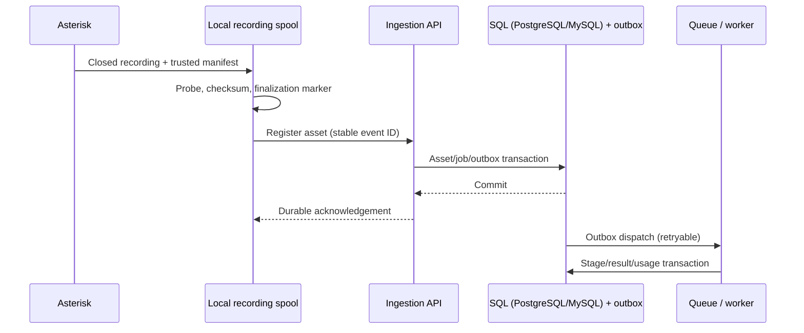

# Маршруты, записи и запуск речевой аналитики

Дата: 2026-09-18. Проектный контракт. Требования INT-01…INT-08, этапы AI-03/06 в [ROADMAP](ROADMAP.md).

## Наблюдаемое состояние

| Факт кода | Источник |
|---|---|
| В форме уже есть `record`, `record_all`, `record_stereo`, сохраняются по кнопке Save | `packages/frontend/src/features/routes/ui/RouteFormModal/RouteFormModal.tsx:84,189`; `RouteGeneralTab.tsx:132` |
| Запись mono WAV или stereo RAW через MixMonitor, затем MP3 | `packages/backend/src/modules/routes/routes.service.ts:380`; `route-recording.util.ts:14` |
| При успешной конвертации оригинал удаляется | `route-recording.util.ts:27,32` |
| У on_hangup собственная синхронная ffmpeg + CURL цепочка; в просмотренном handler нет `StopMixMonitor` и проверки успешного создания MP3 | `packages/backend/src/shared/utils/dialplan-subroutines.util.ts:83,97,102` |
| Комментарии обещают готовый MP3, но сами по себе не подтверждают закрытый файл/успешную конвертацию | `packages/backend/src/modules/routes/dialplan-webhooks.service.ts:158,186` |
| CDR player и path helper ожидают `.mp3` | `packages/backend/src/modules/reports/cdr/cdr.service.ts:299,303,307,454` |
| Имя исходника строится по секунде, caller ID и EXTEN, без unique recording ID | `routes.service.ts:395` |

Это code audit, не воспроизведение потери/порчи записи в живом звонке. Потенциальную гонку закрытия файла и коллизии имен нужно проверить в recording spike. Нельзя считать строку `System(ffmpeg...)` доказательством `recording.ready`.

Официальная документация требует StopMixMonitor для гарантии доступности файла при обработке в dialplan; режим D требует `.raw`, а флаг b записывает только bridged audio. Поэтому «после ответа» в существующем UI не означает запись всех участков IVR/робота после Answer. Это нужно явно проверить и исправить в политике recording. [MixMonitor](https://docs.asterisk.org/Latest_API/API_Documentation/Dialplan_Applications/MixMonitor/).

## INT-01. UX включения

| Вариант | Плюсы | Недостатки | Решение |
|---|---|---|---|
| Только checkbox маршрута | Просто | Нельзя удобно настроить сотни маршрутов, нет наследования | Недостаточно |
| Только global on/off | Быстро | Невозможно исключить отдельный маршрут или выбрать проект | Недостаточно |
| Tenant default + route override + kill-switch | Предсказуемо, можно начать с одного маршрута | Нужен показ эффективной политики | Выбран для плана |

У tenant настройки аналитики: «Автоматический анализ записей», default project, правила минимальной длительности/исключений/retention. Начальное состояние — OFF. Отдельный аварийный «Приостановить новые анализы» не меняет сохранённые route overrides.

В `RouteGeneralTab`/выделенном `RouteAnalyticsSection` рядом с записью:

- Поле «Речевая аналитика»: **По настройкам компании / Не анализировать / Анализировать**.
- При «Анализировать»: проект из tenant catalog, показывается опубликованная версия политики проекта.
- Read-only строка «Будет применено: …» с проектом, записью и причиной ограничения.
- При recording OFF: явное действие «Включить запись и анализ» с видимым изменением параметров. Не включать запись скрытым побочным эффектом покупки модуля.
- Для новых записей аналитики рекомендуются раздельные каналы; mono разрешён с предупреждением о менее надёжной идентификации участников.
- При отсутствии entitlement блок не активируется, есть переход к описанию модуля. При suspended сохраняются настройки и понятная причина; forged API не может активировать обработку.

Форма сохраняется общей кнопкой Save: её toggles — local state. Глобальный switch, сразу пишущий на сервер, обязан делать RTK `onQueryStarted/updateQueryData`, merge server response, undo + toast при ошибке. Следовать текущим Stack/Text/SCSS/i18n ru/en и modal shell height; не добавлять второй самописный редактор действий.

## INT-02. Эффективная политика

Предлагаемый API контракт (поля новые):

```ts
type RouteAnalyticsPolicy = {
  mode: 'inherit' | 'off' | 'on';
  project_uid?: string;
};

type EffectiveAnalyticsPolicy = {
  enabled: boolean;
  reason: 'enabled' | 'unlicensed' | 'paused' | 'disabled' |
    'recording_off' | 'no_project' | 'project_inactive';
  project_uid?: string;
  policy_version_uid?: string;
};
```

Правила в порядке применения:

1. Нет лицензии продукта или действует kill-switch → admission запрещён независимо от override.
2. `off` → анализа нет. `on` → требуется доступный project. `inherit`/отсутствующее поле → tenant default, изначально OFF.
3. Политика не включит скрытую запись: recording OFF делает её неэффективной, ошибка/предупреждение выдаётся до Save/apply. Миграция старых routes не меняет recording flags.
4. Проект и опубликованная pipeline policy snapshot фиксируются при создании recording intent. Отключение entitlement/kill-switch дополнительно проверяется перед платной стадией; применяются правила отмены/уже принятых работ.
5. Длительность/качество проверяются после finalization. Исключённый короткий звонок имеет видимый статус `skipped_by_policy`, не `failed`.

Backend возвращает effective policy, UI её не вычисляет отдельной копией. Проверка tenant ownership project нужна при сохранении, apply, admission и worker consume. Блокировка нового анализа не блокирует обычный телефонный звонок.

Маршрут может быть один из многих в call chain. В первой версии одна каноническая conversation/project на входной recording intent; переадресации добавляют segments с provenance. Route override применяется к новому recording intent, не переписывает задним числом историю уже начатого. Analytics `off` сам по себе **не отключает обычную запись PBX**. Поддержку multiple projects для одного звонка отложить; публичный reanalyze разрешает осознанный новый run.

Отдельный внутренний контракт `CapturePolicy` задаёт `capture: allow|deny` и `analysis_export: allow|deny` для чувствительного segment, с причиной и policy revision. Он не является дополнительным значением route analytics selector. Приоритет: privacy deny → остальные recording/analytics настройки. При `capture=deny` конкретный recorder приостанавливается/завершается до сегмента; при `analysis_export=deny` сегмент не передаётся STT/LLM и не входит в score. Если надёжно отделить запрещённый участок невозможно, удержать весь asset от анализа с явной причиной. Capture/analysis exclusion проверяется на переводе и уже начатой записи; первоначальный pilot допускает deny всего разговора вместо непроверенной частичной редактуры.

## INT-03. Формат записи

Канонический источник — lossless WAV PCM16 или FLAC с реальными sample_rate/channel metadata. Для текущего D-interleaved пути RAW временный, немедленно нормализуется worker в документированный контейнер. Не подавать RAW в STT без явного формата. Не считать частоту 8 kHz истинной лишь потому, что она зашита в текущей ffmpeg команде: фиксировать negotiated/capture format и подтвердить тестовым сигналом.

Артефакты: immutable original; normalized analysis derivative при необходимости; компактный MP3 для текущего CDR playback. Переход сохраняет существующую совместимость `.mp3`; в следующих фазах player получает asset/variant API. Старые MP3 принимаются аналитикой с `source_quality=legacy_lossy`, stereo не создаёт отсутствующих независимых каналов.

Для hosts без проверенного D: испытать `r()`/`t()` с синхронизацией дорожек, затем собрать stereo worker-ом. Не утверждать, что универсальные версии Asterisk поддерживают одинаковые флаги. Conference mixed recording — multi-party/fallback diarization, не двухсторонний stereo.

Role mapping хранится явно: track index → channel leg → participant role с интервалами и confidence/source. RX/TX — относительно конкретного monitored channel, не синонимы клиент/оператор. Направление звонка, transfer, Local channels, bridge rejoin, conference и hold могут менять участников. Неизвестная роль остаётся `unknown`; пользователь может исправить её с audit и новым derived result, оригинал не переписывается.

## INT-04. Надёжный handoff



**Выбран гибрид:** короткий сигнал завершения записи + local durable spool/manifest + outbox/очередь и reconciler. Фоновая аналитика не исполняется в hangup hook; внешний пользовательский webhook не служит внутренней шиной продукта.

- Завершить конкретный recorder корректным Asterisk механизмом; manifest становится ready только после close/probe/checksum. Hook/AMI event — триггер, но не единственное доказательство.
- На узле Asterisk заранее известны `pbx_node_id`, server-generated recording UID, tenant binding, uniqueid/linkedid, route policy snapshot, capture/channel layout. Caller strings не входят в shell commands/имена файлов.
- Имя содержит уникальный asset ID; путь строится сервером под root. При обработке использовать `execFile`/аргументы, не shell-строку из metadata.
- Spool переживает недоступность API/Redis и перезапуск процесса. Отправка завершается после durable ack; повторная отправка безопасна. Лимит диска, возраст orphan assets, disk-full alarm и политика временной остановки capture обязательны.
- Reconciler сверяет ready manifests и зарегистрированные assets. File size «не менялся N секунд» — только запасной сигнал, не полная гарантия закрытия; неизвестные/незавершённые файлы карантинируются.
- В выбранной SQL-БД (PostgreSQL/MySQL) уникальность `(tenant, pbx_node_id, recording_uid)`; `linkedid` группирует разговор, но не является ключом файла или единственным dedupe key. Вставка asset+outbox атомарна; concurrent duplicate fixtures выполняются на обеих СУБД.
- Media может появиться раньше CDR и наоборот. Job не ждёт CDR бесконечно: API origin metadata достаточно, CDR enrichment асинхронный; внутренний tenant binding должен быть достоверным до admission.
- User webhook запускается по собственному событию и своей delivery queue. Failure callback не теряет исходную запись и не повторяет analysis/charge.

## INT-05. Внешний API

Внешний клиент использует API v1: upload session → upload → complete → `202 conversation/job ID`, либо ограниченный прямой multipart для MVP. POST содержит `Idempotency-Key`, external_call_id, metadata и channel mapping. Повтор ключа с тем же request hash возвращает исходный ID; иной payload даёт 409. SHA256 помогает обнаружению дубля, но два различных разговора с одинаковым аудио не склеиваются автоматически.

Presigned upload scoped к tenant/object, короткий срок, size/content constraints, HEAD/probe перед complete. URL import — отдельная отключённая по умолчанию возможность с HTTPS, redirect/DNS/IP checks, запретом private/link-local/metadata targets, download timeout/size limit; проверка повторяется на каждом redirect/resolution. Для локальных PBX в закрытых сетях лучше outbound uploader, чем разрешать SaaS произвольные внутренние URL.

Результат: polling endpoint и подписанный HMAC webhook с event ID, timestamp, expiry/replay window и ретраями. Ключ webhook отличается от входного API key. Scope внешнего клиента: upload/read только разрешённого проекта, без возможностей администратора PBX.

## INT-06. Интеграция с отчётами и модулями

CDR/карточка КЦ/контакт автообзвона показывают статус и ссылку на conversation при наличии права. Analytics domain не запрашивает напрямую UI-сервисы КЦ. Экран аналитики работает и без локального CDR; optional links скрываются без данных/прав.

Записи AI-робота могут попасть в тот же ingestion pipeline, если аналитика включена. Live transcript робота — один из sources с provenance, но не обязательно точная запись услышанного клиентом; post-call анализ может требовать STT записи. Выбор режима и стоимость видны пользователю заранее.

## INT-07. Приёмка

| Сценарий | Ожидаемый результат |
|---|---|
| Entitlement OFF + поддельный route/API payload | Нет analysis admission, звонок продолжает штатный маршрут |
| Default OFF, inherit/off/on | Таблица решений выполняется; UI показывает эффективный проект |
| Save/copy/reopen, raw/actions, nested routes | Policy сохраняется/копируется корректно, обратная совместимость |
| Inbound + outbound, две тестовые фразы на разных legs | Дорожки независимы, роли корректны или честно unknown |
| Answer→IVR/AI без обычного Dial bridge | Подтверждена политика capture; b не теряет нужную речь |
| Transfer/hold/Local leg/двойной MixMonitor stop | Нет чужого recorder stop, дубликата charge или перепутанной attribution |
| Backend/Redis down во время hangup | Звонок не ждёт STT/LLM; spool доставляет после восстановления |
| Crash до/после SQL commit и publish | Durable job не теряется; повторная доставка не дублирует run |
| Файл truncated, fake stereo, источник удалён | Видимые rejected/degraded states, автоматического хорошего score нет |
| Один call ID на двух PBX/тенантах | Разные conversations; чужое аудио/результаты недоступны |
| Внешний API с повторным ключом/чужим project/unsafe URL | Replay/409/403 или 404/validation reject по контракту |
| Существующий CDR playback до/после feature OFF | MP3 проигрывается, legacy записи не переименованы |

## INT-08. Выкладка и rollback

Additive schema → shadow manifest/registry → один tenant с сохранением старого playback → сравнение assets/CDR → enable policy на одном тестовом маршруте → расширение. Для существующих calls нет автоматического backfill/reanalysis. Технический rollback выключает новый admission и возвращает legacy generator для новых звонков; уже запущенные workers/spool drain либо paused с сохранёнными файлами. Не удалять новые таблицы и оригиналы в downgrade при незавершённых задачах.

План обязан совместить переключение пути записи с repair существующих CDR/deployment P0. Исторический production report от 2026-09-17 — причина отдельной проверки, не подтверждение состояния сервера сегодня.
