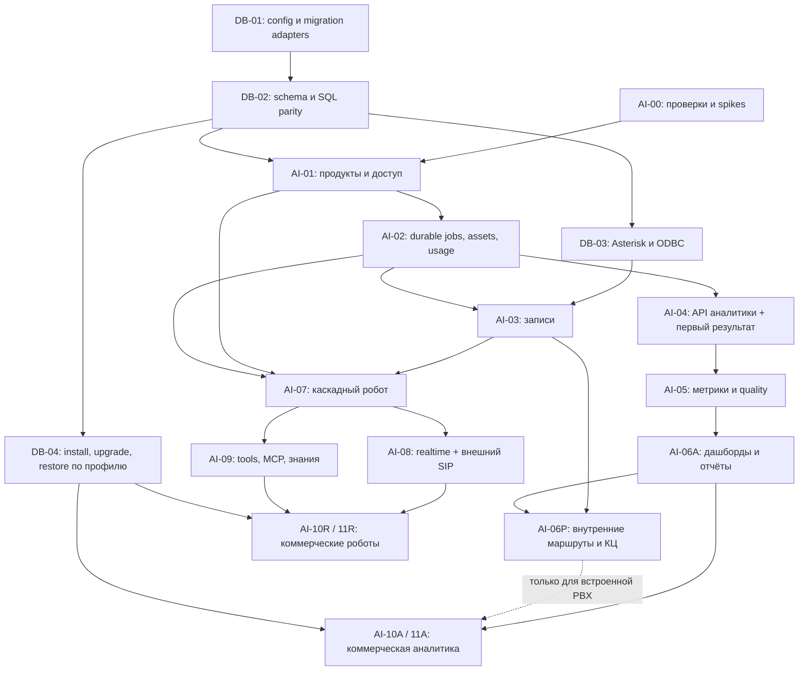

# План реализации AI-продуктов Krasterisk

**Детализация r3:** добавлены [AI-05](AI-05-PLAN.md), [AI-06A/P](AI-06-PLAN.md), [AI-08](AI-08-PLAN.md), [AI-09](AI-09-PLAN.md), ещё 23 задания (всего 60). [ADVANCED-PRODUCT-CONTRACTS](ADVANCED-PRODUCT-CONTRACTS.md) согласует scopes/outcomes/neutral delivery и отмечает обязательные provider/SIP/MCP/retrieval measurements. Реализация и release gates не закрыты наличием этих планов.

**Детализация r2 (2026-09-18):** добавлены [AI-03](AI-03-PLAN.md), [AI-04](AI-04-PLAN.md), [AI-07](AI-07-PLAN.md) — ещё 17 task-level задач. [Контракты границ](PRODUCT-SLICES-CONTRACTS.md) согласуют scopes, transactional admission, capture и live voice. Планы подготовлены заранее, их dependencies не объявлены реализованными; первым implementation assignment остаётся A1.

Дата: 2026-09-18. Статус: **частичная реализация foundation, детальное проектирование AI-01/02 завершено**. DB-01 и отдельные DB-02 срезы имеют verification; AI-00/01 содержат исследования и начальные implementation slices, но сквозная приёмка новых AI-продуктов не пройдена. **Решения пользователя: развивать оба продукта параллельно; поддержать SaaS и коробочную установку; базовый модуль разрабатывать OpenSource.** Контракты поставки и лицензирования: [DEPLOYMENT-LICENSING](DEPLOYMENT-LICENSING.md), gates DEP-01…08. SaaS и self-hosted включаются в приёмку каждой продуктовой ветки.

**Дополнение пользователя: PostgreSQL и MySQL — равноправные варианты установки**, включая Sequelize application schema, Asterisk CDR/queue_log/realtime. Контракт и платформенные подэтапы DB-01…04: [DATABASE-PORTABILITY](DATABASE-PORTABILITY.md). Один engine на установку, существующий MySQL сохраняется; ни новая PostgreSQL dependency, ни переключатель ORM сами по себе не закрывают поддержку.

**Готовность планирования:** подробные планы — [AI-00](AI-00-PLAN.md) с [closure](AI-00-CLOSURE-PLAN.md), [DB-01](DB-01-PLAN.md), [DB-02](DB-02-PLAN.md), [AI-01 A/B/C](AI-01-PLAN.md), [AI-02](AI-02-PLAN.md). Актуальные code gaps, dependency gates и следующий A1 — в [IMPLEMENTATION-SEQUENCE](IMPLEMENTATION-SEQUENCE.md). Старые Wave1/2 AI-01 не считать завершённой фазой; полный DB-02 тоже не закрыт. Остальные предметные планы детализируются перед исполнением; production/release readiness не достигнута.

Канонические ссылки: корневой `AGENTS.md`, обе `packages/*/.idea/ARCHITECTURE.md`, `.planning/CANONICAL_REFS.md`, [ARCHITECTURE](ARCHITECTURE.md), [RECORDING-INTEGRATION](RECORDING-INTEGRATION.md), [ROBOTS-SPEC](ROBOTS-SPEC.md), [ANALYTICS-SPEC](ANALYTICS-SPEC.md), три audit-файла инициативы. Исторические P0: `.planning/PRODUCTION-READINESS-2026-09-17.md`, `.planning/AI-CAPABILITY-AUDIT-2026-09-17.md`; соседний scope: `.planning/AUTODIAL-REFACTOR-IMPLEMENTATION-2026-09-18.md`.

## Результаты и порядок

**Первый сквозной результат аналитики:** внешний WAV → защищённый API → durable job → транскрипт/несколько метрик → UI → usage без повторного списания. Это AI-04; редактор метрик, отчёты, подключение внутренних маршрутов и коммерческая приёмка добавляются следующими срезами.

**Первый сквозной результат роботов:** SIP-вызов → отдельный AI-робот → каскадный диалог → корректный hangup/transfer → журнал и usage. Это AI-07; realtime, полноценный внешний SIP onboarding, MCP/KB и коммерческая приёмка следуют далее.

Согласованный порядок: `AI-00` параллельно `DB-01 → DB-02`, затем общий `AI-01 → AI-02`; `DB-03` может выполняться одновременно с AI-01/02 и закрывается до native PBX AI-03. Далее **параллельно** аналитика `04 → 05 → 06A → 10A → 11A` и shared capture `03 → роботы 07 → 08/09 → 10R → 11R`. Срез06P добавляет internal routes/КЦ после03 и06A; он обязателен для встроенной PBX, но не для standalone analytics release. Внешний API и самостоятельный коммерческий выпуск аналитики не ждут DB-03 Asterisk; DB-04 core install/upgrade/restore gates входят в release каждой ветки, PBX-срез DB-04 дополнительно требует DB-03. Cross-engine transfer действующих данных — отдельная будущая capability, не blocker первого релиза. Проектирование UX/fixtures/providers обоих продуктов идёт параллельно уже в00; исполнение общего registry/schema/локалей имеет одного владельца. Коммерческая аналитика не ждёт готовности роботов и наоборот. A/R/P — срезы фаз, не новые дублирующие системы.

| Волна | Общая платформа | Аналитика | AI-роботы |
|---|---|---|---|
| 0 | AI-00 contracts + DB-01 config/adapters → DB-02 schema/query parity | Dataset/STT/metric spike | ARI/media/realtime spike |
| 1 | AI-01 identity/entitlements/profiles; DB-03 Asterisk параллельно | UX/spec/tests на согласованных DTO | UX/spec/tests на согласованных DTO |
| 2 | AI-02 jobs/assets/usage на обеих СУБД | Ingestion/pipeline contracts | Session/transport contracts |
| 3 | AI-03 capture/spool | AI-04 внешний vertical slice | Editor/runtime work по стабильным contracts; recording acceptance ждёт03 |
| 4 | Integration review | AI-05 метрики/eval | AI-07 каскад + запись после03 |
| 5 | Общие API/usage hardening | AI-06A отчёты; AI-06P маршруты после shared capture | AI-08 realtime/SIP и AI-09 tools/KB |
| 6 | Единые price/ledger/ops contracts; DB-04 dual-engine release gates | AI-10A/11A собственный выпуск | AI-10R/11R собственный выпуск |

Волны показывают разрешённое совмещение, а не жёсткое синхронное ожидание всей команды. Рабочие contracts замораживаются на очередной vertical slice; изменение общего DTO проходит review обеих веток. Незавершённая реализация playback не блокирует offline editor/turn-manager работу роботов, но блокирует обещание полной VR-11 приёмки.

Глобальные GSD phase numbers пока не назначены: [правила mapping](DELIVERY-WORKFLOW.md). Ни один существующий Phase 1–17.x не объявляется завершённым этим документом.

## AI-00. Доказать исходные предпосылки и выбрать профиль

**Цель:** неизвестности, способные изменить архитектуру, превращены в маленькие проверенные решения. Детальный старт: [AI-00-PLAN](AI-00-PLAN.md).

Задачи:

1. Сверить текущую ветку/dirty baseline, GSD/code/live claims, миграции и соседний autodial scope. Зафиксировать устаревший пункт merge into aiPBX как superseded новым направлением.
2. Контрактные spike: ARI dispatcher coexistence; запись closed→stereo roles→asset; capability transport/provider, отдельный старт analytics-only.
3. Выбрать первый STT + LLM для аналитики, STT/LLM/TTS каскада и realtime provider по доступности владельцу проекта, качеству RU и формату API; записать region/locality/BYOK и quotas. Без ключей готовятся replay doubles, live decision остаётся pending.
4. Уточнить нагрузочный профиль (call concurrency, минут/сутки, max duration, retention, SLA), состав OpenSource core и commercial pricing inputs. Зафиксировать deployment SaaS/self-hosted отдельно от entitlements; первый Linux/container install profile, offline-license contract и local-provider feasibility. Сам выбор SaaS/коробки/OSS уже задан пользователем; defaults конкретной реализации не считать его ответом.
5. Подтвердить ADR-13 и inventory MySQL-specific schema/runner/raw SQL/Asterisk dependencies; начать DB-01 по отдельному детальному плану. PostgreSQL/MySQL — заданное требование, версии/ODBC adapters и результаты tests фиксируются evidence. Existing production данные не мигрировать.

**Выход:** ADR delta, test fixtures/measurements, compatibility matrix и перечень P0 для затрагиваемых путей. Старые CDR/tenant-trigger проблемы проверяются до внутреннего analytics admission; внешний upload slice может идти без локального CDR.

**Приёмка:** известны владельцы Stasis events и recorder lifecycle, нет неопределённого tenant; выбран хотя бы один проверяемый профиль. Никаких автоматических production upgrades. Размер: M, высокая неопределённость.

## AI-01. Границы модулей, identity и навигация

**Зависит:** 00 и DB-02 для SQL-зависимой реализации. **Требования:** PL-01…PL-04, VR-01, AN-01, DBR-01/02/03/06. Независимая UX/contracts работа может начаться раньше.

1. Разделить entitlements `ai_voice_robots`/`speech_analytics` и deployment SaaS/self-hosted; определить compatibility mapping legacy `cc_ai_voice`/`voice_robot` и текущее `mode != CLOUD → true`. Старые права клиентов не менять без migration policy. Server runtime/API guards обязательны; license-provider interface поддерживает SaaS entitlement и локально проверяемый signed document.
2. Project-scoped API credentials, rotation/revoke, service principal, product RBAC; tenant из JWT/key binding. Закрыть или изолировать существующие unauth public robot/recording пути в новом deployment profile до внешнего доступа.
3. Отделить tenant/organization signup от PBX provisioning. Analytics-only не требует Context/AMI/ARI и Asterisk realtime tables; PBX activation запускает отдельное provisioning действие.
4. Добавить входы продуктов в Module Hub/ModuleShell/command palette и role start. Встроенный подраздел AI-роботов связан с тем же продуктом; `voiceRobots` сохраняется. Admin provider screen не должен требовать лишней лицензии AI-chat.
5. Inventory существующих `cc_ai_agents`, provider/toolset связей и migration design единственного source of truth. Устранить provider-owner допуск `[0, userUid]`: tenant 0 не глобальный; проверять ownership/enabled/capability при CRUD, publish и admission. Не создавать дублирующий новый CRUD без этого шага.
6. OpenSource core/package boundary: community build не импортирует обязательные commercial AI modules. Provider catalog/credentials/capabilities/media contracts вынести в нейтральный core/connectivity module; текущие voicemail/ai-chat не зависят от robot `AiAgentsModule` ради providers. Сохранить facade/один credential store. Module descriptors позволяют подключать продукты; absent package не оставляет endpoints/cron/menu. Gate включает compile/test без commercial source tree. Утвердить manifest составов без изменения лицензии existing code.

**Области файлов:** `cloud-admin/modules-registry`, `auth`, `ai-agents`, `ai-platform/module-coverage.registry`, frontend `app/router`, module registry, `widgets/ModuleHub`, `shared/api/endpoints`, `packages/shared`; новые `integration-credentials`/policy contracts по архитектурному согласованию.

**Приёмка:** два отдельных entitlements; direct URL/API обход не работает; два tenant не видят ресурсы друг друга; analytics-only smoke работает без PBX; community core собирается без AI-пакетов (DEP-01); SaaS/self-hosted policy matrix (DEP-02…05); scripted regression зелёный. **Rollback:** новые модули disabled, прежние license mappings восстановимы. Размер: L.

## AI-02. Долговечные задачи, медиа и измерение расхода

**Зависит:** 01. **Требования:** PL-05…PL-08, PL-10, AN-02/03, VR-12.

1. Additive SQL migrations на PostgreSQL и MySQL: asset registry, jobs/stages/outbox, API idempotency, usage events/reservations/ledger. Выбранная SQL-БД — authority финансовых reservations; Redis — очередь/leases/concurrency, не второй баланс. Shared compatibility contract: DBR-02/03/05.
2. BullMQ wiring, dispatcher, worker lease/retry/DLQ/cancel, crash recovery, tenant fairness и limits. Отдельный readiness для worker dependencies; нет null-Redis success.
3. Storage adapter local+S3-compatible contract: streaming upload, limits, checksums, probe, retention, signed authorized playback. Первый deploy может использовать local disk, но API не зависит от абсолютного пути.
4. Отдельные composition roots API/analytics worker/media worker, один владелец scheduler; не запускать полный AppModule во всех процессах. Предотвратить двойные cron bills/сканеры/ARI listeners.
5. Metering shadow mode: stage/provider operation IDs, cost units, price snapshots, reserve/settle/release, reconciliation unknown outcome.
   Денежный reserve условен по billing policy; entitlement/resource quota обязательны всегда. Self-hosted local/BYOK профиль работает без SaaS-wallet, только с локальной лицензией/лимитами и usage journal.
6. Local self-hosted storage/Redis/worker profiles без обязательной связи с нашим облаком; ownership encryption keys, backup/restore contract, single scheduler в каждой установке. SaaS использует те же schema/event contracts; community PBX не обязан запускать AI queues (DEP-01/06/07/08).

**Области:** backend worker bootstrap/composition modules, `redis`, `cloud-admin/billing`, новые domain modules по месту; `packages/shared` events; `packages/backend/database` текущий migration runner. Не добавлять иной migration framework.

**Приёмка:** kill worker до/после provider result/DB commit, replay outbox, duplicate upload/completion; одна клиентская операция не списывается дважды. Два реальных test jobs: PostgreSQL+Redis и MySQL+Redis; одинаковые locking/dedupe/ledger assertions (DBR-05/08). Storage путь tenant-safe. **Rollback:** остановка admissions и drain, данные сохраняются. Размер: L.

## AI-03. Recording asset из внутренних звонков

**Зависит:** 02; native PBX integration дополнительно DB-03. Это общая capture/asset capability обоих продуктов, без зависимости от лицензии/проекта аналитики. Для internal PBX проверяется CDR/tenant attribution на обоих engines; robot-only external SIP использует trusted VoiceSession/media manifest без legacy CDR repair. **Требования:** INT-03/04/07/08, PL-09, VR-11 recording slice, DBR-04.

1. Recording UID/manifest, original lossless и MP3 playback derivative; close→probe→ready вместо тяжёлой обработки в hangup.
2. Spool uploader/reconciler, disk-full/partial/quarantine, stable identity tenant/node/asset. Migration preserves existing CDR MP3 path contract.
3. Stereo/mono/fake-stereo, direction/roles/transfer segments; capability fallback D или r/t. Capture robot/IVR без bridged b проверяется отдельно.
4. Controlled Asterisk harness: inbound/outbound, transfer, hangup during write, duplicate event, API down. Проигрывание старых записей.

**Файлы:** `routes/routes.service.ts`, `route-recording.util.ts`, `shared/utils/dialplan-subroutines.util.ts`, `system-settings/dialplan-subroutines.service.ts`, `reports/cdr/*`, новый recording spool/ingest code. `RouteFormModal` policy ещё в 06.

**Приёмка:** фактически читаемый lossless asset правильного tenant; повтор событий не дублирует asset; звонок не ждёт STT/LLM; восстановление после API outage. **Rollback:** feature flag для новых captures, old playback остаётся. Размер: L.

## AI-04. Вертикальный MVP внешней аналитики

**Зависит:** 02. **Требования:** AN-01/02/03/04/06/07/08/10/11 (тонкий срез), AN-05 только фиксированные метрики; INT-05. Полный редактор и продуктовый MVP ещё впереди.

1. Project + immutable published pipeline config, Conversation/AnalysisRun/Transcript, UI списка/карточки.
2. Scoped API upload + completion + status/result; 202, idempotency/replay/409; manual upload из UI использует тот же ingestion service. Сначала multipart, затем direct object upload при необходимости объёма.
3. Probe→normalize→batch STT→speaker mapping→summary+три базовые метрики→validation→result. Provider adapters по 00; ограниченный max duration и честный reject сверх него. Chunk-overlap strategy описать в ADR; полноценные long-call chunks вводить отдельным расширением, когда нужен больший лимит.
4. Timeline player + transcript + evidence; loading/failed/retry/cancel. HMAC delivery queue + polling, callback replay.
5. Metering shadow, интеграционные negative tests, analytics-only launch profile.

**Области:** новые backend `speech-analytics` + media integration; frontend `features/speech-analytics`, `pages/SpeechAnalytics*`, RTK endpoints; shared DTO/OpenAPI.

**Приёмка:** внешний клиент без PBX лицензии загружает WAV, видит результат, один сбой worker не теряет задачу; tenant/project scopes соблюдены. Скриншоты/UI проверены на 360/1440px. **Rollback:** stop intake, существующие jobs drain/paused. Размер: L.

## AI-05. Редактор метрик, качество, версии

**Зависит:** 04. **Требования:** AN-04/05/06/07/12; AN-08/09 только подготовка контрактов для следующей фазы.

1. Typed metric editor: boolean/number/enum/string, range/unit/polarity/weight/applicability, no-code template + advanced instructions, стабильный metric key.
2. Draft→test on samples→publish immutable revision, compare/rollback. Reanalysis создаёт новый run; исторические aggregate не пересчитываются молча.
3. Deterministic talk/silence/overlap отдельно от LLM inference; rationale/evidence с timestamps; unknown/not-applicable/unscorable, review overrides с audit.
4. Structured output validate + bounded repair, transcript/source IDs; запись без пригодного speech не получает хороший/плохой employee score.
5. Golden/held-out dataset, tests свойств scoring/denominator и eval report. Проверка prompt injection в transcript и fake speaker role.

**Приёмка:** публикация новой метрики не меняет прежний отчёт; drilldown показывает основание score; dataset thresholds согласованы и измерены. Размер: L.

## AI-06. Внутренняя аналитика, дашборды и отчёты

**Срез 06A (standalone dashboards/reports) зависит:** 05. **Срез 06P (native PBX) зависит:** 03 + 06A. **Требования всей фазы:** INT-01/02/06/07, AN-02/03 (internal path), AN-08/09/10/11 и regression subset AN-12. 06A закрывает задачи 3/4 и product cost/reanalysis часть 5 без Asterisk; 06P закрывает 1/2 и legacy PBX backfill часть 5. Внешние team/agent/call metadata валидируются integration contract, наличие внутренних КЦ/CDR таблиц для отчёта не требуется.

1. Tenant default + route inherit/off/on/project + effective-policy API. Элементы в `RouteFormModal` и `RouteGeneralTab`; save/copy/raw/actions; default OFF без внезапной записи.
2. Recording intent snapshot→ingestion через тот же сервис, что внешний API. CDR/КЦ/автообзвон links и metadata, один canonical call с segments.
3. Dashboards с фильтрами project/team/agent/time/tags/version, coverage/quality рядом с score. Rollups + invalidation/version keys; server pagination и aggregate SQL, не загрузка всех calls в браузер.
4. Drilldown KPI→metric→call→quote. CSV/XLSX/PDF по целевым формам, scheduler/reports notifications с durable delivery; timezone/DST и export permissions.
5. Cost/processing view, project budget, bulk reanalyze estimate и явный запуск. Backfill legacy recordings по диапазону/preview, по умолчанию выключен.

**Приёмка 06A:** внешний dataset проходит dashboards/drilldown/export/scheduled reports/cost/reanalysis на обоих engines без Asterisk, CDR и КЦ tables. **Дополнительная приёмка 06P:** внутренний и внешний вызов отображаются в единой аналитике, default/override matrix выполнена; module disabled не запускает jobs; незаписанный разговор не превращается в пустой успешный анализ. 06P остаётся обязательным результатом инициативы для встроенной АТС, но не блокирует standalone commercial release. **Rollback:** отключить analysis admission, обычные маршруты остаются работоспособны. Размер: L, отдельные срезы 06A/06P.

## AI-07. AI-робот: версия и каскадный разговор

**Зависит:** 01/02/03 (shared capture) + ARI probe 00. **Требования:** VR-01/02/04/05 и первый срез VR-09/10/11/12. VR-03 realtime ещё не реализуется; аналитика 04…06 и её entitlement не требуются.

1. Завершить выбранную миграцию `ai-agents` configuration→versioned robot aggregate, отдельные route action `ai_voice_robot` и catalog без изменения `voicerobot`. Legacy URLs/UID compatibility map.
2. Один ARI ingress/dispatcher на node с явным worker owner; extraction media primitives из scripted engine минимальными шагами. Tenant-required admission, cleanup, session ownership; два media workers не дублируют listeners/mutations.
3. VAD→streaming STT→LLM→ordered TTS, endpointing/pre-roll, barge-in epochs, timeouts, bounded audio buffers. Новый caller audio не теряется при cancellation предыдущей реплики.
4. Только минимальные безопасные tools: terminate/transfer по allowlist, простое read-only действие; журнал tool calls и terminal outcome. Full MCP/RAG в 09.
5. Robot editor: identity/prompt/provider/voice/fallback, test dialog, publish version/rollback; call trace с latency/cost. Внутренний тестовый номер и opt-in browser audio preview.
6. КЦ handoff получает разрешённую summary и session link. AutoDial campaign получает отдельный AI executor и typed attempt outcome; DNC/schedule/pacing/retry сохраняются у AutoDial. Первое controlled integration покрывает связку attempt→session→outcome, дальнейшая live приёмка в 08.
7. Robot recording по deployment/connection policy использует shared capture/asset-ready из 03, работает без Route/CDR и без аналитики. Проверить playback/retention права; optional analytics получает событие только при entitlement/policy.

**Области:** `ai-agents` evolution/новый `ai-voice` runtime, `voice-robots/services`, `ari`, `dialplan.util`, shared ActionType/DTO, frontend dialplan schema registry/useSchemaRefs/CATALOG_DEFAULTS и отдельный robot editor.

**Приёмка:** реальный test call ведёт диалог, interruption прекращает старый playback, transfer/hangup завершает правильный канал; scripted + autodial + AI coexistence без cross-handling. Размер: XL, делить на 3–4 PR по вертикальным границам.

## AI-08. Realtime, внешний SIP и lifecycle

**Зависит:** 07. **Требования:** VR-03/06; завершение VR-09 integrations; VR-10/11/12. VR-07 здесь только parity native tool events, полный tools в 09.

1. Realtime model adapter по API/capabilities 00, session updates, tools events, interruption/playback acknowledgement, final usage и provider error mapping.
2. Secure external SIP onboarding: trunk credential/IP policy, allowed DID→robot mapping, per-tenant CPS/concurrency/duration, TLS/SRTP по профилю; NAT/codec probe и проверочный звонок.
3. Тот же robot version/runtime без локальной PBX лицензии. Failover voice provider только когда capability и разговор допускают, иначе понятный fallback/transfer.
4. Provider outage/429, ARI disconnect, worker drain/restart, orphan reconciliation; external transfer safety и loop limit. Outbound initiation через scoped API/существующий autodial, с destination policy.
5. Live КЦ handoff и AutoDial AI executor: exactly-one attempt owner, typed outcome, отмена/таймаут/перевод, absence of duplicate retry/dial. Robot-only клиент использует scoped outgoing API без покупки полного модуля автообзвона; outbound policy и admission общие, массовый pacing остаётся AutoDial.

**Приёмка:** внешняя PBX подключается SIP-транком, не устанавливая Krasterisk и не меняя свою версию Asterisk; другой tenant не выбирается через SIP headers; realtime и cascade дают сопоставимые trace/outcomes. Возможность конкретного SIP security profile подтверждена стендом. Размер: L.

## AI-09. Tools, MCP и базы знаний

**Зависит:** 07, не зависит от готовности realtime. **Требования:** VR-07/08, VR-02 version bindings, VR-10 test bench, VR-12 adversarial checks.

1. Tenant-owned HTTP/MCP connection catalog, encrypted secrets, allowlist/schema import/revision, probe/test, per-robot binding и scopes.
2. Typed ToolGateway: timeout/budget, side-effect policy, idempotency, exact principal/resource check; административный `AgentDiffProposal` механизм отдельно.
3. Knowledge CRUD + document ingestion pipeline, chunk/retrieve/cite, immutable release, tenant ACL/delete. Vector retrieval решение после маленького corpus benchmark, без лишнего storage fork.
4. UX tools/knowledge test bench, unknown-answer fallback, citation trace; prompt version включает tool/schema/KB release binding.
5. Adversarial tests: prompt injection, forged tool args, SSRF, cross-tenant retrieval, repeated side-effect, long-running tool while caller interrupts.

**Приёмка:** робот решает согласованные бизнес-задачи с объяснимым trace, не меняет конфигурацию АТС по требованию caller; KB deletion/ACL соблюдаются. Размер: L.

## AI-10. Коммерческая готовность по каждому продукту

**A зависит:** 06A; встроенный PBX-профиль дополнительно 06P. **R зависит:** 08+09. **Общее:** 02 и per-engine DB-04 gates соответствующего deployment profile. **Требования:** PL-01/07/08/09; AN-11 и AN-12 operational gates; VR-01/10/11 и hardening VR-06/12. Окончательная VR-12 приёмка в 11R. Самостоятельная аналитика может выйти до internal PBX integration; это не закрывает невыполненный 06P scope всей инициативы.

1. Тарифы/price versions/trial/quotas, local/BYOK/managed-provider model. Marketplace checkout активирует нужный entitlement, app enable отделён от покупки. SaaS charge отдельно от локального metering; BYOK/local не списывает фиктивные provider fees.
2. Shadow ledger reconcile → контролируемое переключение billable mode; invoice/export lines, rounding, reserves/refunds/unknown outcomes. Без реальных автоматических списаний во время разработки.
3. Product-specific onboarding: аналитика project→key→sample→result; роботы provider→prompt→test→SIP→publish. PBX-only поля скрыты в standalone.
4. Integration API docs/OpenAPI, examples/curl, errors, callbacks, credential rotation; customer support diagnostics/redacted export.
5. Retention/delete/export policy, offboarding; schedule jobs/active calls при expiry/disable. Trial ограничения enforced server-side.
6. Self-hosted package/installer/preflight, signed license import/renewal/expiry/grace/key rotation, отсутствие mandatory heartbeat для выбранного offline профиля. Community/OpenSource build artifact и manifest проходят CI без коммерческих пакетов; OSS core не отключается при expiry. Подготовить инструкции backup/restore/upgrade, version compatibility и локальных providers по проверенному hardware profile.

**Приёмка:** аккаунт/установка только с одним продуктом проходит onboarding и использование без второго продукта/PBX/КЦ, в SaaS и коробке (DEP-03/04). Invalid/expired/wrong-install license и renewal проверены; данные/ядро не удаляются/не отключаются (DEP-05). Community build самостоятелен; local/BYOK data остаётся в выбранных границах. Сверка usage ledger, нет double-charge. Размер: L с общим packaging/license срезом, затем M delta второго продукта.

## AI-11. Приёмка, нагрузка, пилот и эксплуатация

**A/R зависят:** соответствующий срез 10; критичные tenant/media/billing gates обязательны для каждого.

1. Нагрузочный профиль по 00: media отдельно от batch workers, queue fairness, max file/duration, storage pressure, 1→5→20 concurrent calls как начальная лестница измерений, не обещанный лимит продукта.
2. Fault injection: restart API/worker/Redis, duplicate events, packet jitter/loss, long tool, provider rate limit, clock/timezone, DB deadlock, storage unavailable.
3. Backup/restore и key rotation, dashboards/alerts/runbooks, drain upgrade, rollback rehearsal. SLA/SLO финализировать по измерениям, не по ожиданиям от модели.
4. Pilot одного tenant, потом двух с параллельными данными/вызовами, затем согласованное расширение. Published eval + UAT report с точной environment/model/versions.
5. CI/UAT matrix: community-core, SaaS two-tenant, self-hosted analytics-only, self-hosted robots-only, оба продукта. Чистая установка/restore/upgrade; offline licensing и отсутствие незаявленного egress; реальный local-AI профиль измеряется отдельно, fake provider не закрывает обещание локального STT/LLM/TTS (DEP-01…08).
6. Поддерживаемые deployment profiles проходят PostgreSQL и MySQL matrix (DBR-01…08), включая real concurrency для ledger/outbox и Asterisk persisted CDR/queue_log там, где есть PBX. SQL-only тесты не заменяют Asterisk live gate. DB-04 оформляет version support, install/restore/upgrade для каждого engine. Перенос данных между engines не требуется для первого релиза и не считается выполненным сменой переменной окружения.

**Выход:** separate `IMPLEMENTATION`, `VERIFICATION`, `LIVE-UAT`, `RELEASE` evidence; все pending checks названы. Все три обязательных npm checks проходят на release branch. Только после этого соответствующий продукт считается коммерчески готовым. Размер: L, зависит от доступного стенда.

## Общие требования и traceability

| ID | Требование | Фазы | Проверка |
|---|---|---|---|
| PL-01 | Два независимых продукта и licensing | 01/10 | Только один SKU, API+UI доступ |
| PL-02 | Tenant isolation в каждом пути | 01/02/07/09/11 | JWT/key/SIP/worker/storage/vector negative tests |
| PL-03 | Внешние credentials и интеграции | 01/04/08 | Rotation/revoke/scopes/replay |
| PL-04 | Standalone без скрытой PBX зависимости | 01/04/08/10 | Startup/signup/use без AMI/ARI для analytics |
| PL-05 | Durable jobs/outbox и recovery | 02/04/06 | Crash/replay, no lost accepted job |
| PL-06 | Immutable versions/results | 02/05/07/09 | Publish/reanalyze не меняет историю |
| PL-07 | Usage/idempotent charge | 02/10 | Concurrent reserve/settle и duplicate event |
| PL-08 | Бюджеты/limits/quotas | 02/08/10 | Admission race и exhaustion |
| PL-09 | Storage lifecycle и privacy controls | 03/09/10/11 | Delete/retention/export permission |
| PL-10 | Isolated process roots и observability | 02/11 | Один scheduler, media unaffected by batch |
| PL-11 | Современный FSD UI, RU/EN, responsive | Все UI-фазы | UI integration + 360/1440px |
| PL-12 | Воспроизводимые AI/runtime evals | 00/05/07/08/09/11 | Dataset/versioned run + live harness |
| PL-13 / DBR-01…08 | Выбор PostgreSQL или MySQL для всего deployment | DB-01…04, AI-01/02/03/06/10/11 | DATABASE-PORTABILITY; реальные dialect и Asterisk matrix |
| DEP-01…08 | OpenSource core, SaaS/self-hosted, лицензии и локальная эксплуатация | 00/01/02/04/07/08/10/11 | Матрица DEPLOYMENT-LICENSING |
| INT-01…08 | Маршруты, recording и API integration | 03/04/06/11 | Матрица RECORDING-INTEGRATION |
| AN-01…12 | Полный продукт аналитики | 01/02/03/04/05/06/10A/11A | Матрица ANALYTICS-SPEC |
| VR-01…12 | Полный продукт роботов | 01/07/08/09/10R/11R | Матрица ROBOTS-SPEC |

Размеры — относительная сложность, не календарная оценка. Неизвестные объёмы/провайдеры/стенд и текущий dirty baseline не позволяют честно назначить срок в днях. После 00/первого среза можно оценить оставшиеся фазы по фактической скорости и live blockers.

## Что не входит в первую версию

Полное копирование aiPBX; перенос всех исторических данных/аккаунтов; собственный SIP-stack; собственный общий agent framework; обещанная совместимость с любым провайдером по одному baseURL; realtime coaching операторов; emotion/CSAT как объективный факт; cross-product microservice rewrite; автоматический анализ всех старых записей. Полноценные tools/MCP/KB и коммерческий биллинг входят в общий roadmap, а не вычеркнуты как «потом когда-нибудь».
