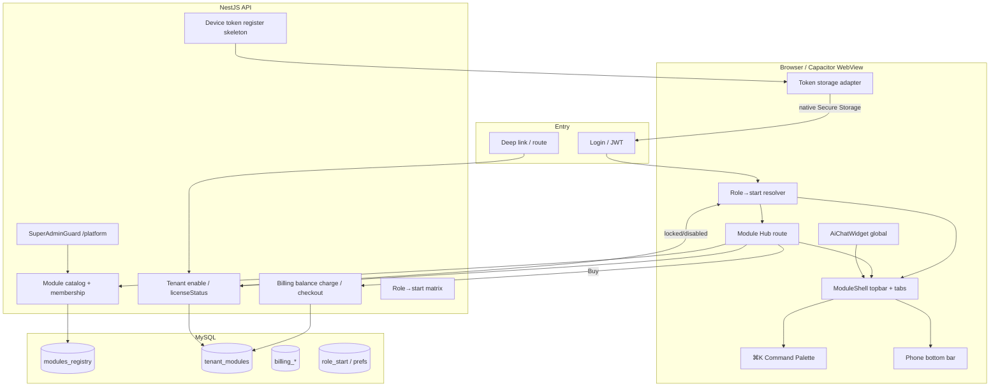

# Phase 8: Navigation redesign & Android port foundation - Research

**Researched:** 2026-07-16
**Domain:** Modular navigation shell (Hub + ModuleShell), NestJS module catalog/billing, Capacitor Android foundation (auth storage, FCM, WebRTC WebView)
**Confidence:** HIGH (codebase + official Capacitor docs + locked UI-SPEC/sketch winners; Android Studio absent on research machine → env gap flagged)

<user_constraints>
## User Constraints (from CONTEXT.md)

### Locked Decisions

### Desktop nav shell — module system
- **D-01:** App = набор **Modules**. Global Module Switcher → вход в модуль → **in-module nav**. Не плоский единый sidebar навсегда.
- **D-02:** **Hybrid Hub:** full-screen **Module Hub** (wow / marketplace) + **быстрый switcher** без обязательного возврата на Hub.
- **D-03:** In-module nav — **per module type** через единый **nav registry**: dense (PBX/Settings) → sidebar/rail; sparse → tabs. Один API регистрации для marketplace modules.
- **D-04:** Post-login — **role-aware default** + явная **матрица роль → стартовый модуль/экран**, конфигурируемая с максимальной гибкостью (per-tenant / per-role) в admin.
- **D-05:** Hub visual = **Bento grid** модулей + **dock** (Recent + Favorites, star на карточке).
- **D-06:** Quick switcher = **header chip** + **⌘K / Ctrl+K** command palette (модули + страницы текущего модуля).
- **D-07:** Marketplace UI в Hub: **Active + ghost Locked** (blur/lock); registry поле `licenseStatus`. Полный store UX завязан на billing skeleton (D-30).
- **D-08:** Hub = **route** (deep-linkable); quick switcher = **overlay**.
- **D-09:** Motion = **cinematic but short** (staggered bento, короткий enter-module); уважать `prefers-reduced-motion`.
- **D-10:** Клик по **логотипу** → всегда Module Hub.
- **D-11:** Sketch strategy: **3 визуальных варианта** Hub/shell → выбор пользователя → один production winner (как Phase 2).

### IA / modules / marketplace
- **D-12:** Baseline modules: **Base** = Core (PBX + pages) · Apps · System. **Marketplace (default)** = Analytics · Call Center · AI bots / related. Всё **конфигурируемо**.
- **D-13:** **Backend module catalog API** + полноценная **admin UI Modules**.
- **D-14:** **Dashboard / «Обзор»** — cross-cutting: плитка в Hub + возможный role-default target; не тяжёлый отдельный product-module.
- **D-15:** Стартовая раскладка пунктов — **baseline #1** (Core/PBX, Apps, System, marketplace CC/Analytics/AI); **queues / reports / orphan items** уточняет research. **Принадлежность пункта к модулю меняется в admin**.
- **D-16:** Default role→start (переопределяемо в admin): OPERATOR → Call Center agent; SUPERVISOR → Call Center supervisor; ADMIN → Overview; если CC выключен → fallback Core/Overview.
- **D-17:** Deep-link на выключенный модуль → **smart fallback** (role-default / Overview); Hub различает license-locked vs admin-disabled.
- **D-18:** **Wallboard TV** URL остаётся **вне module shell** (display-token); в модуле CC — страница настройки/токенов.
- **D-19:** **Service Requests** и прочие «осиротевшие» пункты — Claude/research выбирает baseline module; admin может переназначить.
- **D-20:** Research **MUST** изучить и оценить переработку:
  - `packages/frontend/src/pages/UsersPage/UsersPage.tsx`
  - `packages/frontend/src/pages/RolesPage/RolesPage.tsx`
  - `packages/frontend/src/pages/NumbersPage/NumbersPage.tsx`
  (роли, матрицы доступа, связь с module landing / System module).

### Platform roles & billing
- **D-21:** **Super-admin / platform operator** — **вне тенанта**: создаёт и управляет тенантами; **только он** конфигурирует отображение/состав/содержание модулей (catalog structure, item membership, defaults).
- **D-22:** **Tenant admin** — видит модули; может **включать/выключать** у себя и **совершать покупку**; не редактирует глобальный catalog/composition.
- **D-23:** В Phase 8 — **каркас реального биллинга** модулей (license/checkout hooks, не только UI-заглушка). Конкретный платёжный провайдер / PCI детали — research + planner; полный production hardening store может волноваться, но каркас обязателен.

### Mobile
- **D-24:** **Adaptive:** phone = Hub-first; tablet = dual-pane ≈ desktop.
- **D-25:** Phone module switch = **chip → bottom sheet** + **логотип → Hub**.
- **D-26:** In-module pages на phone = **hybrid by module type** (как registry).
- **D-27:** **Full responsive pass** всех reachable-страниц (planner разбивает на waves).
- **D-28:** Call Center agent на phone = **stacked tabs/sections** + sticky softphone controls.
- **D-29:** Tables = **hybrid**: критичные списки → cards; остальные → horizontal scroll + column priority.

### Android / Capacitor
- **D-30:** Оболочка = **Capacitor** над существующим Vite/React SPA (не RN rewrite).
- **D-31:** Depth = scaffold + platform bridges + **softphone/WebRTC validation** в Android WebView + audio-focus notes.
- **D-32:** **FCM foundation** — Capacitor Push plugin + backend hook skeleton (не full push UX campaigns).
- **D-33:** Auth tokens на Android → **Capacitor Secure Storage** (или encrypted Preferences); web auth path не ломать тотальным cookie-рефактором в этой фазе.
- **D-34:** API/WSS URL = **hybrid**: build flavors (dev/staging/prod) + optional override для on-prem/debug.
- **D-35:** Offline = **banner + retry** only; constraints документировать в research; no offline action queue.
- **D-36:** Background/call when minimized — **не фиксировать заранее**; baseline после WebRTC WebView spike в research (Foreground-only vs foreground-service notification).
- **D-37:** **iOS** = Capacitor project structure readiness; без Xcode CI / simulator smoke в этой фазе.

### Design system & shell language
- **D-38:** Shell = **refresh + bold Hub language** (expressive Hub cards/motion/density) при сохранении **FSD**. Страницы модулей не требуют тотального рескина в той же волне, что Hub, но full responsive — да.
- **D-39:** Если DS меняется существенно — **обновить** `packages/frontend/.idea/ARCHITECTURE.md` под новую систему.

### Cross-cutting
- **D-40:** **AiChatWidget** доступен **во всех модулях** (global overlay).
- **D-41:** Legacy URLs (`/operator`, старые paths) — **redirects только на переходный период**, затем удаление.

### Claude's Discretion
- Точный baseline mapping orphan routes (service-requests и т.п.) после research.
- Queues ↔ Apps vs Call Center; Reports split Core vs Analytics — после research.
- Конкретный payment provider для billing skeleton.
- Background call strategy после WebRTC spike.
- Детали prefers-reduced-motion / shared-element transitions.
- Объём переработки Users/Roles/Numbers в Phase 8 vs follow-up wave — research рекомендует, planner режет waves (пользователь ожидает вероятную полную переработку в рамках проекта/фазы).

### Deferred Ideas (OUT OF SCOPE)
- Production Google Play listing, signing secrets CI, store assets
- Full iOS QA / TestFlight pipeline
- Full offline sync / action queues
- Native Android Telecom/ConnectionService (unless research elevates a minimal slice)
- React Native rewrite
- Complete payment-provider production hardening beyond billing skeleton (if research splits it)
</user_constraints>

> **UI-SPEC override (binding):** Sketch winners + `08-UI-SPEC.md` **supersede D-05 visual framing**. Ship Hub as **002-E dense single-column list** (no bento/dock chrome). D-02/D-05 remain valid for *Hybrid Hub behavior* (Hub route + quick switcher without forced return). In-module = **003-B top tabs**; phone = **004-B bottom bar**; marketplace = **005-B section**; admin = **006-B separate apps**. [VERIFIED: 08-UI-SPEC.md + sketch-findings-krasterisk-v4]

<phase_requirements>
## Phase Requirements

`.planning/REQUIREMENTS.md` has no Phase 8 REQ-IDs (ends at earlier phases; ROADMAP marks Phase 8 Requirements as TBD). Treat CONTEXT decisions **D-01…D-41** plus UI-SPEC surface contracts as the phase requirements. Derived tracking IDs for planner/Nyquist:

| ID | Description | Research Support |
|----|-------------|------------------|
| NAV-01 | Replace flat `buildNavigation` with module registry + per-module nav contributors | Architecture Patterns §Module Registry |
| NAV-02 | Module Hub route (002-E list) + favorites + Active/Marketplace sections | UI-SPEC §1; sketch Hub E |
| NAV-03 | ModuleShell topbar (logo→Hub, chip, ⌘K) + top tabs (003-B) | UI-SPEC §2 |
| NAV-04 | Command palette modules + current-module pages (Dialog-based, no cmdk) | UI-SPEC Design System; Don't Hand-Roll |
| NAV-05 | Role→start matrix + post-login redirect; smart fallback for locked/disabled | D-04/D-16/D-17; backend catalog |
| NAV-06 | Platform `/platform/*` vs tenant System→Modules (006-B) | Existing cloud-admin + SuperAdminGuard |
| NAV-07 | Billing checkout skeleton (plan→confirm→success) wired to real license hooks | Existing billing balance + activateModule |
| NAV-08 | Phone bottom bar + chip→Sheet; tablet uses desktop shell at 768 | UI-SPEC §3; `useIsMobile` |
| NAV-09 | Full responsive pass (waves); tables hybrid D-29; CC agent sticky softphone D-28 | ARCHITECTURE responsive rules |
| NAV-10 | Capacitor 8 scaffold android+ios structure; Secure Storage auth bridge | Capacitor official docs |
| NAV-11 | URL flavors (dev/staging/prod) + optional runtime override | Capacitor env-specific configs |
| NAV-12 | FCM foundation Push plugin + backend device-token hook skeleton | Capacitor Push Notifications docs |
| NAV-13 | WebRTC/softphone Android WebView validation + audio-focus notes | Capacitor/WebView issues; D-36 baseline |
| NAV-14 | i18n ru+en for all new shell/marketplace/admin strings; no em dash | ARCHITECTURE i18n |
| NAV-15 | Preserve wallboard outside shell; AiChatWidget global; legacy redirects transitional | router.tsx; D-18/D-40/D-41 |
| NAV-16 | Users/Roles/Numbers rework for System module + access matrices | Code review §Users/Roles/Numbers |
</phase_requirements>

## Summary

Phase 8 replaces the brownfield flat sidebar (`buildNavigation` ~25 routes + dividers) with a **module system**: deep-linkable Module Hub, in-module ModuleShell (top tabs), marketplace-aware license states, separate platform vs tenant admin surfaces, and a **Capacitor 8** Android foundation over the existing Vite/React 19 SPA. Sketch + UI-SPEC winners are locked (Hub E, tabs B, mobile B, marketplace B, admin B).

Critical brownfield insight: **catalog/billing/superadmin already exist** under `packages/backend/src/modules/cloud-admin/` (`modules_registry`, `tenant_modules`, balance/deposit/charge, bank webhook, `SuperAdminGuard`, frontend `MarketplacePage`/`MyModulesPage`/`SuperAdminPage`). Phase 8 must **evolve and remap** this stack to Hub-level modules (Core / Apps / System / Call Center / Analytics / AI) with page→module membership and `licenseStatus`, not invent a parallel marketplace. Navigation today does **not** gate on `useMyModules` — Hub/shell must become the license gate.

Capacitor is not in `package.json` yet. Official Capacitor 8 install path applies (`@capacitor/core` **8.4.2**, android/ios/cli same major). Auth today writes JWT to `localStorage` in `authSlice` — abstract a storage adapter so native uses `@aparajita/capacitor-secure-storage` without a cookie rewrite. Research machine has Node 22 but **no Android Studio/SDK/adb** — emulator smoke needs an env install wave or human checkpoint.

**Primary recommendation:** (1) Introduce a frontend **nav registry** + Hub/ModuleShell replacing Sidebar; (2) extend cloud-admin catalog with Hub modules, page membership, role→start, tenant enable/purchase APIs returning `licenseStatus`; (3) wire checkout to existing balance `charge` + `activateModule`; (4) Capacitor 8 scaffold with Secure Storage + flavors + FCM register hook + WebRTC permission smoke; (5) wave responsive + Users/Roles/Numbers into System module.

## Architectural Responsibility Map

| Capability | Primary Tier | Secondary Tier | Rationale |
|------------|-------------|----------------|-----------|
| Module Hub UI + ModuleShell chrome | Browser / Client | — | Presentation, routing, motion; FSD widgets/pages |
| Nav registry (module → pages/tabs) | Browser / Client | API / Backend | Client owns UI contribution; backend owns membership + license |
| Module catalog CRUD / composition | API / Backend | Database | Platform operator only; tenant isolation |
| Tenant enable/disable + purchase | API / Backend | Database | License state + billing ledger |
| Role→start matrix | API / Backend | Browser / Client | Server is source of truth; client applies post-login redirect |
| Command palette | Browser / Client | — | Client-side index of registry + current module pages |
| Auth token storage (web vs native) | Browser / Client | — | Adapter over localStorage / Secure Storage |
| FCM device token registration | Browser / Client | API / Backend | Plugin registers; backend stores token per user/tenant |
| Softphone / WebRTC | Browser / Client | External (Asterisk WSS) | sip.js in WebView; native only grants mic permissions |
| Wallboard TV | Browser / Client | API / Backend | Remains outside AppLayout; display-token |
| Responsive page layouts | Browser / Client | — | SCSS modules per ARCHITECTURE |

## Standard Stack

### Core (already in repo — do not replace)

| Library | Version | Purpose | Why Standard |
|---------|---------|---------|--------------|
| React | 19.1.x | UI | Project stack [VERIFIED: package.json] |
| Vite | 6.3.x | Bundler; Capacitor `webDir` | Project stack [VERIFIED: package.json] |
| react-router-dom | 7.5.x | Hub/module/platform routes | Existing router [VERIFIED: package.json] |
| NestJS | 11.x | Catalog/billing/auth APIs | Backend ARCHITECTURE [CITED: packages/backend/.idea/ARCHITECTURE.md] |
| Sequelize | 6.x | `modules_registry`, `tenant_modules`, billing tables | Existing cloud-admin models [VERIFIED: codebase] |
| RTK Query | 2.x | `cloudAdminApi` / marketplace hooks | Existing [VERIFIED: cloudAdminApi.ts] |
| motion | 12.x | Hub stagger (respect reduced motion) | Existing [VERIFIED: package.json] |
| i18next | 24.x | ru+en shell copy | ARCHITECTURE mandate [CITED: ARCHITECTURE.md] |
| sip.js | 0.21.2 | Softphone (pin kept) | Phase 7 pin [VERIFIED: package.json] |
| Vitest | 4.1.x | Frontend unit tests | Existing [VERIFIED: package.json] |
| Jest | (backend workspace) | Backend unit tests | Existing project pattern |

### Supporting (install for Capacitor — Phase 8)

| Library | Version | Purpose | When to Use |
|---------|---------|---------|-------------|
| `@capacitor/core` | 8.4.2 | Native bridge runtime | Always on native builds [VERIFIED: npm registry + capacitorjs.com] |
| `@capacitor/cli` | 8.4.2 | `cap init/add/sync` | DevDependency [VERIFIED: npm registry] |
| `@capacitor/android` | 8.4.2 | Android project | D-30 [VERIFIED: npm registry] |
| `@capacitor/ios` | 8.4.2 | iOS structure readiness | D-37 [VERIFIED: npm registry] |
| `@capacitor/preferences` | 8.0.1 | Non-secret prefs (favorites, URL override flag) | Optional prefs [VERIFIED: npm registry] |
| `@aparajita/capacitor-secure-storage` | 8.0.0 | JWT/refresh on device Keystore/Keychain | D-33 [CITED: github.com/aparajita/capacitor-secure-storage] [VERIFIED: npm registry] [slopcheck OK] |
| `@capacitor/push-notifications` | 8.1.2 | FCM foundation | D-32 [CITED: capacitorjs.com/docs/apis/push-notifications] |
| `@capacitor/app` | 8.1.1 | App state / deep link URL | Offline banner + launch URL [VERIFIED: npm registry] |
| `@capacitor/status-bar` / `splash-screen` / `keyboard` | 8.x | Shell polish | Scaffold defaults [VERIFIED: npm registry] [slopcheck OK] |

### Alternatives Considered

| Instead of | Could Use | Tradeoff |
|------------|-----------|----------|
| Capacitor 8 | Capacitor 7 | Locked to Capacitor (D-30); 8 is current latest — use 8 [CITED: capacitorjs.com] |
| `@aparajita/capacitor-secure-storage` | `@capacitor/preferences` only | Preferences are not Keystore-backed — weaker for refresh tokens [ASSUMED relative security] |
| Dialog-based CommandPalette | `cmdk` | UI-SPEC forbids new package without research decision; Dialog+Input+list is enough |
| Stripe/CloudPayments PCI | Internal balance + bank webhook + charge | Repo already has balance/deposit/charge + bank webhook — skeleton should extend this, not add PCI processor in Phase 8 |
| React Native | Capacitor | Explicitly deferred (D-30 / deferred ideas) |
| HashRouter | BrowserRouter | Capacitor https localhost supports History API; keep BrowserRouter unless spike fails [CITED: capacitor getting-started / community practice] [ASSUMED for this app until smoke] |

**Installation (frontend workspace):**

```bash
cd packages/frontend
npm i @capacitor/core @capacitor/android @capacitor/ios @capacitor/preferences @aparajita/capacitor-secure-storage @capacitor/push-notifications @capacitor/app @capacitor/status-bar @capacitor/splash-screen @capacitor/keyboard
npm i -D @capacitor/cli
npx cap init
# set webDir to Vite outDir (dist)
npx cap add android
npx cap add ios
```

**Version verification (2026-07-16):** `@capacitor/core@8.4.2`, `@capacitor/android@8.4.2`, `@capacitor/cli@8.4.2`, `@aparajita/capacitor-secure-storage@8.0.0`, `@capacitor/push-notifications@8.1.2`. Capacitor 8 requires **Node 22+** and Android Studio ≥ 2025.2.1 per official env setup. [CITED: capacitorjs.com/docs/getting-started/environment-setup]

## Package Legitimacy Audit

| Package | Registry | Age | Downloads | Source Repo | slopcheck | Disposition |
|---------|----------|-----|-----------|-------------|-----------|-------------|
| `@capacitor/core` | npm | years (Ionic) | high | github.com/ionic-team/capacitor | OK | Approved |
| `@capacitor/cli` | npm | years | high | ionic-team/capacitor | OK | Approved |
| `@capacitor/android` | npm | years | high | ionic-team/capacitor | OK | Approved |
| `@capacitor/ios` | npm | years | high | ionic-team/capacitor | OK | Approved |
| `@capacitor/preferences` | npm | years | high | ionic-team/capacitor-plugins | OK | Approved |
| `@capacitor/push-notifications` | npm | years | high | ionic-team/capacitor-plugins | OK | Approved |
| `@capacitor/app` | npm | years | high | ionic-team/capacitor-plugins | OK | Approved |
| `@capacitor/status-bar` | npm | years | high | ionic-team/capacitor-plugins | OK | Approved |
| `@capacitor/splash-screen` | npm | years | high | ionic-team/capacitor-plugins | OK | Approved |
| `@capacitor/keyboard` | npm | years | high | ionic-team/capacitor-plugins | OK | Approved |
| `@aparajita/capacitor-secure-storage` | npm | multi-year (v2→v8) | ~94.5k/wk (npm page) | github.com/aparajita/capacitor-secure-storage | OK | Approved |

**Packages removed due to slopcheck [SLOP] verdict:** none  
**Packages flagged as suspicious [SUS]:** none  

**Do not install:** `cmdk` (UI-SPEC). No new payment SDK in Phase 8.

## Project Constraints (from .cursor/rules/ + ARCHITECTURE)

`.cursor/rules/` is empty / absent in this repo. Enforce these from `packages/frontend/.idea/ARCHITECTURE.md`, `packages/backend/.idea/ARCHITECTURE.md`, and `AGENTS.md`:

- **FSD:** No native `div`/`span`/`button`/`input` in `features`/`pages`/`widgets`/`entities` — use `shared/ui` + Stack (`VStack`/`HStack`/`Flex`) + `Text`.
- **Styling:** Tailwind only inside `shared/ui`; SCSS modules + `var(--color-*)` above that layer. Map sketch tokens via UI-SPEC translation table (`--color-indigo` → `--color-primary`).
- **z-index:** Only CSS variables from `globals.css`, never hardcoded.
- **i18n:** Every new string in `ru.ts` + `en.ts`; no em dash `—` in UI copy.
- **Responsive:** 360px–2560px; tables `overflow-x-auto`; grid collapse at 640px.
- **Backend tenancy:** Always filter by `vpbx_user_uid` from JWT; never trust tenant id from client body for tenant APIs.
- **npm packages:** `npm show` + peerDeps + changelog before install (backend ARCHITECTURE §0).
- **Verify before done:** `npm run lint`, `npm run test:backend`, `npm run test:frontend`.
- **MCP rule:** New user-facing PBX entities need MCP tools — module catalog is platform/admin, not a new PBX entity; skip MCP unless planner adds tenant-facing module management tools.

## Architecture Patterns

### System Architecture Diagram



### Recommended Project Structure

```
packages/frontend/src/
├── app/
│   ├── layouts/
│   │   ├── AppLayout.tsx          # evolve → ModuleShell host OR thin wrapper
│   │   ├── PlatformLayout.tsx     # NEW /platform/* console chrome
│   │   └── HubLayout.tsx          # optional Hub-only chrome
│   └── router/router.tsx          # Hub, module prefixes, platform tree, redirects
├── widgets/
│   ├── ModuleHub/                 # NEW Hub list + marketplace section
│   ├── ModuleShell/               # NEW topbar + tabs + chip
│   ├── MobileBottomBar/           # NEW phone chrome
│   ├── CommandPalette/            # NEW shared/ui or widget
│   ├── Sidebar/                   # deprecate primary use; keep temporarily for redirects
│   └── AiChatWidget/              # keep mounted at shell root
├── features/
│   ├── modules/                   # registry, license gates, favorites, checkout sheet
│   ├── platform-admin/            # catalog / membership / role→start editors
│   ├── cloud-admin/               # evolve existing tenants UI
│   └── auth/                      # storage adapter for Capacitor
├── shared/
│   ├── config/modules/            # baseline module + page membership seed (client mirror)
│   ├── lib/capacitor/             # isNative, env URLs, push register
│   └── ui/CommandPalette/         # Dialog-based palette
└── capacitor/                     # capacitor.config.ts at frontend package root
    android/ ios/                  # generated native projects (git policy TBD)

packages/backend/src/modules/cloud-admin/
├── modules-registry.service.ts    # extend Hub modules + membership
├── tenant-modules.controller.ts   # enable/disable + my-modules licenseStatus
├── billing/                       # checkout purchase endpoint skeleton
└── role-start/                    # NEW matrix CRUD (or settings JSON)
```

### Pattern 1: Module nav registry (replace buildNavigation)

**What:** Typed registry of Hub modules; each module contributes tab items `{ id, path, labelKey, icon, minLevel?, licenseCode? }`. Client merges with backend membership + `licenseStatus`.
**When to use:** All navigation chrome; marketplace modules register the same way.
**Example:**

```typescript
// Conceptual — planner implements under features/modules
export type LicenseStatus = 'active' | 'locked' | 'disabled';

export interface ModuleDef {
  code: string;                 // 'core' | 'apps' | 'system' | 'callcenter' | ...
  kind: 'base' | 'market';
  navVariant: 'tabs' | 'sidebar'; // Phase 8 baseline: tabs; sidebar reserved
  pages: ModulePageDef[];
}

export interface ModulePageDef {
  id: string;
  path: string;                 // existing routes kept for D-41 transition
  labelKey: string;
  icon: LucideIcon;
  minLevels?: UserLevel[];
}
```

### Pattern 2: licenseStatus resolution

**What:** For each Hub module code, compute:
- `active` — tenant enabled (or BOX mode unlock-all)
- `disabled` — purchased/base but admin off → Active section muted
- `locked` — not licensed → Marketplace section + Buy

Reuse `DEPLOYMENT_MODE` BOX vs CLOUD behavior already in `ModulesRegistryService.tenantHasModule`. [VERIFIED: modules-registry.service.ts]

### Pattern 3: Platform vs tenant route trees

**What:** `/platform/*` uses `PlatformLayout` + `SuperAdminGuard` (level 0). Tenant System → Modules stays under ModuleShell. Never share tabs between the two (006-B).

### Pattern 4: Auth storage adapter

**What:**

```typescript
// Source pattern: abstract over Capacitor.isNativePlatform()
interface TokenStorage {
  get(key: string): Promise<string | null>;
  set(key: string, value: string): Promise<void>;
  remove(key: string): Promise<void>;
}
// web → localStorage sync wrapper
// native → SecureStorage from @aparajita/capacitor-secure-storage
```

Keep web path working; hydrate Redux on app start from async storage on native.

### Anti-Patterns to Avoid

- **Keeping flat Sidebar as primary nav** — sketch rejects it; scales poorly with marketplace modules.
- **Copying sketch CSS variable names** (`--color-indigo`) into production — use UI-SPEC translation table.
- **Tenant admin editing page→module membership** — platform-only (D-21/D-22).
- **Treating Disabled as Locked/Buy** — distinct pills and flows (UI-SPEC).
- **Mounting wallboard inside ModuleShell** — breaks display-token TV (D-18).
- **Installing cmdk / Stripe without need** — UI-SPEC + existing billing ledger.
- **Assuming background WebRTC works** — WebView limits; Phase 8 baseline foreground-only until spike says otherwise.

## Don't Hand-Roll

| Problem | Don't Build | Use Instead | Why |
|---------|-------------|-------------|-----|
| Native WebView bridge | Custom Java/Kotlin bridge | Capacitor 8 + official plugins | Lifecycle, permissions, sync already solved [CITED: capacitorjs.com] |
| Encrypted token store | Custom AES in JS | `@aparajita/capacitor-secure-storage` | Keystore/Keychain integration [CITED: plugin README] |
| Push transport | Raw FCM SDK wiring | `@capacitor/push-notifications` | Handles google-services + permission APIs [CITED: Capacitor Push docs] |
| Command palette a11y/keyboard | New npm cmdk | Existing `Dialog` + `Input` + listbox pattern | UI-SPEC; fewer deps |
| Module billing ledger | New payment DB | Existing `BillingBalanceService` deposit/charge + `activateModule` | Already seeded [VERIFIED: codebase] |
| Sheet / modal chrome | Custom overlays | `shared/ui/Sheet`, `Dialog` | Already in design system |
| Motion primitives | CSS-only one-offs | `motion` + `prefers-reduced-motion` | Matches Sidebar patterns |

**Key insight:** Phase 8 is mostly **IA + shell composition + wiring existing cloud-admin**, plus Capacitor scaffolding — not a greenfield marketplace or new UI kit.

## Runtime State Inventory

> Migration/rename-adjacent: module codes, routes, auth storage keys.

| Category | Items Found | Action Required |
|----------|-------------|------------------|
| Stored data | `modules_registry` seed uses **page-level** codes (`pbx_core`, `queues`, `voice_robot`, …) not Hub modules (Core/Apps/…) [VERIFIED: MODULES_SEED] | Data migration / remap: either new Hub-module table + page membership JSON, or add `hub_code` + membership fields; provision tenants accordingly |
| Stored data | `tenant_modules` status `active\|inactive\|trial` — no `licenseStatus` enum yet | Code + API mapping layer; optional schema additive columns |
| Stored data | `roles.role` TEXT JSON legacy interface permissions (`table_module_*`) [VERIFIED: role.model.ts] | Rework in Phase 8: align with Hub modules / page grants; migration of JSON shape |
| Stored data | `numbers.numbers` JSON access lists [VERIFIED: number-list.model.ts] | Keep entity; UI rework; ensure CC/queues scopes still apply |
| Stored data | JWT/`user`/`accessToken`/`refreshToken` in **localStorage** [VERIFIED: authSlice.ts] | Adapter: web keys unchanged; native migrate to Secure Storage on first launch |
| Live service config | Firebase `google-services.json` for FCM — not in git | Manual ops: add per flavor; document in README; do not commit secrets |
| Live service config | Bank webhook / seller settings already cloud-admin | Keep; checkout skeleton calls charge+activate |
| OS-registered state | None for Capacitor yet (no android/ project) | After scaffold: Android Studio local state; gitignore secrets |
| Secrets/env vars | `DEPLOYMENT_MODE`, SMTP, existing billing envs; need `VITE_API_URL` / WSS flavors | Document `.env` flavor matrix; Capacitor `capacitor.config.ts` switch |
| Build artifacts | No Capacitor artifacts yet | After add: `android/`, `ios/` — decide commit policy (usually commit Capacitor native projects) |

**Nothing found:** No existing Capacitor Secure Storage keys; no Play listing; no graph.json knowledge graph (`no graph` at research time).

## Discretion Recommendations (Claude's Discretion)

### Baseline page → Hub module mapping (D-15/D-19)

| Hub module | kind | Pages (existing paths) |
|------------|------|------------------------|
| **Overview** | cross-cutting tile | `/` Dashboard — not a heavy product module (D-14) |
| **Core** | base | `/endpoints`, `/contexts`, `/trunks`, `/routes`, `/time-groups`, `/phonebooks`, `/provision-templates` |
| **Apps** | base | `/ivrs`, `/queues`, `/prompts`, `/moh`, `/voice-robots`, `/call-groups`, `/integrations` (notifications) |
| **System** | base | `/users`, `/roles`, `/numbers`, `/settings`, `/settings/tts-engines`, `/settings/stt-engines`, `/audit-log`, **Modules** (tenant enable/Buy) |
| **Call Center** | market | `/callcenter/agent`, `/supervisor`, `/reports`, `/settings`; wallboard **settings** inside; **TV** `/callcenter/wallboard` stays public |
| **Analytics** | market | `/reports` placeholder, `/reports/cdr`, `/reports/voice-robot-cdr` (advanced analytics later) |
| **AI** | market | `/ai-agents`, voice-robot AI-adjacent if licensed |

**Orphans:**
- **Service Requests** `/service-requests` → **Call Center** (seed already `service_requests` paid CC CRM) [VERIFIED: MODULES_SEED]
- **Queues** → **Apps** (config surface); runtime agent UX stays Call Center
- **CDR / audit** → Core-adjacent analytics lite stays reachable; paid Analytics module can gate advanced reports later
- Legacy `/marketplace`, `/my-modules` → fold into Hub Active/Marketplace + System→Modules; keep redirects (D-41)
- `/superadmin` → migrate to `/platform/*` console (006-B)

### Payment provider for billing skeleton (D-23)

**Recommend:** Extend **internal balance ledger** already in repo:
1. Checkout sheet steps plan → confirm → success (UI-SPEC)
2. `POST` tenant purchase endpoint: validate price → `BillingBalanceService.charge(..., module_code)` → `activateModule`
3. Insufficient balance → clear error + link to deposit / bank payment instructions (existing bank webhook deposits)
4. Do **not** integrate Stripe/CloudPayments PCI in Phase 8 — deferred hardening

### Background call strategy (D-36)

**Recommend Phase 8 baseline: Foreground-only** with documented constraints:
- Android WebView WebRTC works with `RECORD_AUDIO` + `MODIFY_AUDIO_SETTINGS` + runtime permission [CITED: Capacitor issues #6967, #802]
- Minimized/background audio is unreliable without native Telecom/foreground-service — deferred
- Spike task: register+mic getUserMedia on emulator/device; document audio-focus behavior; if spike proves a minimal foreground-service notification is required for held calls, planner may add a thin Cap plugin note — **not** full ConnectionService

### Users / Roles / Numbers rework scope (D-20)

| Surface | Current state | Phase 8 recommendation |
|---------|---------------|------------------------|
| UsersPage | Thin FSD page + UsersTable; `UserLevel` without SUPERADMIN in shared enum | **In phase:** add System module landing polish; expose `UserLevel.SUPERADMIN` in shared; gate platform users; link role + numbers_id clearly |
| RolesPage | Misnamed «Интерфейсы»; JSON `role` TEXT of legacy module tables | **In phase (full rework):** rename UX to Interfaces/Access profiles; editor maps grants to **Hub modules + pages**; feed role→start defaults |
| NumbersPage | Access lists JSON for queues/operators/CDR scopes | **In phase (UI rework + responsive):** keep model; card/table hybrid; document relationship to CC visibility |

Planner should schedule Users/Roles/Numbers as a dedicated mid/late wave after ModuleShell + catalog membership exist (Roles editor depends on page registry).

## Common Pitfalls

### Pitfall 1: Dual catalog models
**What goes wrong:** New Hub module codes diverge from `MODULES_SEED` page codes; licenses never match nav.
**Why:** Seed is feature-granular; Hub is product-granular.
**How to avoid:** Explicit membership table `hub_module` → `page_code[]` owned by platform admin; migrate seed once.
**Warning signs:** Hub shows Active but tabs 404 / empty.

### Pitfall 2: SuperAdmin in shared types
**What goes wrong:** Frontend `UserLevel` omits `SUPERADMIN=0` while backend + `useMyModules` use `level === 0`.
**Why:** Enum drift shared vs backend [VERIFIED: shared enums vs user.model.ts].
**How to avoid:** Add `SUPERADMIN = 0` to `@krasterisk/shared` and frontend consts/badges; platform routes RequireRole level 0.

### Pitfall 3: AppLayout Tailwind / div debt
**What goes wrong:** New shell copies `AppLayout.tsx` Tailwind `div` patterns and fails FSD review.
**Why:** Legacy shell predates strict ARCHITECTURE rules [VERIFIED: AppLayout.tsx].
**How to avoid:** Implement ModuleShell/Hub with SCSS modules + Stack/Text from day one.

### Pitfall 4: Android mic permissions incomplete
**What goes wrong:** getUserMedia fails with NotAllowedError / could not start audio source.
**Why:** Missing `MODIFY_AUDIO_SETTINGS` or runtime request [CITED: Capacitor #6967].
**How to avoid:** Manifest permissions + Capacitor permission flow before sip.js register; document in spike notes.

### Pitfall 5: FCM without google-services.json
**What goes wrong:** Push register fails on device.
**Why:** Official plugin requires Firebase file in `android/app` [CITED: Push Notifications docs].
**How to avoid:** Wave checkpoint: human places flavor-specific JSON; CI uses secret — not committed.

### Pitfall 6: Offline SSE/WebRTC expectations
**What goes wrong:** Users expect offline call control.
**Why:** D-35 limits offline to banner+retry.
**How to avoid:** Network listener (`@capacitor/app` / `navigator.onLine`) shows banner; no action queue.

### Pitfall 7: Wallboard accidentally wrapped
**What goes wrong:** TV wallboard requires login shell.
**Why:** Route nesting mistake.
**How to avoid:** Keep `/callcenter/wallboard` sibling outside AppLayout (already correct in router).

## Code Examples

### Capacitor init (official)

```bash
# Source: https://capacitorjs.com/docs/getting-started
npm i @capacitor/core
npm i -D @capacitor/cli
npx cap init
npm i @capacitor/android @capacitor/ios
npx cap add android
npx cap add ios
npm run build && npx cap sync
```

### Push registration skeleton (official)

```typescript
// Source: https://capacitorjs.com/docs/apis/push-notifications
import { PushNotifications } from '@capacitor/push-notifications';

await PushNotifications.requestPermissions();
await PushNotifications.register();
PushNotifications.addListener('registration', ({ value }) => {
  // POST value to backend device-token skeleton
});
```

### Secure storage (plugin docs)

```typescript
// Source: https://github.com/aparajita/capacitor-secure-storage
import { SecureStorage } from '@aparajita/capacitor-secure-storage';

await SecureStorage.set('refreshToken', token);
const refresh = await SecureStorage.get('refreshToken');
```

### Existing activate + charge hooks to reuse

```typescript
// Backend already exposes:
// POST /cloud-admin/tenants/:tenantId/modules/:moduleCode  (SuperAdmin)
// DELETE same → deactivate
// GET /marketplace/my-modules
// BillingAdminController charge/deposit
// Extend with tenant-facing POST /marketplace/purchase { moduleCode } → charge + activate
```

## State of the Art

| Old Approach | Current Approach | When Changed | Impact |
|--------------|------------------|--------------|--------|
| Flat sidebar all routes | Hub modules + in-module tabs | Phase 8 (this) | Scales marketplace |
| Capacitor 5/6 docs in training | Capacitor **8** (Node 22+, AS 2025.2.1) | Cap 8 release line | Pin 8.x; update engines note |
| Cordova custom WebRTC plugins | WebView getUserMedia + permissions | Capacitor 3+ permission model | Validate in WebView; defer Telecom |
| Separate MarketplacePage hero grid | Hub Marketplace section 005-B | Sketch 2026-07-16 | Fold pages into Hub |
| SuperAdmin inside tenant AppLayout | `/platform/*` separate console | UI-SPEC 006-B | Chrome cue; no shared tabs |

**Deprecated/outdated:**
- Treating D-05 bento/dock as visual requirement — superseded by Hub E.
- ROADMAP out-of-scope line "Backend API changes кроме минимально необходимых" — **superseded by CONTEXT** D-13/D-23 (catalog + billing skeleton are in scope).

## Assumptions Log

| # | Claim | Section | Risk if Wrong |
|---|-------|---------|---------------|
| A1 | BrowserRouter works under Capacitor https localhost without HashRouter | Standard Stack / Pitfalls | Need HashRouter or server rewrite in smoke wave |
| A2 | Internal balance + charge is acceptable "real billing skeleton" vs card processor | Discretion / Billing | Product may insist on Stripe-like provider earlier |
| A3 | Foreground-only softphone acceptable for Phase 8 Android | D-36 baseline | Call center may require earlier foreground-service |
| A4 | Favorites can start as localStorage/Preferences per-user | UI-SPEC Hub | May need user prefs API for multi-device sync |
| A5 | Tablet = same desktop shell at ≥768 (UI-SPEC) satisfies D-24 "dual-pane ≈ desktop" | Mobile | User may later want true dual-pane |

## Open Questions (RESOLVED)

1. **Commit policy for `android/` / `ios/` folders** — **RESOLVED**
   - **Decision:** Commit generated `android/` and `ios/` projects under `packages/frontend/` (plan 08-10).
   - **Gitignore:** keystores (`*.jks`, `*.keystore`), `google-services.json`, `local.properties`, and other secrets — never commit.
   - Matches Capacitor default + plan 08-10 `user_setup` / Task 1 acceptance criteria.

2. **Hub route path `/` vs `/modules`** — **RESOLVED**
   - **Decision:** **`/modules` = Module Hub** (002-E); logo always navigates to `/modules` (D-10).
   - **`/` remains Overview** (Dashboard) as cross-cutting tile / role→start target; post-login may land on Overview `/` or CC per D-16.
   - Locked in plans 08-03 / 08-04 and UI-SPEC Hub route contract.

3. **BOX mode license UX** — **RESOLVED**
   - **Decision:** Hub still shows Active module structure in BOX; Marketplace locked tiles are hidden or shown as cloud-only via `requires_cloud` on hub_modules (plan 08-02 Task 2).
   - `tenantHasModule` unlock-all in non-CLOUD remains; `licenseStatus` mapping treats base as active; market modules gated by `requires_cloud` when not CLOUD.

## Environment Availability

| Dependency | Required By | Available | Version | Fallback |
|------------|------------|-----------|---------|----------|
| Node.js | Capacitor 8 + Vite | ✓ | v22.13.0 | — |
| npm | installs | ✓ | 11.14.1 | — |
| Java (system) | Android builds | ⚠ | 16.0.2 | Prefer Android Studio bundled JDK |
| Android Studio | Android scaffold/smoke | ✗ | — | Human install; checkpoint before NAV-10 device smoke |
| Android SDK / adb | Emulator / device | ✗ | — | Same — blocking for WebRTC/FCM device validation |
| Xcode | iOS smoke | ✗ (Windows host) | — | D-37 structure-only via `cap add ios` on any OS files; no simulator |
| Firebase project | FCM | ✗ in repo | — | Ops provides `google-services.json` |
| Graphify graph | research enrichment | ✗ | — | Skipped |

**Missing dependencies with no fallback:** Android Studio/SDK for real device/emulator validation of NAV-10–13.  
**Missing with fallback:** Xcode (structure only); Firebase file (stub register API + mock token in unit tests).

Step 2.6 note: Capacitor CLI can scaffold without Android Studio; **sync/run** cannot be fully verified on this machine until Studio is installed.

## Validation Architecture

> `workflow.nyquist_validation` not set to false in `.planning/config.json` (key absent → treat enabled). See also `08-VALIDATION.md`.

### Test Framework

| Property | Value |
|----------|-------|
| Framework | Vitest 4.x (frontend) + Jest (backend) |
| Config file | `packages/frontend/vite.config.ts` `test` block; backend jest config |
| Quick run command | `npm run test:frontend -- --reporter=dot packages/frontend/src/features/modules packages/frontend/src/widgets/ModuleShell` (adjust once paths exist) + backend `npx jest --testPathPattern=cloud-admin` |
| Full suite command | `npm run lint && npm run test:backend && npm run test:frontend` |

### Phase Requirements → Test Map

| Req ID | Behavior | Test Type | Automated Command | File Exists? |
|--------|----------|-----------|-------------------|-------------|
| NAV-01 | Registry maps modules→pages; role filter | unit | vitest `moduleRegistry.test.ts` | ❌ Wave 0 |
| NAV-02 | Hub splits active/locked/disabled | unit | vitest Hub list helpers | ❌ Wave 0 |
| NAV-05 | Role→start + fallback when CC off | unit | jest + vitest resolver | ❌ Wave 0 |
| NAV-06 | SuperAdminGuard rejects non-0 | unit | jest guard spec | ❌ Wave 0 |
| NAV-07 | purchase charges + activates | unit | jest billing/purchase service | ❌ Wave 0 |
| NAV-04 | Palette filters modules/pages | unit | vitest CommandPalette | ❌ Wave 0 |
| NAV-10 | Token storage adapter web vs native mock | unit | vitest auth storage | ❌ Wave 0 |
| NAV-12 | device token POST validates body | unit | jest push controller | ❌ Wave 0 |
| NAV-13 | WebRTC Android | manual | emulator checklist | N/A |
| NAV-14 | i18n keys present ru+en | unit/grep | locale key test or lint script | ❌ Wave 0 |

### Sampling Rate

- **Per task commit:** targeted vitest/jest for touched area
- **Per wave merge:** full lint + both test suites
- **Phase gate:** full suite green + manual Android smoke checklist

### Wave 0 Gaps

- [ ] `moduleRegistry.test.ts` — NAV-01/02 mapping + licenseStatus
- [ ] `roleStartResolver.test.ts` — NAV-05
- [ ] `purchase-module.service.spec.ts` — NAV-07
- [ ] `tokenStorage.test.ts` — NAV-10 adapter
- [ ] `device-token` controller spec — NAV-12
- [ ] Quick script alias e.g. `test:nav` optional

## Security Domain

### Applicable ASVS Categories

| ASVS Category | Applies | Standard Control |
|---------------|---------|-----------------|
| V2 Authentication | yes | JWT access/refresh; Secure Storage on native; no token in logs |
| V3 Session Management | yes | Existing refresh rotation (`user_sessions`); multi-device sessions |
| V4 Access Control | yes | `RolesGuard`, `SuperAdminGuard`, module license gates server-side |
| V5 Input Validation | yes | class-validator DTOs for catalog/purchase/device-token |
| V6 Cryptography | yes | Secure Storage / Keystore; do not hand-roll JWT crypto |

### Known Threat Patterns

| Pattern | STRIDE | Standard Mitigation |
|---------|--------|---------------------|
| Tenant escalates to platform catalog | Elevation | SuperAdminGuard level===0 only; separate `/platform` routes |
| Purchase without payment | Tampering | Server-side charge+activate transaction; never trust client "paid" flag |
| Module enabled client-only | Elevation | API guards on CC/analytics routes (extend existing RequireRole + module check) |
| Token theft from WebView | Information Disclosure | Secure Storage; short access TTL; HTTPS only |
| FCM token hijack | Spoofing | Authenticated register endpoint; bind token to user_uid + tenant |
| Impersonation abuse | Elevation | Existing impersonate stays SuperAdmin-only; audit log |

## Recommended Plan Waves

| Wave | Focus | Outcomes |
|------|-------|----------|
| **0** | Nyquist stubs + shared `UserLevel.SUPERADMIN` + module type contracts | Tests/files exist before features |
| **1** | Backend Hub catalog + page membership + licenseStatus + role→start API | Platform data model |
| **2** | Frontend registry + Module Hub (002-E) + ModuleShell tabs (003-B) + logo/chip | Replace Sidebar primary path |
| **3** | ⌘K palette + overlays + legacy redirects + AiChat global + wallboard untouched | Hybrid Hub behavior |
| **4** | Platform console `/platform/*` + tenant System→Modules; fold Marketplace/MyModules | 006-B / 005-B |
| **5** | Billing checkout skeleton → charge + activate | D-23 |
| **6** | Phone bottom bar (004-B) + Sheet switcher + safe-area; tablet desktop shell | NAV-08 |
| **7** | Users/Roles/Numbers rework in System + role→start admin UI | D-20/D-04 |
| **8** | Responsive waves (Dashboard, Core tables, CC agent sticky softphone) | D-27/D-28/D-29 |
| **9** | Capacitor scaffold + Secure Storage adapter + URL flavors | NAV-10/11 |
| **10** | FCM foundation + WebRTC Android spike notes + ARCHITECTURE update + i18n audit | NAV-12/13/14/D-39 |

## Sources

### Primary (HIGH confidence)

- `08-CONTEXT.md`, `08-UI-SPEC.md`, sketch-findings references (Hub E, shell B, mobile B, marketplace B, admin B)
- Codebase: `buildNavigation.ts`, `AppLayout.tsx`, `router.tsx`, `authSlice.ts`, `modules-registry.service.ts`, `billing.controller.ts`, `SuperAdminPage` / Marketplace / MyModules
- https://capacitorjs.com/docs/getting-started
- https://capacitorjs.com/docs/getting-started/environment-setup
- https://capacitorjs.com/docs/apis/push-notifications
- https://capacitorjs.com/docs/guides/environment-specific-configurations
- https://github.com/aparajita/capacitor-secure-storage
- npm registry versions 2026-07-16; slopcheck OK on all listed Capacitor packages

### Secondary (MEDIUM confidence)

- Capacitor GitHub issues on getUserMedia / MODIFY_AUDIO_SETTINGS (#6967, #802)
- npm weekly downloads claim for secure-storage from npm page

### Tertiary (LOW confidence)

- HashRouter necessity — pending device smoke (A1)
- Exact Android Studio version availability on developer machines

## Metadata

**Confidence breakdown:**
- Standard stack: **HIGH** — Capacitor official docs + npm + slopcheck; web stack from package.json
- Architecture: **HIGH** — brownfield cloud-admin + locked UI-SPEC; mapping recommendations labeled discretion
- Pitfalls: **HIGH** — verified enum drift, wallboard routing, permission issues from official issue tracker

**Research date:** 2026-07-16  
**Valid until:** 2026-08-16 (Capacitor majors move faster — re-check npm before install)
