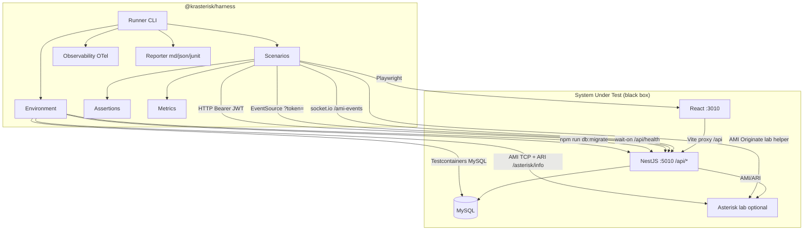

# Phase 11: Harness Layer — Research

**Researched:** 2026-08-04  
**Domain:** External black-box test harness (Vitest API runner + Playwright UI + Testcontainers environment + harness-side OTel)  
**Confidence:** HIGH (codebase-verified public surfaces); MEDIUM (Testcontainers/OTel integration patterns)

## Summary

Phase 11 builds `@krasterisk/harness` as a root npm workspace package that absorbs the existing top-level `e2e/` Playwright suite and adds a Vitest-driven API/realtime scenario runner. The harness acts as an external user: HTTP `/api/*`, browser UI, SSE, and (when lab-ready) Socket.IO `/ami-events` and direct AMI/ARI readiness probes — **never** importing `packages/*/src`.

The codebase already provides nearly all public contracts needed for the pre-Asterisk MVP (D-01): auth login, MOH CRUD, call-center UI routes, and SSE with JWT query auth. Two gaps block green CI today: **`GET /api/health` is waited on in `.github/workflows/e2e.yml` but has no controller in source** (D-H06), and **`MohController` lacks `@UseGuards(JwtAuthGuard)`** unlike peer controllers — harness must still send `Authorization: Bearer` and planner should flag this inconsistency for a minimal backend fix or explicit public-API decision.

**Primary recommendation:** Scaffold `/harness` with Vitest + Playwright + Testcontainers + harness OTel per locked CONTEXT; implement `GET /api/health` as the only required app touch; migrate `e2e/` in one PR; evolve `e2e.yml` → `harness.yml` on Node 22 with `workers=1`; gate Asterisk scenarios on AMI TCP + ARI `/asterisk/info` readiness.

## Architectural Responsibility Map

| Capability | Primary Tier | Secondary Tier | Rationale |
|------------|-------------|----------------|-----------|
| Auth + MOH CRUD scenarios | Harness (API client) | API / Backend | Black-box HTTP against `:5010/api/*` |
| Agent/supervisor UI smoke | Harness (Playwright) | Browser / Client | Routes on `:3010`; Vite proxies `/api` |
| SSE connect/heartbeat | Harness (SSE client) | API / Backend | `EventSource` to backend SSE endpoint |
| Environment (MySQL, migrate) | Harness (Environment) | Database / Storage | Testcontainers MySQL + `npm run db:migrate` CLI |
| Health readiness gate | API / Backend | Harness (wait-on) | CI polls `GET /api/health` — backend must expose it |
| AMI event assertions | Harness (socket.io-client) | API / Backend | Gateway namespace `/ami-events` on backend port |
| Asterisk originate lab setup | Harness (lab helper) | External Asterisk | Direct AMI TCP from env vars; not Nest imports |
| Metrics + JUnit/MD/JSON reports | Harness (Reporter) | — | Harness-owned artifact pipeline |
| Harness OTel spans/logs | Harness (Observability) | — | No Nest/React SDK in v1 (D-H05) |

## User Constraints (from CONTEXT.md)

### Locked Decisions

#### Architecture (pre-locked, approved 2026-08-04)
- **D-H01:** Absorb `e2e/` into `/harness` (target). Temporary shim only if needed for CI bridge; delete `e2e/` after green. — **Reversibility:** costly — dual entrypoints confuse authors
- **D-H02:** Default assertions = API + SSE + UI. SQL helper exists; use only for Asterisk/CC side-effects without API — not per-scenario default. — **Reversibility:** reversible
- **D-H03:** Asterisk / realtime in planning (env profile, SSE, `/ami-events`, gated live lab).
- **D-H04:** Vitest in `@krasterisk/harness`; do **not** migrate backend Jest unit suite. Frontend unit stays Vitest.
- **D-H05:** Observability v1 = harness-side OTel + structured logs only. No Nest/React OTel SDK without separate v2 approval.
- **D-H06:** Implement stable public `GET /api/health` (CI already waits; missing in source). — **Reversibility:** reversible

#### MVP scenarios
- **D-01:** Pre-Asterisk green bar = **Auth + MOH CRUD (API) + agent + supervisor UI smoke + SSE connect/heartbeat** (no live AMI events required).
- **D-02:** First CRUD domain = **MOH** (create → read → update → delete via public API).
- **D-03:** UI smoke covers **`/callcenter/agent` and `/callcenter/supervisor`** (not legacy `/operator` as primary).
- **D-04:** SSE without Asterisk = open EventSource with JWT `?token=`, assert connection / heartbeat / no immediate error.

#### Asterisk lab contract
- **D-05:** Minimal telephony happy-path = **Originate → agent ring/answer → hangup**.
- **D-06:** When lab unavailable: **skip** scenarios with `requires: ['asterisk']` (green CI without secrets).
- **D-07:** Ready gate = **AMI TCP connect + ARI HTTP `/asterisk/info` (or equivalent) + optional WSS reachable**.
- **D-08:** Lab config = **env vars + committed `.env.harness.example`** (secrets in CI secrets / local env only).

#### CI matrix
- **D-09:** Non-Asterisk harness on **every PR + push to main/develop** (evolve from `e2e.yml`).
- **D-10:** Asterisk lab job = **`workflow_dispatch` + optional nightly** (not every PR).
- **D-11:** Artifacts: **Playwright report + traces + harness markdown/JSON/JUnit**.
- **D-12:** v1 parallelism: **no sharding; `workers=1` in CI**.

#### Seed / tenant / accounts
- **D-13:** Credentials = **`PW_USER` / `PW_PASS`** (default `admin`/`admin`), same as current e2e.
- **D-14:** Multi-tenant isolation scenarios **out of MVP** (single tenant).
- **D-15:** Seed data via **public API** after login (not SQL dumps / ORM).
- **D-16:** Cleanup = **delete via API in `finally` / teardown** for scenario independence.

#### CLI / launch
- **D-17:** Root scripts: `npm run harness`, `harness:ui`, `harness:api`, `harness:asterisk`.
- **D-18:** Select scenarios by **`--scenario <id>`** and/or **`--tag <tag>`**.
- **D-19:** Default execution **sequential**; **`--parallel` opt-in**.
- **D-20:** Playwright headed/`--ui` as opt-in scripts only; API runner without watch mode in MVP.

#### Package layout
- **D-21:** `/harness` is npm **workspace member** `@krasterisk/harness`. — **Reversibility:** costly — workspace + lockfile churn
- **D-22:** **No** dependency on `@krasterisk/shared` (true black-box; minimal inline types if needed).
- **D-23:** Absorb `e2e/` in **one PR** (move + update scripts/CI + delete `e2e/` when green).
- **D-24:** Harness CI uses **Node 22** (align with root `engines`; fix current e2e Node 20 drift).

### Claude's Discretion
- Exact MOH API paths/payload shapes — follow Swagger `/api/docs` at plan/research time.
- Exact ARI readiness URL path if `/asterisk/info` differs in lab — verify against live Asterisk.
- Internal Runner registry file layout within `/harness` as long as D-17…D-20 CLI contracts hold.
- Whether PR-1 includes `/api/health` in same PR as scaffold or adjacent tiny PR — either OK if documented.

### Deferred Ideas (OUT OF SCOPE)
- Multi-tenant isolation harness scenarios (two tenants, negative visibility cases) — later phase/PR after MVP
- Queue-based call path as primary Asterisk scenario (originate path is MVP)
- App-level OpenTelemetry / Tracetest (v2)
- Backend Jest → Vitest migration
- CI sharding / high parallelism
- Dedicated `harness` seed user (vs admin/admin)
- Forever thin `e2e/` shim as target model (rejected)

## Project Constraints (from AGENTS.md)

- Monorepo: `packages/backend` (NestJS), `packages/frontend` (React FSD), `packages/shared` — harness is **outside** these packages [VERIFIED: codebase]
- Verify before done: `npm run lint`, `npm run test:backend`, `npm run test:frontend` [VERIFIED: AGENTS.md]
- Architecture docs: `packages/frontend/.idea/ARCHITECTURE.md`, `packages/backend/.idea/ARCHITECTURE.md` [VERIFIED: AGENTS.md]
- Do not migrate backend Jest or add Nest/React OTel in Phase 11 [VERIFIED: 11-CONTEXT.md]

## Standard Stack

### Core

| Library | Version | Purpose | Why Standard |
|---------|---------|---------|--------------|
| `vitest` | 4.1.10 | API + realtime scenario runner in `/harness` | Locked D-H04; already used by frontend unit tests [VERIFIED: npm registry] |
| `@playwright/test` | 1.62.1 | UI scenarios (absorb `e2e/`) | Already in repo `e2e/package.json`; industry E2E default [VERIFIED: npm registry] |
| `testcontainers` | 12.1.0 | MySQL (+ Redis later) isolation in CI/local | Locked in 11-ARCHITECTURE.md; dynamic ports + Ryuk cleanup [VERIFIED: npm registry] |
| `@testcontainers/mysql` | 12.1.0 | MySQL 8 module | Pairs with testcontainers core [VERIFIED: npm registry] |
| `@opentelemetry/sdk-node` | 0.221.0 | Harness-side trace export (v1) | Locked D-H05; no app instrumentation [VERIFIED: npm registry] |
| `@opentelemetry/api` | 1.9.1 | Span API in runner/assertions | OTel standard API [VERIFIED: npm registry] |
| `eventsource` | 4.1.0 | Node SSE client for D-04 | Native EventSource is browser-only; Node harness needs polyfill [VERIFIED: npm registry] |
| `socket.io-client` | 4.8.3 | AMI gateway assertions (PR-7) | Matches backend `@nestjs/platform-socket.io` / frontend dep [VERIFIED: npm registry] |
| `axios` | (latest ^1.x) | HTTP client for API scenarios | Already a frontend dep; simple Bearer auth [VERIFIED: codebase] |
| `wait-on` | 9.1.0 | Readiness polling (health, frontend) | Already used implicitly in CI via npx [VERIFIED: npm registry] |

### Supporting

| Library | Version | Purpose | When to Use |
|---------|---------|---------|-------------|
| `asterisk-manager` | ^0.2.0 | Lab-side AMI Originate for D-05 | Asterisk-gated scenarios only; harness env layer, not app import [VERIFIED: backend package.json dep name] |
| `@opentelemetry/exporter-trace-otlp-http` | 0.221.x | Export harness spans to collector | When `OTEL_EXPORTER_OTLP_ENDPOINT` set [ASSUMED: standard OTel Node pairing] |
| `pino` or `winston` | — | Structured JSON logs with `trace_id` | D-H05 structured logs [ASSUMED: planner picks one] |

### Alternatives Considered

| Instead of | Could Use | Tradeoff |
|------------|-----------|----------|
| Testcontainers | GHA `services: mysql` only | Current e2e.yml pattern; weaker for multi-dep; keep as interim PR-2 fallback |
| Vitest harness | Jest harness | Rejected — D-H04; backend Jest untouched |
| Nest TestingModule + Supertest | Live HTTP black-box | Rejected — violates black-box |
| Cypress | Playwright | Rejected in 11-ARCHITECTURE.md |

**Installation (harness package):**

```bash
npm install -w @krasterisk/harness vitest @playwright/test testcontainers @testcontainers/mysql \
  @opentelemetry/sdk-node @opentelemetry/api eventsource socket.io-client axios wait-on
```

## Package Legitimacy Audit

| Package | Registry | Age | Downloads/wk | Source Repo | Verdict | Disposition |
|---------|----------|-----|--------------|-------------|---------|-------------|
| `@playwright/test` | npm | recent | ~52M | github.com/microsoft/playwright | SUS (too-new seam) | Approved — Microsoft official; seam flags release cadence |
| `vitest` | npm | recent | ~88M | github.com/vitest-dev/vitest | SUS (too-new) | Approved — already in frontend |
| `testcontainers` | npm | recent | ~5.6M | github.com/testcontainers/testcontainers-node | SUS (too-new) | Approved — official Testcontainers Node |
| `@testcontainers/mysql` | npm | recent | ~308K | same | SUS (too-new) | Approved |
| `@opentelemetry/sdk-node` | npm | recent | ~16M | github.com/open-telemetry/opentelemetry-js | SUS (too-new) | Approved — CNCF official |
| `@opentelemetry/api` | npm | stable | ~74M | same | OK | Approved |
| `eventsource` | npm | stable | ~50M | github.com/EventSource/eventsource | OK | Approved |
| `socket.io-client` | npm | stable | ~13M | github.com/socketio/socket.io | OK | Approved |
| `axios` | npm | recent | ~118M | github.com/axios/axios | SUS (too-new) | Approved — already monorepo dep |

**Packages removed due to SLOP verdict:** none  
**Packages flagged as suspicious [SUS]:** `@playwright/test`, `vitest`, `testcontainers`, `@testcontainers/mysql`, `@opentelemetry/sdk-node`, `axios` — all are official/high-download; seam "too-new" is registry publish-date artifact, not slopsquat signal.

## Architecture Patterns

### System Architecture Diagram



### Recommended Project Structure

```
/harness
  package.json                 # @krasterisk/harness workspace member
  tsconfig.json
  vitest.config.ts             # API + realtime scenarios
  playwright.config.ts         # absorbed from e2e/
  runner/
  environment/
    compose/                   # optional local full stack
    testcontainers/
    readiness.ts               # health, AMI, ARI gates
    seed.ts                    # API seed after login
    teardown.ts
  scenarios/
    api/                       # auth, moh-crud
    ui/                          # agent/supervisor smoke (from e2e/)
    realtime/                  # sse-heartbeat, ami-events (gated)
  assertions/
    http.ts
    sse.ts
    ui.ts
    sql.ts                     # opt-in D-H02
  metrics/
  reporters/
  fixtures/                    # auth.fixture.ts port
  utils/
  reports/                     # gitignored
  .env.harness.example
  README.md
```

### Pattern 1: API Auth Client (black-box)

**What:** Login once per scenario/worker; attach `Authorization: Bearer ${accessToken}` to MOH and CC routes.  
**When to use:** All API scenarios (D-02, D-15, D-16).

**Verified contract** [VERIFIED: codebase — `auth.controller.ts`, `auth-response.dto.ts`, `e2e/fixtures/auth.fixture.ts`]:

| Step | Method | Path | Body | Response |
|------|--------|------|------|----------|
| Login | POST | `/api/auth/login` | `{ "login": string, "password": string }` | `{ accessToken, refreshToken, user }` |
| Refresh | POST | `/api/auth/refresh` | `{ refreshToken }` | same as login |

`user` payload fields: `uniqueid`, `login`, `name`, `level`, `role`, `exten`, `vpbx_user_uid`.

Env: `PW_USER` / `PW_PASS` (default `admin`/`admin`) — D-13.

### Pattern 2: MOH CRUD via Public API (D-02)

**Verified routes** [VERIFIED: codebase — `moh.controller.ts`, `moh.service.ts`]:

Global prefix: `api` [VERIFIED: `main.ts` line 143].

| Operation | Method | Path | Auth | Body / Notes |
|-----------|--------|------|------|--------------|
| List | GET | `/api/moh` | Bearer recommended* | Returns array of classes with `displayName`, `entries` |
| Read | GET | `/api/moh/:name` | Bearer recommended* | `:name` = Asterisk class name e.g. `moh_{uid}_sales_hold` |
| Create | POST | `/api/moh` | Bearer recommended* | `{ displayName, sort?, entries: [{ filename, position }] }` — **≥1 entry required** |
| Update | PUT | `/api/moh/:name` | Bearer recommended* | `{ displayName?, sort?, entries? }` |
| Delete | DELETE | `/api/moh/:name` | Bearer recommended* | `{ message, name }` |

\* **Gap:** `MohController` has **no** `@UseGuards(JwtAuthGuard)` unlike `queues`, `ivrs`, etc. Unauthenticated calls may run with `user_uid=0`. Harness MUST still send Bearer per tenant conventions; planner should add minimal `@UseGuards(JwtAuthGuard)` on MOH controller or document intentional exposure.

**Create example payload** (harness seed):

```json
{
  "displayName": "Harness Test Hold",
  "sort": "alpha",
  "entries": [{ "filename": "silence/1", "position": 1 }]
}
```

Class name generation: `moh_{vpbx_user_uid}_{slugified_displayName}` [VERIFIED: `moh.service.ts` `generateClassName`].

**Cleanup (D-16):** `DELETE /api/moh/{name}` in `afterAll`/`finally`.

### Pattern 3: SSE Connect Without Asterisk (D-04)

**Verified** [VERIFIED: codebase — `callcenter-sse.controller.ts`, `useCallCenterSSE.ts`]:

| Property | Value |
|----------|-------|
| URL | `GET /api/callcenter/events?token={accessToken}` |
| Auth | JWT via query param (`JwtAuthGuard` + `@UseGuards`) |
| Initial event | `fullSnapshot` (custom event type) |
| Heartbeat | Every **15_000 ms**, event type `heartbeat`, empty data |
| Browser pattern | `new EventSource(url)` — frontend uses `/api` via Vite proxy |

Harness Node path: use `eventsource` package with same URL against `http://localhost:5010` (direct backend, not Vite proxy).

**Assertions:** `onopen` within timeout; receive `fullSnapshot` or `heartbeat` within 20s; no immediate `onerror`.

### Pattern 4: UI Smoke — Agent + Supervisor (D-03)

**Routes** [VERIFIED: codebase — `router.tsx`, `roleStartResolver.ts`]:

| Route | Page | Notes |
|-------|------|-------|
| `/callcenter/agent` | `CallCenterAgentPage` | Primary operator workspace |
| `/callcenter/supervisor` | Supervisor view | KPI / queue monitor |
| `/operator` | Redirect → `/callcenter/agent` | Legacy — migrate tests away |

**Port from `e2e/fixtures/auth.fixture.ts`:** worker-scoped API login + `localStorage` seed (`accessToken`, `refreshToken`, `user`) before navigation.

**Update from current `operator-happy-path.spec.ts`:** replace `page.goto('/operator')` with `/callcenter/agent` and add parallel supervisor spec with status/KPI locators (i18n-tolerant regexes like existing tests).

**Playwright config to preserve** [VERIFIED: `e2e/playwright.config.ts`]:

- `baseURL`: `PLAYWRIGHT_BASE_URL` || `http://localhost:3010`
- `trace: 'retain-on-failure'`, `screenshot: 'only-on-failure'`, `video: 'retain-on-failure'`
- CI: `workers: 1`, `retries: 2`

### Pattern 5: Health Endpoint (D-H06)

**Gap** [VERIFIED: codebase grep + `e2e.yml`]:

- CI: `npx wait-on -t 60000 http://localhost:5010/api/health`
- Source: **no** `HealthController` or `/health` route under `packages/backend/src`

**Required minimal implementation:**

```typescript
// packages/backend/src/modules/health/health.controller.ts
@Controller('health')
export class HealthController {
  @Get()
  getHealth() {
    return { status: 'ok', timestamp: new Date().toISOString() };
  }
}
```

Register in `AppModule`. Public (no JWT). Returns 200 for wait-on.

### Pattern 6: Asterisk Lab Readiness + Originate (D-05–D-08)

**Env vars** (align with backend defaults) [VERIFIED: codebase — `ami.service.ts`, `ari-http-client.service.ts`]:

| Var | Default | Purpose |
|-----|---------|---------|
| `AMI_HOST` | `127.0.0.1` | AMI TCP host |
| `AMI_PORT` | `5038` | AMI TCP port |
| `AMI_LOGIN` | `krasterisk` | AMI username |
| `AMI_SECRET` | `''` | AMI secret |
| `ARI_PROTOCOL` | `http` | `http` or `https` |
| `ARI_HOST` | `localhost` | ARI host |
| `ARI_PORT` | `8088` | ARI port |
| `ARI_USER` | `krasterisk` | ARI basic auth user |
| `ARI_PASSWORD` | `''` | ARI basic auth password |
| `HAS_ASTERISK` | unset | Harness skip gate (existing e2e convention) |

**Ready gate (D-07)** in `environment/readiness.ts`:

1. **AMI TCP:** connect to `AMI_HOST:AMI_PORT` (socket connect probe)
2. **ARI HTTP:** `GET {ARI_PROTOCOL}://{ARI_HOST}:{ARI_PORT}/ari/asterisk/info` with basic auth [VERIFIED: `ari-http-client.service.ts` uses `/asterisk/info` on baseURL `{protocol}://{host}:{port}/ari`]
3. **Optional WSS:** probe backend Socket.IO or ARI WebSocket if lab requires

**Originate happy-path (D-05)** — two-tier approach:

| Tier | Mechanism | Use |
|------|-----------|-----|
| **Public API (preferred for outbound)** | `POST /api/callcenter/agent/login` then `POST /api/callcenter/agent/click-to-call` `{ target }` | Black-box; backend calls `amiService.originate` internally [VERIFIED: `callcenter.controller.ts`] |
| **Lab AMI helper (inbound ring to agent)** | Harness `environment/asterisk.ts` uses `asterisk-manager` npm client to send AMI `Originate` action | Required when simulating external inbound call; still black-box (no Nest imports) |

**Hangup via API:** `POST /api/callcenter/agent/hangup` [VERIFIED: `callcenter.controller.ts` via frontend API map].

**Skip when lab down (D-06):**

```typescript
// Vitest / Playwright
const requiresAsterisk = meta.requires?.includes('asterisk');
if (requiresAsterisk && process.env.HAS_ASTERISK !== '1') {
  test.skip();
}
```

### Pattern 7: Socket.IO AMI Gateway (PR-7)

**Verified** [VERIFIED: codebase — `ami.gateway.ts`]:

| Property | Value |
|----------|-------|
| Namespace | `/ami-events` |
| URL | `http://localhost:5010/ami-events` (Socket.IO path) |
| Events emitted | `peerStatus`, `agentStatus`, `newChannel`, `hangup`, `dashboardUpdate` |
| CORS | `origin: '*'` |

Harness connects with `socket.io-client`, subscribes to events during telephony scenarios; assert `newChannel` / `hangup` after originate.

### Anti-Patterns to Avoid

- **Importing `@krasterisk/shared` or backend models in harness** — violates D-H22 black-box
- **SQL seed/cleanup as default** — violates D-H02; API delete in teardown only
- **Keeping `e2e/` permanently** — violates D-H01
- **Node 20 in harness CI** — violates D-H24; root `engines.node >= 22`
- **Waiting on `/api/health` before implementing it** — CI fails today
- **Using `/operator` as primary UI route in new specs** — use `/callcenter/agent` (D-03)

## Don't Hand-Roll

| Problem | Don't Build | Use Instead | Why |
|---------|-------------|-------------|-----|
| Browser automation | Custom Puppeteer wrappers | `@playwright/test` | Traces, fixtures, CI artifacts already configured |
| MySQL CI isolation | Shell mysql install scripts | `testcontainers` + `@testcontainers/mysql` | Dynamic ports, auto cleanup (Ryuk) |
| HTTP test runner | Custom tap runner | `vitest` | Locked D-H04; JSON/junit reporters ecosystem |
| SSE in Node | Raw HTTP chunk parser | `eventsource` package | Correct EventSource semantics |
| Distributed tracing | Custom log correlation | `@opentelemetry/sdk-node` | Standard exporters; D-H05 |
| AMI protocol parsing | Custom TCP parser | `asterisk-manager` (lab only) | Battle-tested AMI action format |
| Readiness polling | sleep loops | `wait-on` | Already in CI pattern |
| JUnit/XML reports | String templating | Vitest `junit` reporter + Playwright built-in | D-11 artifact triad |

**Key insight:** The harness validates the **product as deployed** (ports, JWT, SSE, UI). In-process Nest `TestingModule` would miss proxy, CORS, and real auth flows.

## Common Pitfalls

### Pitfall 1: Health Endpoint Missing

**What goes wrong:** CI and local `wait-on` hang or fail against `:5010/api/health`.  
**Why it happens:** `e2e.yml` added wait before controller existed.  
**How to avoid:** Implement D-H06 in PR-1 or adjacent PR before switching CI wait target.  
**Warning signs:** Backend logs show listening on 5010 but wait-on times out.

### Pitfall 2: MOH Controller Auth Gap

**What goes wrong:** MOH scenarios pass without token but fail in production-like RBAC; or write to `user_uid=0`.  
**Why it happens:** `MohController` lacks `@UseGuards(JwtAuthGuard)`.  
**How to avoid:** Harness always sends Bearer; plan backend guard fix.  
**Warning signs:** CRUD works with `curl` without Authorization header.

### Pitfall 3: MOH Create Requires Entries

**What goes wrong:** `POST /api/moh` returns 400 "At least one playlist entry is required".  
**Why it happens:** `moh.service.create` validates `entries.length > 0`.  
**How to avoid:** Seed with `{ filename: "silence/1", position: 1 }` or similar fixture file name.  
**Warning signs:** 400 on create in harness API scenario.

### Pitfall 4: SSE Auth via Header

**What goes wrong:** 401 on SSE connect.  
**Why it happens:** `EventSource` cannot set `Authorization` header.  
**How to avoid:** Pass JWT as `?token=` query param only [VERIFIED: `callcenter-sse.controller.ts`].  
**Warning signs:** UI works but harness SSE fails when using fetch + Accept text/event-stream with Bearer only.

### Pitfall 5: Playwright baseURL vs API URL

**What goes wrong:** Auth fixture calls `/api/auth/login` on `:3010` — works via Vite proxy; API-only Vitest calls must target `:5010` directly.  
**Why it happens:** Frontend proxies `/api` → `:5010` [VERIFIED: `vite.config.ts`].  
**How to avoid:** `HARNESS_API_URL=http://localhost:5010` for Vitest; `PLAYWRIGHT_BASE_URL=http://localhost:3010` for UI.  
**Warning signs:** ECONNREFUSED on 5010 when only frontend is up.

### Pitfall 6: Node Version Drift in CI

**What goes wrong:** Engine mismatch warnings; subtle Vitest/Playwright behavior differences.  
**Why it happens:** `e2e.yml` uses `node-version: '20'`; root requires `>=22`.  
**How to avoid:** D-H24 — set `node-version: '22'` in evolved workflow.  
**Warning signs:** npm engine warnings in CI log.

### Pitfall 7: Asterisk Scenarios Blocking PR CI

**What goes wrong:** Red CI on every PR when lab unreachable.  
**Why it happens:** Missing `requires: ['asterisk']` skip guard.  
**How to avoid:** D-D06 skip pattern; separate `workflow_dispatch` job D-10.  
**Warning signs:** AMI connection timeout in default PR workflow.

## Code Examples

### Auth Login (API scenario)

```typescript
// Source: [VERIFIED: e2e/fixtures/auth.fixture.ts, auth.controller.ts]
const res = await fetch(`${apiUrl}/api/auth/login`, {
  method: 'POST',
  headers: { 'Content-Type': 'application/json' },
  body: JSON.stringify({
    login: process.env.PW_USER ?? 'admin',
    password: process.env.PW_PASS ?? 'admin',
  }),
});
if (!res.ok) throw new Error(`Login failed: ${res.status}`);
const { accessToken, refreshToken, user } = await res.json();
```

### MOH CRUD Sequence

```typescript
// Source: [VERIFIED: moh.controller.ts, moh.service.ts]
const headers = {
  Authorization: `Bearer ${accessToken}`,
  'Content-Type': 'application/json',
};

const createRes = await fetch(`${apiUrl}/api/moh`, {
  method: 'POST',
  headers,
  body: JSON.stringify({
    displayName: `Harness ${Date.now()}`,
    sort: 'alpha',
    entries: [{ filename: 'silence/1', position: 1 }],
  }),
});
const created = await createRes.json();
const name = created.name;

await fetch(`${apiUrl}/api/moh/${name}`, { headers }); // GET
await fetch(`${apiUrl}/api/moh/${name}`, {
  method: 'PUT',
  headers,
  body: JSON.stringify({ sort: 'random' }),
});
await fetch(`${apiUrl}/api/moh/${name}`, { method: 'DELETE', headers });
```

### SSE Heartbeat Assert (Node)

```typescript
// Source: [VERIFIED: callcenter-sse.controller.ts — SSE_HEARTBEAT_MS = 15_000]
import EventSource from 'eventsource';

await new Promise<void>((resolve, reject) => {
  const es = new EventSource(
    `${apiUrl}/api/callcenter/events?token=${encodeURIComponent(accessToken)}`,
  );
  const timer = setTimeout(() => reject(new Error('SSE timeout')), 25_000);
  es.addEventListener('fullSnapshot', () => { clearTimeout(timer); es.close(); resolve(); });
  es.addEventListener('heartbeat', () => { clearTimeout(timer); es.close(); resolve(); });
  es.onerror = () => { clearTimeout(timer); es.close(); reject(new Error('SSE error')); };
});
```

### Playwright Auth Fixture (absorb)

```typescript
// Source: [VERIFIED: e2e/fixtures/auth.fixture.ts]
await page.addInitScript((s) => {
  localStorage.setItem('accessToken', s.accessToken);
  localStorage.setItem('refreshToken', s.refreshToken);
  localStorage.setItem('user', JSON.stringify(s.user));
}, session);
await page.goto('/callcenter/agent');
```

### Asterisk Readiness Gate

```typescript
// Source: [VERIFIED: ami.service.ts, ari-http-client.service.ts]
import net from 'net';

async function amiTcpReady(host: string, port: number): Promise<boolean> {
  return new Promise((resolve) => {
    const s = net.connect({ host, port }, () => { s.end(); resolve(true); });
    s.on('error', () => resolve(false));
  });
}

async function ariInfoReady(base: string, user: string, pass: string): Promise<boolean> {
  const auth = Buffer.from(`${user}:${pass}`).toString('base64');
  const res = await fetch(`${base}/asterisk/info`, {
    headers: { Authorization: `Basic ${auth}` },
  });
  return res.ok;
}
// base = `${ARI_PROTOCOL}://${ARI_HOST}:${ARI_PORT}/ari`
```

### AMI Originate (lab helper — gated)

```typescript
// Source: [VERIFIED: ami.service.ts originate action shape]
// Use asterisk-manager or raw AMI in harness/environment/asterisk.ts only
const originate = {
  action: 'Originate',
  channel: 'PJSIP/harness-caller',
  context: 'from-internal',
  exten: '101',
  priority: '1',
  callerid: 'Harness <999>',
  async: 'true',
};
// Then assert via SSE agentUpdate or POST /api/callcenter/agent/hangup
```

## CI Evolve Path (e2e.yml → harness.yml)

**Current state** [VERIFIED: `.github/workflows/e2e.yml`]:

| Aspect | Current | Target (D-09–D-12, D-24) |
|--------|---------|----------------------------|
| Trigger | push/PR main+develop, workflow_dispatch | Same for non-Asterisk job |
| Node | 20 | **22** |
| MySQL | GHA service container | Interim: keep; PR-2+: Testcontainers option |
| Backend start | `npm run dev:backend &` + wait `/api/health` | Same after D-H06 |
| Frontend start | `npm run dev:frontend &` + wait `:3010` | Same |
| Test cwd | `e2e/` | `harness/` workspace |
| Install browsers | `e2e` prefix | `@krasterisk/harness` |
| Workers | 1 in CI | 1 (D-12) |
| Artifacts | playwright-report only | + harness md/json/junit (D-11) |
| Asterisk job | none | Separate workflow: workflow_dispatch + nightly (D-10) |

**Root scripts migration** [VERIFIED: `package.json`]:

```json
"harness": "npm run test -w @krasterisk/harness",
"harness:ui": "npm run test:ui -w @krasterisk/harness",
"harness:api": "npm run test:api -w @krasterisk/harness",
"harness:asterisk": "npm run test:asterisk -w @krasterisk/harness"
```

Replace `test:e2e` / `test:e2e:install` after absorption (D-23).

## Environment Availability

| Dependency | Required By | Available | Version | Fallback |
|------------|------------|-----------|---------|----------|
| Node.js | Harness + app | ✓ | v22.13.0 | — |
| npm workspaces | D-21 | ✓ | 11.x | — |
| Docker | Testcontainers | ✓ | 20.10.22 | GHA `services: mysql` interim |
| MySQL 8 | Backend + harness | ✓ (CI service) | 8.0 image in e2e.yml | Testcontainers mysql:8 |
| Playwright Chromium | UI scenarios | install step | @playwright/test 1.62.1 | — |
| Asterisk lab | D-05 scenarios only | ✗ local | — | Skip `requires: ['asterisk']` |
| OTEL collector | Harness OTel export | ✗ | — | Console exporter fallback |

**Missing dependencies with no fallback:**
- None for pre-Asterisk MVP (D-01)

**Missing dependencies with fallback:**
- Asterisk lab → skip gated scenarios (D-06)
- Docker absent on runner → keep GHA MySQL service pattern until Testcontainers viable

## Validation Architecture

### Test Framework

| Property | Value |
|----------|-------|
| Harness API runner | Vitest 4.1.10 — `harness/vitest.config.ts` (Wave 0) |
| Harness UI runner | Playwright 1.62.1 — `harness/playwright.config.ts` (migrate from `e2e/`) |
| App unit (unchanged) | Backend Jest; Frontend Vitest (`vite.config.ts` test block) |
| Quick run command | `npm run harness:api` / `npm run harness:ui` |
| Full suite command | `npm run harness` |
| Phase gate | `npm run lint && npm run test:backend && npm run test:frontend && npm run harness` |

### Phase Requirements → Test Map

| Req ID | Behavior | Test Type | Automated Command | File Exists? |
|--------|----------|-----------|-------------------|-------------|
| D-01 | Auth login | API | `vitest run scenarios/api/auth` | ❌ Wave 0 |
| D-02 | MOH CRUD | API | `vitest run scenarios/api/moh-crud` | ❌ Wave 0 |
| D-03 | Agent UI smoke | UI | `playwright test scenarios/ui/agent-smoke` | ❌ migrate from e2e |
| D-03 | Supervisor UI smoke | UI | `playwright test scenarios/ui/supervisor-smoke` | ❌ Wave 0 |
| D-04 | SSE heartbeat | Realtime | `vitest run scenarios/realtime/sse-heartbeat` | ❌ Wave 0 |
| D-H06 | Health 200 | API/smoke | `curl localhost:5010/api/health` | ❌ backend + harness |
| D-05 | Originate path | Realtime+gated | `vitest run --grep asterisk` | ❌ PR-7 |
| D-11 | JUnit report | Reporter | harness reporter output | ❌ PR-5 |

### Sampling Rate

- **Per task commit:** `npm run harness:api` (fast) or affected UI spec
- **Per wave merge:** `npm run harness`
- **Phase gate:** Full suite green before `/gsd-verify-work 11`

### Wave 0 Gaps

- [ ] `harness/package.json` + workspace entry in root
- [ ] `harness/vitest.config.ts`
- [ ] `harness/playwright.config.ts` (from `e2e/`)
- [ ] `harness/fixtures/auth.fixture.ts` (from `e2e/`)
- [ ] `packages/backend` — `GET /api/health` controller
- [ ] `.github/workflows/harness.yml` (evolve from `e2e.yml`)
- [ ] `@UseGuards(JwtAuthGuard)` on `MohController` (recommended minimal fix)

## Security Domain

### Applicable ASVS Categories

| ASVS Category | Applies | Standard Control |
|---------------|---------|------------------|
| V2 Authentication | yes | Harness uses same login flow; stores tokens in memory/fixture only |
| V3 Session Management | partial | Refresh via `/api/auth/refresh`; no harness session store |
| V4 Access Control | yes | Bearer JWT; tenant from token not body |
| V5 Input Validation | yes | Assert 4xx on bad MOH payloads; no injection in scenario IDs |
| V6 Cryptography | no | Harness does not manage secrets beyond env vars |

### Known Threat Patterns

| Pattern | STRIDE | Standard Mitigation |
|---------|--------|---------------------|
| Credentials in logs | Information disclosure | Redact `PW_*`, JWT in harness structured logs |
| Committed secrets | Information disclosure | `.env.harness.example` only; CI secrets for lab |
| SQL assertion helper misuse | Tampering | Opt-in only D-H02; parameterized queries if used |

## Assumptions Log

| # | Claim | Section | Risk if Wrong |
|---|-------|---------|---------------|
| A1 | `@opentelemetry/exporter-trace-otlp-http@0.221.x` pairs with sdk-node 0.221 | Standard Stack | Export config mismatch — pin versions together |
| A2 | `silence/1` MOH filename exists on target Asterisk | MOH CRUD | Create fails if sound missing — use tenant-valid filename from lab docs |
| A3 | Admin user has MOH + CC permissions in seeded DB | MVP scenarios | 403 on CRUD — verify seed/migrations |
| A4 | Socket.IO client path for `/ami-events` is `http://host:5010/ami-events` | AMI gateway | Connection URL may need `/socket.io` prefix — verify at PR-7 |
| A5 | Inbound originate requires lab AMI helper (not public HTTP) | Asterisk | May need ops-provided test trunk context name |

## Open Questions (RESOLVED)

1. **MOH JWT guard** — RESOLVED: Add `@UseGuards(JwtAuthGuard)` at MohController class level in Plan 03 Task 2, matching ivrs.controller.ts pattern; harness always sends Bearer.
   - What we know: Controller has no `@UseGuards(JwtAuthGuard)`.
   - What's unclear: Intentional public API vs oversight.
   - Recommendation: Add guard in minimal backend PR; harness always sends Bearer.

2. **Valid MOH entry filename for CI** — RESOLVED: Assert HTTP 200 roundtrip only (create, GET, PUT, DELETE); do not assert Asterisk audio playback. Use silence/1 entry filename per RESEARCH Pitfall 3.
   - What we know: Create requires ≥1 entry with `filename` under `ASTERISK_SOUNDS_PATH`.
   - What's unclear: Which files exist in CI without Asterisk.
   - Recommendation: MOH API scenario may succeed on DB write even if AMI reload noop when AMI disconnected [VERIFIED: `moh.service.spec.ts` mocks `amiService.isConnected` false] — assert HTTP 200 + GET roundtrip, not audio playback.

3. **Supervisor UI smoke locators** — RESOLVED: Use `getByRole('heading')` plus queue monitor KPI regex patterns mirroring agent spec in Plan 04 Task 2.
   - What we know: Agent spec uses i18n regex patterns.
   - What's unclear: Stable supervisor-specific headings without reading FE source in harness.
   - Recommendation: Prefer `getByRole('heading')` + queue monitor KPI regexes similar to agent spec during migration.

## State of the Art

| Old Approach | Current Approach | When Changed | Impact |
|--------------|------------------|--------------|--------|
| Top-level `e2e/` outside workspaces | `@krasterisk/harness` workspace | Phase 11 | Single lockfile, unified scripts |
| GHA MySQL service only | Testcontainers hybrid | Phase 11 PR-2 | Better local/CI parity |
| No health endpoint | `GET /api/health` | Phase 11 D-H06 | CI wait succeeds |
| `/operator` UI tests | `/callcenter/agent` | Phase 11 D-03 | Match product routes |

## Sources

### Primary (HIGH confidence — codebase verified)
- `packages/backend/src/modules/moh/moh.controller.ts` — MOH REST routes
- `packages/backend/src/modules/auth/auth.controller.ts` — login contract
- `packages/backend/src/modules/callcenter/callcenter-sse.controller.ts` — SSE auth + heartbeat
- `packages/backend/src/modules/ami/ami.gateway.ts` — Socket.IO namespace
- `packages/backend/src/modules/ami/ami.service.ts` — AMI env defaults + Originate shape
- `packages/backend/src/modules/ari/ari-http-client.service.ts` — ARI `/asterisk/info`
- `e2e/fixtures/auth.fixture.ts`, `e2e/playwright.config.ts`, `e2e/tests/operator-happy-path.spec.ts`
- `.github/workflows/e2e.yml` — CI evolve baseline
- `package.json` — workspaces, engines Node ≥22

### Secondary (MEDIUM confidence)
- `.planning/phases/11-harness-layer-external-scenario-runner-environment-observabi/11-ARCHITECTURE.md` — stack decisions
- `.planning/phases/11-harness-layer-external-scenario-runner-environment-observabi/11-CONTEXT.md` — locked decisions
- npm registry version checks (2026-08-04 session)

### Tertiary (LOW confidence — ASSUMED)
- OTel exporter pairing — confirm at PR-6 implementation

## Metadata

**Confidence breakdown:**
- Standard stack: **HIGH** — locked in CONTEXT + verified npm versions + existing Playwright in repo
- Architecture: **HIGH** — public API surfaces verified in source; health gap confirmed
- Pitfalls: **HIGH** — MOH auth gap and create validation verified in source
- Asterisk lab: **MEDIUM** — AMI/ARI env verified; originate context/exten lab-specific (A5)

**Research date:** 2026-08-04  
**Valid until:** 2026-09-04 (stable stack); re-verify MOH/auth if backend controllers change
