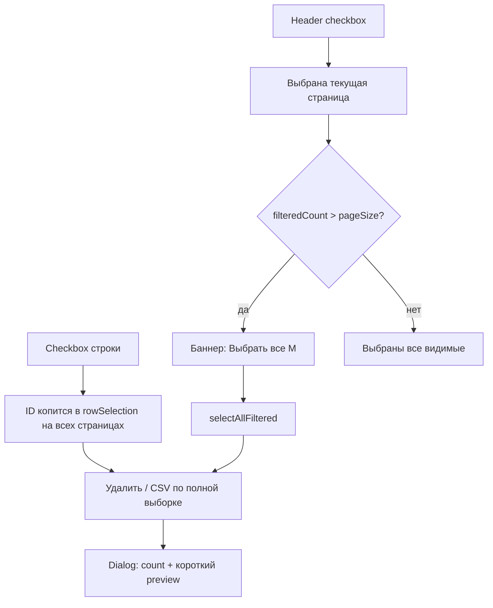

# Krasterisk v4 — Архитектура и план разработки

> **Внимание:** Данный проект (v4) является полным переписыванием (rewrite) системы Krasterisk v3. Стек полностью меняется с legacy PHP на современный NestJS (TypeScript) для Backend и React 19 (FSD) для Frontend. Это относится ко всем модулям.

## Стек технологий

| Компонент | Технология | Версия |
|---|---|---|
| **Backend** | NestJS | 11.x |
| **Frontend** | React (FSD) | 19.x |
| **Bundler** | Vite | 6.x |
| **Стилизация** | Tailwind CSS + shadcn/ui (Radix + CVA) | 4.x |
| **State** | Redux Toolkit + RTK Query | 2.x |
| **ORM** | Sequelize | 6.x |
| **DB** | MySQL (existing Asterisk Realtime) | — |
| **Auth** | JWT + bcrypt | — |
| **Real-time** | Socket.IO (AMI events → browser) | 4.x |
| **Asterisk** | AMI (persistent TCP) + ARI (HTTP + WS) | — |
| **i18n** | i18next | 24.x |
| **Таблицы** | TanStack Table | 8.x |
| **Графики** | Recharts | 2.x |
| **Анимации** | Motion (Framer) | 12.x |
| **Иконки** | Lucide React | — |
| **TypeScript** | | 5.7+ |
| **Node.js** | | 20+ |

---

## Архитектура монорепо

```
krasterisk_v4/
├── package.json              # root workspaces
├── tsconfig.base.json        # shared TS config
├── .env.example
├── .gitignore
└── packages/
    ├── shared/               # @krasterisk/shared — types, enums, DTOs
    │   └── src/
    │       ├── enums/
    │       └── types/
    ├── backend/              # @krasterisk/backend — NestJS API
    │   └── src/
    │       ├── main.ts
    │       ├── app.module.ts
    │       └── modules/
    │           ├── auth/     # JWT login, guards, strategy
    │           ├── users/    # User model + CRUD
    │           ├── peers/    # SIP peers CRUD
    │           ├── trunks/   # (planned)
    │           ├── queues/   # (planned)
    │           ├── routes/   # (planned)
    │           ├── reports/  # CDR (planned)
    │           └── ami/      # AMI Service + WS Gateway
    └── frontend/             # @krasterisk/frontend — React FSD
        └── src/
            ├── app/          # Store, Router, Layout, Styles
            ├── pages/        # LoginPage, DashboardPage, ...
            ├── widgets/      # Sidebar, Header
            ├── features/     # Auth slice, ...
            ├── entities/     # (planned)
            └── shared/       # API (RTK Query), UI, Hooks, i18n, Lib
```

---

## Интеграция с Asterisk

### AMI (Asterisk Manager Interface)
- **Тип:** Persistent TCP connection
- **Библиотека:** `asterisk-manager`
- **Поведение:** Подключается при старте, автоматически реконнектится
- **События:** PeerStatus, QueueMemberStatus, NewChannel, Hangup
- **Поток:** AMI Event → AmiService → AmiGateway (WebSocket) → Browser

### ARI (Asterisk REST Interface)
- **Тип:** HTTP + WebSocket
- **Библиотека:** `ari-client`
- **Применение:** Originate, Spy, Transfer, Bridge management
- **Статус:** Planned (Phase 3)

### База данных
- **Подключение:** Sequelize → existing MySQL (krasterisk DB)
- **synchronize: false** — НЕ модифицирует таблицы
- **Таблицы:** users, sippeers, trunks, queue_table, cdr

---

## UI/UX дизайн

### Тема
- **Режим:** Dark-first
- **Фон:** #0c1214 (login), #09090b (app)
- **Primary:** #6366f1 (Indigo)
- **Эффекты:** Glassmorphism, glow, gradient text, floating animations
- **Шрифт:** Inter (Google Fonts)

### Дизайн-система и Стандарты (FSD)
Проект использует строгую дизайн-систему, основанную на паттернах `aiPBX`, но со своими CSS-переменными в `design-system.scss`.
- **Позиционирование (Layout):** Запрещено использование тегов `div` и `span` с inline `flex` классами на уровне компонентов фич и страниц. Для позиционирования необходимо использовать **Stack**-компоненты: `<VStack>`, `<HStack>`, `<Flex>`.
- **Строгий отказ от базовых HTML-тегов:** В слоях выше `shared` (то есть в `entities`, `features`, `widgets`, `pages`) **строго запрещено** использование нативных тегов разметки, таких как `div`, `span`, `label`, `select`, `input`, `button`. 
    - Любой текст должен рендериться через компонент `<Text>` или `<Typography>`.
    - Любые инпуты, лейблы, селекты, кнопки должны браться ИСКЛЮЧИТЕЛЬНО из `@/shared/ui/`.
    - Если нужен сложный компонент из сторонней библиотеки (фреймворка) — он **обязательно** оборачивается в собственную обертку (wrapper) внутри `shared/ui` с инкапсуляцией Public API.
- **Стилизация:** TailwindCSS используется только внутри базовых UI компонентов (`shared/ui`). На уровне бизнес-логики (`features/`, `pages/`, `widgets/`) кастомная стилизация **обязана** осуществляться через SCSS-модули с CSS-переменными из дизайн-системы.
- **Z-Index:** Хардкодирование `z-index` (например, `z-index: 100`) **строго запрещено**. Для управления слоями необходимо использовать только глобальные CSS-переменные из `globals.css` (например, `var(--z-index-dropdown)`, `var(--z-index-modal)` и т.д.). Это предотвращает конфликты перекрытия и "z-index войны".
- **Optimistic toggles (MUST):** Любой `Switch` / toggle, который **сразу пишет на сервер** (нет отдельной кнопки Save) и чей `checked` берётся из RTK Query cache, **обязан** обновлять UI мгновенно:
  1. В mutation — `async onQueryStarted` → `api.util.updateQueryData(...)` (optimistic patch).
  2. При успехе — записать ответ сервера в тот же cache entry (или оставить patch).
  3. При ошибке — `patchResult.undo()` **и** показать toast/ошибку пользователю.
  4. Не полагаться только на `invalidatesTags` + refetch: это даёт заметную задержку бегунка до ответа сети.
  - Формы с локальным `useState` + явной кнопкой «Сохранить» уже «optimistic» на уровне UI — правило про RTK-patch к ним не применяется, пока toggle не биндится напрямую к query cache.
  - Эталон: `updateMyNotifications` / `updateMyUiCustomization` в `shared/api/endpoints/callCenterApi.ts`.
- **Table row actions (MUST):** Колонка действий в `DataTable` / списках (edit / copy / delete) **обязана** использовать `TableRowActions` + `TableRowAction` из `@/shared/ui`. Тот же паттерн — на мобильных карточках строки (hybrid mobile-card).
  - Нельзя: нативный `<button>` / `Button variant="ghost" size="icon"` + Tailwind `hover:bg-white/5` / `hover:bg-accent` / `className="h-8 w-8"` на иконках — фон кнопки сливается с hover строки, иконка «пропадает».
  - Визуал: muted иконка → на hover только смена цвета (`foreground` / `destructive` для `danger`), **без** заливки фона.
  - Порядок, если есть копирование: **Edit → Copy → Delete**. Copy только `dispatch(openCopyModal)`, без прямого API.
  - Обязательны `title` и `aria-label`.
  - Lucide внутри `TableRowAction`: только `<Pencil />` / `<Copy />` / `<Trash2 />` **без** `className`, `size`, `text-primary`, `text-destructive`. Размер задаёт `TableRowActions.module.scss` (`svg { width: 1rem; height: 1rem }`). Цвет по умолчанию - muted; destructive **только** на hover у `danger`.
  - **Запрещённые иконки edit:** `Edit2`, `FileEdit`, `SquarePen` - только `Pencil`.
  - **Запрещённый цвет «сразу»:** `className="w-4 h-4 text-primary"` / `text-destructive` на иконке - иконка кричит до hover и расходится с каноном.
  - **Запрещённый hover-фон:** `hover:bg-white/10` / `hover:bg-white/5` / `hover:bg-destructive/10` / `hover:bg-accent` на кнопке действия.
  - Copy **не обязателен**: кнопка есть только если в slice есть `openCopyModal` (эталон без Copy - `ContextsTable`). Иначе только Edit + Delete.
  - Не дублировать `.actionBtn` в feature SCSS.
  - Эталоны: `features/contexts/ui/ContextsTable/useContextsTableColumns.tsx`, `features/trunks/ui/TrunksTable/useTrunksTableColumns.tsx`, `features/users/ui/UsersTable/useUsersTableColumns.tsx`, `features/routes/ui/RoutesTable/RoutesTable.tsx`.
  - Компонент: `shared/ui/TableRowActions`.
  - Полный канон страницы + таблицы: см. «Паттерн страницы списка и таблицы» ниже (в т.ч. **§4.2** массовое выделение, **§4.2.1** кросс-страничный select / баннер «Выбрать все N», **§4.2.2** Dialog preview, **§4.2.3** CSV).
- **Cross-page table selection (MUST):** В CRUD-`DataTable` с client-side пагинацией header checkbox выбирает **только текущую страницу**; выбор отдельных строк **сохраняется** между страницами; при «вся страница» и `filteredCount > pageSize` — баннер `renderBanner` («Выбрать все N» / «Снять»). Массовые действия и CSV работают по полному `rowSelection`. Bulk confirm — Dialog с коротким preview (лимит 8), не `window.confirm` со всеми именами. Эталон: `features/endpoints/ui/EndpointsTable`. Детали — «Паттерн страницы списка и таблицы» §4.2–4.2.3.
- **Focus ring inset (MUST):** обводка фокуса у полей ввода **обязана** рисоваться **внутри** рамки (`ring-inset`). Контейнеры модалок (`DialogContent size="large"` → `overflow: hidden`) и тело со скроллом (`.scrollBody` / `.formBody` → `overflow-y: auto`) **обрезают** внешний ring / `box-shadow` - слева/сверху «пропадает» половина выделения.
  - Tailwind: `focus:outline-none focus:ring-2 focus:ring-inset focus:ring-ring focus:border-transparent` (для обёрток вроде `TagInput` - `focus-within:…`).
  - Запрещено: `focus:ring-1` / `focus-within:ring-1` без `ring-inset`, внешний `box-shadow: 0 0 0 2px` на контроле внутри скролла.
  - Эталоны: `shared/ui/Input`, `shared/ui/Select`, `shared/ui/Textarea`, `shared/ui/TagInput`. Новый контрол в `shared/ui` копирует этот же focus-паттерн.

```tsx
import { TableRowActions, TableRowAction } from '@/shared/ui';
import { Pencil, Copy, Trash2 } from 'lucide-react';

<TableRowActions>
  <TableRowAction title={t('common.edit')} aria-label={t('common.edit')} onClick={onEdit}>
    <Pencil />
  </TableRowAction>
  <TableRowAction title={t('common.copy')} aria-label={t('common.copy')} onClick={onCopy}>
    <Copy />
  </TableRowAction>
  <TableRowAction danger title={t('common.delete')} aria-label={t('common.delete')} onClick={onDelete}>
    <Trash2 />
  </TableRowAction>
</TableRowActions>
```

- **No emoji icons (MUST):** Unicode-эмодзи **запрещены** как иконки UI (кнопки, лейблы, бейджи, tooltips, empty states, tab triggers). Для иконок используется **только Lucide React** (`lucide-react`). Подсказки у полей — текст (`Text` / `InfoTooltip` с Lucide), не символы вроде ℹ️ / ❓ / ✅.
  - Эталон без emoji-иконок у лейблов: `features/users/ui/UserFormModal/UserFormModal.tsx`.
- **Password fields (MUST):** Поля пароля с возможностью просмотра используют `PasswordInput` из `@/shared/ui` — toggle «показать/скрыть» **внутри** поля (Eye/EyeOff), не отдельной кнопкой рядом. Генерация пароля (если нужна) — соседняя action-кнопка вне инпута.
  - Компонент: `shared/ui/PasswordInput`. Эталон: `features/users/ui/UserFormModal/UserFormModal.tsx`.

---

### Система дизайн-токенов и стилизация через SCSS-модули

#### Источник токенов

Все дизайн-токены проекта определены в `src/app/styles/globals.css` в директиве `@theme` (Tailwind v4). Это **единственный источник правды** для цветов, скруглений и z-индексов.

```css
/* globals.css */
@theme {
  --color-background: #09090b;
  --color-foreground: #fafafa;
  --color-card:       #0a0a0f;
  --color-border:     #27272a;  /* light: #e4e4e7 */
  --color-primary:    #6366f1;
  --color-muted:      #18181b;
  --color-muted-foreground: #71717a;
  --color-destructive: #ef4444;
  --color-success:    #22c55e;
  --color-warning:    #f59e0b;
  --color-info:       #3b82f6;
  --radius-sm: 0.375rem;
  --radius-md: 0.5rem;
  --radius-lg: 0.75rem;
  --radius-xl: 1rem;
}
```

#### Правила использования токенов в SCSS-модулях

**✅ Правильно** — использовать `var(--color-*)` и `var(--radius-*)` напрямую:

```scss
/* features/my-feature/ui/MyCard/MyCard.module.scss */
.card {
  background:    var(--color-card);      /* НЕ hsl(var(--card)) */
  border:        1px solid var(--color-border);
  border-radius: var(--radius-lg);
  transition:    box-shadow 0.2s ease;

  &:hover {
    box-shadow: 0 4px 16px rgba(0, 0, 0, 0.1);
  }
}

.icon { color: var(--color-primary); }
.label { color: var(--color-muted-foreground); }
```

**❌ Запрещено** — старый shadcn/ui синтаксис через `hsl(var(--border))`:

```scss
/* ❌ НЕПРАВИЛЬНО — такие переменные в этом проекте не существуют */
.card {
  border: 1px solid hsl(var(--border));    /* ❌ --border не определён */
  background: hsl(var(--card));            /* ❌ --card не определён */
  color: hsl(var(--muted-foreground));     /* ❌ --muted-foreground не определён */
}
```

#### Прозрачные варианты токенов: `color-mix()`

Для создания полупрозрачных вариантов токенных цветов используется CSS `color-mix()`. Это современный стандарт, работающий в Chrome 111+, Firefox 113+, Safari 16.2+.

```scss
/* ✅ Правильно — прозрачность через color-mix() */
.tabsRow {
  background: color-mix(in srgb, var(--color-muted) 30%, transparent);
  border-bottom: 1px solid var(--color-border);
}

.badgeDanger {
  background: color-mix(in srgb, var(--color-destructive) 12%, transparent);
  color:       var(--color-destructive);
  border-color: color-mix(in srgb, var(--color-destructive) 25%, transparent);
}

/* ❌ Запрещено — произвольные rgba() без токенов */
.card {
  background: rgba(10, 10, 15, 0.7); /* ❌ хардкод цвета вне системы */
}
```

#### Отношение Tailwind и SCSS-модулей

| Слой | Tailwind в JSX | SCSS-модули |
|------|---------------|-------------|
| `shared/ui` | ✅ Разрешено | ✅ Разрешено |
| `entities/` | ❌ Запрещено | ✅ Обязательно |
| `features/` | ❌ Запрещено | ✅ Обязательно |
| `widgets/`  | ❌ Запрещено | ✅ Обязательно |
| `pages/`    | ❌ Запрещено | ✅ Обязательно |

> **Почему нельзя Tailwind в `features/pages`?**  
> Tailwind v4 + `@tailwindcss/vite` и SCSS-модули компилируются раздельно. `@apply` в SCSS не работает с этим стеком. Tailwind-классы в JSX выше `shared/ui` создают смешение ответственностей: дизайн-система "вытекает" из компонентного слоя в бизнес-логику, что затрудняет рефакторинг темы.

#### Структура SCSS-модуля (обязательный шаблон)

```scss
/* ─────────────────────────────────────────────────────
   [ComponentName] — краткое описание
   Design tokens: var(--color-*) from globals.css @theme
   ───────────────────────────────────────────────────── */

/* 1. Layout — position, flex/grid, sizing */
.wrapper { ... }

/* 2. Visual — colors, border, shadow */
.card {
  background:    var(--color-card);
  border:        1px solid var(--color-border);
  border-radius: var(--radius-lg);
}

/* 3. States — hover, active, disabled */
.card:hover { box-shadow: 0 4px 16px rgba(0,0,0,0.1); }

/* 4. Variants — color modifiers */
.danger { color: var(--color-destructive); }

/* 5. Animations — keyframes */
@keyframes spin { ... }
```

#### Теневая видимость в светлой теме

В светлой теме `--color-border: #e4e4e7` (светло-серый). Для элементов, которые должны быть чётко видны на белом фоне, **обязательно** добавлять `box-shadow`:

```scss
.card {
  border: 1px solid var(--color-border);
  /* Важно для светлой темы — делает карточку видимой */
  box-shadow: 0 1px 4px rgba(0, 0, 0, 0.06);
}
```

---

- **Локализация:** Все текстовые строки должны выводиться через хук `useTranslation()`. **Важно:** нельзя просто добавлять i18n ключи в JSX — разработчик обязан убедиться в наличии словарей (namespaces). Если словаря или ключей нет в `shared/config/locales/` (как `ru.ts`, так и `en.ts`), их необходимо создать и добавить переводы для **всех поддерживаемых языков**. Хардкод текста в вызовах `t()` как фоллбэк разрешен только временно, окончательный маппинг в словарях — обязателен.
- **Иконки:** Использование эмодзи-иконок (🎲, ☎, 📊 и т.д.) в UI **строго запрещено**. Для иконографии использовать только SVG-иконки из `lucide-react` или собственные SVG-ассеты, размещённые в `shared/assets/`. Это обеспечивает консистентность, масштабируемость и одинаковый вид на всех платформах. В `features/` / `pages/` размер и цвет — проп `size` + SCSS (не Tailwind `w-4 h-4 text-primary`). В `TableRowAction` иконка без `className` (см. «Паттерн страницы списка и таблицы»).
- **Типографика (тире):** Использование длинного тире `—` (em dash, U+2014) в UI-текстах, placeholder-ах, option-ах и fallback-строках `t()` **строго запрещено**. Вместо него используется обычный дефис-минус `-` или запятая. Примеры: `'Выберите действие'` вместо `'— Выберите действие —'`; `'16 - Normal Clearing'` вместо `'16 — Normal Clearing'`. В JSDoc-комментариях допускается.
- **Адаптивность (Responsive Design):** Все компоненты **обязаны** корректно отображаться на экранах от 360px (мобильный) до 2560px (десктоп). Адаптивность не опция, а архитектурное требование, проверяемое на этапе ревью.

#### Брейкпоинты
Проект использует стандартные Tailwind v4 брейкпоинты:

| Токен | Значение | Использование |
|-------|----------|---------------|
| `max-sm:` | `@media (max-width: 639px)` | Мобильные устройства |
| `sm:` | `@media (min-width: 640px)` | Планшет portrait |
| `md:` | `@media (min-width: 768px)` | Планшет landscape |
| `lg:` | `@media (min-width: 1024px)` | Десктоп |

#### Обязательные правила

1. **Grid-лейауты** с фиксированными колонками (`grid-template-columns: 1fr 1fr`) **обязаны** содержать `@media (max-width: 640px) { grid-template-columns: 1fr; }` в SCSS-модуле.

2. **Flex-контейнеры** с горизонтальным расположением (row) **обязаны** использовать `flex-wrap` или переключаться на `flex-direction: column` через `max-sm:` / `@media`, если суммарная ширина дочерних элементов может превысить ширину экрана.

3. **Фиксированные ширины** (`w-[200px]`, `w-[220px]`) допускаются только в паре с `min-w-[...]` и `max-sm:w-full max-sm:basis-full` для мобильной адаптации.

4. **`DialogContent`** — все размеры (`xl`, `2xl`, `3xl`, `large`) автоматически адаптируются к мобильным через базовые классы: `max-sm:max-h-[95dvh] max-sm:max-w-[calc(100vw-1rem)] max-sm:p-4`. Вариант `large` использует `max-sm:h-[90dvh]` и `min-h-0` вместо фиксированного `min-h-[600px]`.

5. **Контейнеры со скроллом** — для предотвращения горизонтального переполнения используется `overflow-x-auto` + `min-w-0` на flex-контейнерах.

6. **Таблицы** внутри модалок и карточек должны быть обёрнуты в контейнер с `overflow-x-auto` для горизонтального скролла на узких экранах.

7. **Кнопки-группы** (action buttons) в заголовках секций оборачиваются в контейнер с `flex-wrap`, чтобы на мобильных кнопки переносились на новую строку.

#### Паттерны адаптивности в SCSS-модулях

```scss
// Пример: formGrid в модалке
.formGrid {
  display: grid;
  grid-template-columns: 1fr 1fr;
  gap: 1rem;

  @media (max-width: 640px) {
    grid-template-columns: 1fr;
  }
}

// Пример: entry row с удалением
.entryRow {
  display: grid;
  grid-template-columns: 1fr 1fr auto;
  gap: 0.5rem;

  @media (max-width: 640px) {
    grid-template-columns: 1fr auto;
  }
}
```

#### Паттерны адаптивности в Tailwind-классах

```tsx
// Flex-контейнер с flex-wrap
<Flex className="flex-wrap" gap="12">
  <VStack className="w-[200px] min-w-[140px] max-sm:w-[calc(100%-50px)]">
    ...
  </VStack>
  <VStack className="flex-1 min-w-[180px] max-sm:w-full max-sm:basis-full">
    ...
  </VStack>
</Flex>
```

#### Запрещено
- Горизонтальный скролл страницы (body overflow-x)
- Фиксированные ширины без мобильного fallback
- `min-height` на модалках, превышающий viewport мобильных устройств

### Паттерны оформления UI

#### Модальные окна форм (MUST) — эталон `UserFormModal`

**Эталон:** `features/users/ui/UserFormModal/UserFormModal.tsx` + `UserFormModal.module.scss`.

Новые и рефакторимые form-модалки (create/edit) **обязаны** следовать этой композиции. Крупные модалки с табами (`size="large"`) дополнительно используют паттерн `scrollBody` и табы ниже.

##### 1. Оболочка: высота viewport, скролл только у тела

`DialogContent` по умолчанию — `grid` без надёжного скролла на коротких экранах. Для form-модалки:

| Зона | Поведение |
|------|-----------|
| **Shell** | `flex flex-col`, `overflow: hidden`, `max-height: min(90vh, 90dvh)`, `max-width: min(<ширина>, calc(100vw - 1rem))`, `gap: 0` |
| **Header** | `flex-shrink: 0`, `padding-right` под кнопку Close |
| **Form** | `flex: 1`, `min-height: 0`, column; внутри: **formBody** + **footer** |
| **formBody** | единственная зона со `overflow-y: auto` + `overscroll-behavior: contain` |
| **Footer** | `flex-shrink: 0`, `border-top: 1px solid var(--color-border)`, кнопки всегда видны |

```tsx
<Dialog open={isOpen} onOpenChange={(open) => !open && onClose()}>
  <DialogContent className={`flex flex-col gap-0 overflow-hidden max-h-[min(90vh,90dvh)] ${styles.dialogContent}`}>
    <DialogHeader className={`shrink-0 ${styles.header}`}>
      <DialogTitle>{isEditing ? t('…edit') : t('…add')}</DialogTitle>
    </DialogHeader>
    <form onSubmit={handleSubmit} className={styles.form} autoComplete="off">
      <div className={styles.formBody}>
        <VStack gap="16" max>{/* поля */}</VStack>
      </div>
      <DialogFooter className={styles.footer}>
        <HStack gap="8" justify="end" max>
          <Button type="button" variant="outline" onClick={onClose}>{t('common.cancel')}</Button>
          <Button type="submit">{t('common.save')}</Button>
        </HStack>
      </DialogFooter>
    </form>
  </DialogContent>
</Dialog>
```

```scss
.dialogContent {
  max-width: min(560px, calc(100vw - 1rem));
  gap: 0;
}

.form {
  display: flex;
  flex-direction: column;
  flex: 1 1 auto;
  min-height: 0;
  width: 100%;
  gap: 0;
}

.formBody {
  flex: 1 1 auto;
  min-height: 0;
  overflow-y: auto;
  overscroll-behavior: contain;
  padding-block: 0.75rem 0.5rem;
  padding-right: 0.25rem;
}

.footer {
  flex-shrink: 0;
  padding-top: 0.75rem;
  border-top: 1px solid var(--color-border);
}
```

**❌ Запрещено:** растягивать модалку выше viewport без внутреннего скролла; прятать Cancel/Save/Close за краем экрана; скроллить весь `DialogContent` целиком (крестик и футер уезжают).

##### 1.1. Статичная высота оболочки (MUST)

Оболочка `DialogContent` **не меняет высоту** из-за смены контента. Меняется только скролл внутри `formBody` / `scrollBody`. Иначе при смене вкладки, loading → форма, ошибке валидации, раскрытии секции или «добавить строку» окно прыгает, футер едет, пользователь теряет фокус.

Это тот же принцип, что reserved-слот bulk-кнопки в тулбаре таблицы: место в оболочке зарезервировано заранее.

| Тип модалки | Высота оболочки |
|-------------|-----------------|
| **Крупная / с табами / переменный контент** (кампания, импорт, схема полей, IVR, endpoint) | Обязательно `DialogContent size="large"` - это `h-[85vh]`, на мобиле `h-[90dvh]`, `overflow: hidden`, `min-h-0`. Ширину можно сузить своим SCSS (`max-width: min(…, calc(100vw - 1rem))`), **высоту не переопределять**. |
| **Компактная форма** со **стабильным** набором полей (эталон `UserFormModal`) | Hug-контент + `max-height: min(90vh, 90dvh)`. Если появятся табы, список «добавить строку», wizard-шаги разной длины или loading другой высоты - перейти на `size="large"`. |

```tsx
<DialogContent size="large" className={cls.dialog}>
  <DialogHeader className={cls.header}>{/* shrink-0 */}</DialogHeader>
  <Tabs className={cls.tabs}>
    <TabsList />
    <div className={cls.formBody}>{/* единственный скролл */}</div>
  </Tabs>
  <DialogFooter className={cls.footer}>{/* shrink-0, всегда виден */}</DialogFooter>
</DialogContent>
```

```scss
.dialog {
  /* только ширина; высоту задаёт size="large" */
  max-width: min(58rem, calc(100vw - 1rem));
  width: 100%;
  gap: 0;
}

.header,
.footer {
  flex-shrink: 0;
}

.tabs {
  display: flex;
  flex-direction: column;
  flex: 1 1 auto;
  min-height: 0;
  min-width: 0;
  width: 100%;
}

.formBody /* или .scrollBody / .body */ {
  flex: 1 1 auto;
  min-height: 0;
  overflow-y: auto;
  overflow-x: hidden;
  overscroll-behavior: contain;
}

.footer {
  padding-top: 0.75rem;
  border-top: 1px solid var(--color-border);
}
```

**Запрещено:**

- `max-height` только у тела, пока оболочка `height: auto` (короткая вкладка сжимает окно, длинная растягивает до порога - классический «скачок»).
- Разный вертикальный размер loading и формы: спиннер **обязан** занимать тот же flex-слот, что и `formBody` (`flex: 1; min-height: 0`), не `padding: 3rem` на hug-блоке.
- `min-height` в px больше мобильного viewport (`min-h-[600px]`). Pin - только `size="large"` (`85vh` / `90dvh`).
- Анимация `height` / `min-height` у `DialogContent`.
- Переопределять `height` / `min-height` фичевым SCSS так, что ломается мобильный `90dvh`.

**Адаптив модалки (MUST, в дополнение к общим брейкпоинтам):**

1. Оболочка `large` уже даёт `max-sm:h-[90dvh]` + `max-sm:max-w-[calc(100vw-1rem)]` + `max-sm:p-4`. Не добавлять `h-[100vh]` без `dvh` и не ставить ширину `calc(100vw - 2rem)` без `max-width: min(…)`.
2. Ряд табов - горизонтальный скролл (`overflow-x: auto`), без переноса кнопок на две строки (это тоже прыжок высоты). Эталон: `shared/ui/Tabs`.
3. Сетки полей (`1fr 1fr`, row из 4-6 колонок) на `max-width: 640px` - **одна** колонка (`1fr`), не оставлять `1fr 1fr` «на планшете» как финальный мобильный слой.
4. Ряды «инпут + узкое поле + чекбокс + actions» (`HStack`) - `wrap="wrap"` и на 640px `flex-direction: column; align-items: stretch`; фиксированные `width: 8rem` получают `width: 100%`.
5. Footer-кнопки на 640px - на всю ширину (`flex-direction: column; align-items: stretch`). `DialogFooter` уже `flex-col-reverse` на `max-sm`.
6. Таблица внутри модалки - обёртка `overflow-x: auto` + `min-width: 0` (горизонтальный скролл только у таблицы, не у страницы и не у оболочки).
7. **Repeatable-row** внутри `size="large"` (строка транка, расписания, провайдера ёмкости): CSS grid, не `HStack` с фиксированными `width`. На `≤768px` - две колонки, на `≤640px` - одна. Составной контрол (поиск + select timezone, MultiSelect очередей, CID directory) **не** клеить в узкую колонку 5-6-col ряда: выносить на полную ширину следующей строки того же `.row`. Табы могут иметь горизонтальный скролл; поля формы - нет (`scrollWidth <= clientWidth` контейнера вкладки).

Эталоны pin-высоты: `DialogContent size="large"` (`shared/ui/Dialog`), `features/endpoints/ui/EndpointFormModal`, `features/ivrs/ui/IvrFormModal`.  
Эталон компактной hug-формы: `features/users/ui/UserFormModal`.  
Эталон repeatable-row в large-модалке: `features/autodial/ui/CampaignFormModal` (расписание / транки / темп).

##### 2. Поля формы

- Поле = `<VStack gap="8" max className={styles.field}>` → `Label` + контрол (`Input` / `Select` / `PasswordInput`).
- Обязательные поля: суффикс ` *` в лейбле.
- Лейблы: muted (`var(--color-muted-foreground)`), кроме **primary-поля** (ключевой селект/роль) — `foreground` + `font-weight: 600`.
- Ряды с action-кнопкой (пароль + generate): input `flex: 1; min-width: 0`, кнопка `flex-shrink: 0`.
- Пароль: только `PasswordInput`; генерация — соседняя `Button variant="outline" size="icon"`.

##### 3. Подсказки — только `InfoTooltip`

Длинный текст-подсказка **под** полем **запрещён**. Подсказки — `InfoTooltip` рядом с лейблом (`HStack gap="4" align="center"`).

Текст подсказки: понятный язык для пользователя, без жаргона (не «гранты», не «Hub», если можно сказать «какие модули видит пользователь»).

```tsx
<HStack gap="4" align="center">
  <Label htmlFor="…" className={styles.fieldLabel}>{t('…')}</Label>
  <InfoTooltip text={t('….hint')} />
</HStack>
```

**Неявные vs явные параметры (MUST):**

| Тип поля | Нужен `InfoTooltip`? | Пример |
|----------|----------------------|--------|
| **Неявный** - селект режимов / источников / enum, смысл опций неочевиден из подписи | **Обязательно** | «Назначение» (`ValueSource`: B-номер / фиксированный / переменная / справочник), режим очереди, поведение справочника |
| **Явный** - подпись уже говорит, что это (единица измерения, число, имя) | Не нужен | «Таймаут, сек», «Имя», «Транк» (каталог сущностей) |

Правила для неявных полей:

- В схеме dialplan-apps: задать `hintKey` + `hint` (fallback) на `FieldSchema`.
- Текст перечисляет **каждую** опцию селекта: `**Опция** - что делает` по строкам (`\n`).
- Если лейбл скрыт (`hideLabel` / `hideFieldLabels`), `InfoTooltip` всё равно показывают, но **слева от самого контрола в одной строке** (`HStack gap="4" align="center"`, контрол во flex-1) - отдельная строка с одинокой иконкой `?` **запрещена**.
- Вложенные неявные контролы (имя переменной, поле справочника) тоже получают свой `InfoTooltip` с контекстом режима (`queue` / `dial` / `scalar`).

Эталон dial-назначения: `routes.chain.source.dialHint` + `ValueSourceField` (`mode="dial"`).

**Оформление текста подсказки (MUST):** `InfoTooltip` / `Tooltip` рендерят строки через `formatRichTooltipText` (`shared/ui/Tooltip/Tooltip.tsx`). В locale / fallback:

- Каждый смысловой пункт — **с новой строки** (`\n`). Не склеивать варианты в одно предложение через точку.
- Ключевые имена параметров / режимов / примеров — в `**жирный**` (маркеры `**…**`, без HTML в строках i18n).
- Без длинного тире `—` (см. типографику выше); обычный дефис `-` или запятая.
- Без dialplan-внутренностей (`Queue(…)`, `PB_*`, tenant-суффиксы), если пользователь их не настраивает руками.
- **Терминология продукта (MUST):** система называется **Krasterisk**. Слово **Asterisk** в подсказках / лейблах / empty states **запрещено**, кроме случаев, где пользователь работает с самим движком напрямую и это оговорено (raw dialplan `extensions.conf`, PJSIP ACL, список переменных канала). Вместо «dialplan-приложение Asterisk» - «приложение Krasterisk».

```ts
// ✅
'**Статичная очередь** - из списка\n**По маске** - номер набранного exten\n**Из переменной** - имя канала без ${}'

// ❌ одна простыня без акцентов
'Статичная очередь - из списка. По маске - номер exten. Из переменной - имя канала.'
```

```tsx
<InfoTooltip
  text={t(
    'routes.chain.source.variableHint',
    'Имя переменной канала **без ${}**\n**Пример:** MY_QUEUE\nЗначения переменной задаются ранее в цепочке маршрута, либо в webhook',
  )}
/>
```

```tsx
// Эталон: неявное поле «Назначение» (dial ValueSource)
<InfoTooltip
  text={t(
    'routes.chain.source.dialHint',
    '**B-номер маршрута** - номер, который набрал абонент (маска этого маршрута)\n**Фиксированное значение** - постоянный номер для набора\n**Из переменной** - номер из переменной канала\n**Из справочника** - номер из поля записи по CallerID',
  )}
/>
```

##### 3.1. Dialplan apps — только схемы (MUST)

Живой редактор шага - это `StepSheet` → `splitSchemaFields` → `SchemaFields`. Он рендерит **только** `IDialplanAppConfig.schema`.

- Персональных React-компонентов на приложение **нет**. Поля `component` в `IDialplanAppConfig` не существует; попытка «сделать UI приложения» отдельным компонентом создаёт мёртвый код, который не виден в интерфейсе (так пропало 46 файлов в `ui/apps/*`).
- Нестандартный контрол подключается через `FieldSchema.render` (см. `renderDialModify*`, `LabelSelect`, `ScheduleIntervalsEditor`). Файлы в `ui/apps/*` содержат **только** `build*Schema` / `summarize*` / кастомные поля.
- Каталоги (`optionsSource`) резолвит **единственный** владелец - `model/useSchemaRefs.ts`. Каждое значение `OptionsSource` обязано иметь запись и в `useSchemaRefs`, и в `CATALOG_DEFAULTS` (`SchemaFields`): без записи `RefSelect` покажет «Ничего не создано» вместо данных. Прямые `useGetXQuery` в `StepSheet` / полях **запрещены** (исключение - `ValueSourceField`, который сам грузит очереди и справочники по своему режиму).
- `useSchemaRefs` вызывает RTK-хуки безусловно, поэтому в тестах, рендерящих `StepSheet` без Redux-Provider, мокаются **все** каталоги.

##### 4. Вторичная группа полей — сворачиваемый блок

Доп. параметры (редко нужные) — в bordered-группе, **по умолчанию свёрнутой** (при edit можно открыть, если значения уже заданы):

- Фон: `color-mix(in srgb, var(--color-muted) 35%, transparent)`.
- Заголовок: название + `InfoTooltip` **сразу справа от заголовка** (клик по `?` не сворачивает секцию). Справа в строке - только иконка `ChevronDown` (toggle, rotate при open); текст «Раскрыть» / «Свернуть» **запрещён** - подпись только в `aria-label` / `title` кнопки.
- **Обязательная подсказка секции (MUST):** у каждого `AppCollapsibleSection` в StepSheet (`Параметры` / primary, доп. параметры, `Опции`, `Условия`, `Модификация номера` и т.д.) задаётся `tooltip` с кратким описанием содержимого «под катом» (как у «Условий»). Без tooltip секцию не оставлять. Ключи: `routes.chain.section.*Tooltip` / `routes.chain.modify.sectionHint`.
- **Подсказка описывает только то, что реально в секции (MUST):** дефолтный текст `extraParamsTooltip` не перечисляет поля. Если у приложения в доп. параметрах есть специфика - задаётся `paramsSection.tooltipKey` в registry. Перечислять в подсказке поля, которых в секции нет, хуже, чем не давать подсказку.
- **Два блока параметров (MUST):** когда у шага есть и primary-, и `params`-поля, заголовки - «Основные параметры» / «Дополнительные параметры» (`routes.chain.section.primaryParams` / `extraParams`). Один блок - обычные «Параметры».
- `aria-expanded` / `aria-controls` на toggle.

##### 5. Медиа / аватар

- Блок по центру (`VStack align="center"`).
- Лейбл действия и upload — **одна** кнопка (напр. «Загрузить аватар»), рядом `InfoTooltip` и опционально remove.

##### 6. Валидация

- HTML-атрибуты по типу (`type="email"`, `inputMode="email"`) + явная проверка перед submit.
- Ошибка — текст под полем (`styles.fieldError` / `var(--color-destructive)`), `aria-invalid` + `aria-describedby`.
- Пустое опциональное поле = валидно.

##### 7. Footer-кнопки

Порядок: **Отмена** (`variant="outline"`) → **Сохранить** (primary, `type="submit"`). При loading — disable обеих, на Save — `Loader2`.

---

- **Скролл тела модалки (`scrollBody`, large / tabs):** для `DialogContent size="large"` контент между header и footer **обязан** оборачиваться в скролл-контейнер. Имя класса в эталонах с табами — `.scrollBody`; в компактных form-модалках (см. выше) — `.formBody`. Суть одна:

  ```scss
  .scrollBody /* или .formBody */ {
    flex: 1;
    min-height: 0;
    overflow-y: auto;
    padding-right: 0.25rem;

    > * {
      flex-shrink: 0;
    }
  }
  ```

  **Обоснование:** без `min-height: 0` flex-дети не сжимаются; без `> * { flex-shrink: 0 }` (где применимо) дочерние блоки сжимаются вместо скролла. Нативный `<div>` для layout в `features/` нежелателен — предпочтительны Stack; исключение — обёртка `formBody`/`scrollBody`, если Stack ломает flex-сжатие. Скролл-контейнер клипит outset-обводку фокуса - только `ring-inset` (см. MUST «Focus ring inset» выше).

- **Табы в модалках:** Если форма сложная (>150 строк или сложная логика), она декомпозируется на «умный» родитель-модалку и дочерние компоненты-вкладки (напр. `[Feature]GeneralTab.tsx`, `[Feature]PromptsTab.tsx`).
- **Table row actions:** Колонка иконок действий в таблицах — только `TableRowActions` / `TableRowAction` (см. MUST выше в «Дизайн-система и Стандарты»). Не дублировать `.actionBtn` в feature SCSS.

#### Паттерн страницы списка и таблицы (MUST)

**Эталоны страницы:** `pages/ContextsPage/`, `features/trunks/ui/TrunksPage/`, `pages/DirectoriesPage/`, `pages/MohPage/`, `pages/IvrsPage/`.  
**Эталоны таблицы:** `features/contexts/ui/ContextsTable/`, `features/trunks/ui/TrunksTable/`, `features/directories/ui/DirectoriesTable/`.  
**Эталон кросс-страничного select / bulk Dialog / CSV+selection:** `features/endpoints/ui/EndpointsTable/` (+ `shared/ui/DataTable`, `features/endpoints/lib/bulkDeletePreview.ts`).

Новые и рефакторимые CRUD-списки (заголовок + CTA + таблица + модалка) **обязаны** следовать этой композиции. Не копировать legacy `UsersPage` / `EndpointsPage` / `QueuesPage` (Tailwind + `h1` + `motion.div`).

##### 1. Состав папки компонента

Каждый UI-компонент (`[Name]Page`, `[Name]Table`, модалка):

| Файл | Назначение |
|------|------------|
| `[Name].tsx` | разметка и логика |
| `[Name].module.scss` | стили на `var(--color-*)` / `var(--radius-*)` / `color-mix()` |
| `index.ts` | Public API (`export { Name } from './Name'`) |
| `[Name].test.tsx` | интеграционный тест (обязателен для features / widgets) |

Импорт снаружи — из папки (`@/features/trunks/ui/TrunksPage`), не из файла `.tsx`. Роутер и `pages/` тонкие оркестраторы: без бизнес-логики, без Tailwind.

##### 2. Страница списка — оболочка

```tsx
<VStack gap="24" max className={cls.page} data-testid="…-page-responsive">
  <Flex justify="between" align="center" className={cls.header} max>
    <HStack gap="12" align="center">
      <Flex align="center" justify="center" className={cls.iconBadge}>
        <Cable size={24} />
      </Flex>
      <VStack gap="4" className={cls.titleBlock}>
        <Text variant="h1" as="h1" className={cls.title}>{t('trunks.title')}</Text>
        <Text variant="muted">{t('trunks.subtitle')}</Text>
      </VStack>
    </HStack>
    <Button className={cls.createBtn} onClick={() => dispatch(actions.openCreateModal())}>
      <Plus size={16} className={cls.createBtnIcon} />
      <Text as="span">{t('trunks.addTrunk')}</Text>
    </Button>
  </Flex>

  <Flex direction="column" align="stretch" max className={cls.tableWrap}>
    <FeatureTable />
  </Flex>

  <FeatureFormModal />
</VStack>
```

**Обязательно:**

- Текст только через `<Text>` (не `h1` / `p` / `span`).
- Lucide: проп `size={24}` / `size={16}`, не Tailwind `className="w-7 h-7 text-primary"`.
- CTA: `Plus` + `Text as="span"`; на `max-width: 640px` кнопка `width: 100%` (`.createBtn`).
- Шапка: `flex-wrap` + `@media (max-width: 640px) { flex-direction: column; align-items: stretch; }`.
- Без `motion.div` и нативного `div` в `features/` / `pages/`. Анимация — в `shared/ui`, если понадобится обёртка.
- Ключи i18n (`title`, `subtitle`, CTA) есть в `ru.ts` и `en.ts`. Fallback в `t()` не заменяет словари.

**Шапка (SCSS):** indigo badge + градиентный title + тень CTA (как Moh / Directories / Trunks):

```scss
.page { flex: 1; min-width: 0; max-width: 100%; }

.header {
  padding: 0 0.5rem;
  flex-wrap: wrap;
  gap: 1rem;
  @media (max-width: 640px) { flex-direction: column; align-items: stretch; }
}

.iconBadge {
  padding: 0.625rem;
  border-radius: var(--radius-xl);
  background: color-mix(in srgb, var(--color-primary) 10%, transparent);
  color: var(--color-primary);
  flex-shrink: 0;
}

.title {
  background: linear-gradient(135deg, var(--color-foreground), color-mix(in srgb, var(--color-foreground) 70%, transparent));
  -webkit-background-clip: text;
  background-clip: text;
  color: transparent;
}

.createBtn {
  box-shadow: 0 10px 15px color-mix(in srgb, var(--color-primary) 20%, transparent);
  @media (max-width: 640px) { width: 100%; }
}

.createBtnIcon { margin-right: 0.5rem; }
```

##### 3. Таблица на 100% ширины (MUST)

`VStack` / `Flex` по умолчанию `align="center"` — ребёнок сжимается по контенту, карточка «плавает» слева. Это **запрещено** для списка.

```tsx
<Flex direction="column" align="stretch" max className={cls.tableWrap}>
  <FeatureTable />
</Flex>
```

```scss
.tableWrap {
  width: 100%;
  min-width: 0;
  align-self: stretch;

  > * {
    width: 100%;
    min-width: 0;
  }
}

.card,
.table,
.tableScroll {
  width: 100%;
  min-width: 0;
}
```

`DataTable` / `Card` внутри таблицы тоже получают `className` на 100%. Не полагаться на Tailwind `w-full` в слое features.

**Двойной Card запрещён:** если `[Name]Table` уже рендерит `Card` (тулбар + таблица), страница **не** оборачивает таблицу во второй `Card` / `CardHeader`. Glass-card на странице (эталон Moh / Directories) — только когда таблица сама карточку не рисует.

##### 4. Канон `[Name]Table`

- Стили ячеек, бейджей, статуса, поиска, тулбара, mobile-card — **только** в `[Name]Table.module.scss` (токены, не Tailwind `text-primary` / `bg-emerald-400` / `font-mono`).
- Текст в ячейках — `<Text>` / `<Text as="span">`, не сырой `<span>`.
- Поиск: иконка `Search` позиционируется в SCSS (`position: absolute` + `ring-inset` на `Input`), не `className="absolute left-3 …"`.
- Тулбар: Stack + SCSS. На десктопе `flex-wrap: nowrap` + `min-height: 2.25rem` — выбор строк не меняет высоту шапки. Wrap и полная ширина поиска — только на `max-width: 640px`.
- Массовое выделение и удаление — **обязательны** для CRUD-списков (см. §4.2). Кнопка bulk-delete **не монтируется по условию** — слот всегда в потоке, иначе таблица «скачет».
- Loading: `Loader2` + `@keyframes spin` в модуле, не `animate-spin`.
- Hybrid (D-29): desktop — `data-hybrid="overflow-x-auto"` + `.tableScroll { overflow-x: auto }`; phone — карточки `data-hybrid="mobile-card"`. Тест проверяет `data-testid` / `data-hybrid`, не Tailwind-класс `overflow-x-auto`.
- Row-actions на desktop **и** на mobile-card — только `TableRowActions` (см. MUST выше и §4.1).
- Колонки выносить в `use[Name]TableColumns.tsx`, общие классы импортировать из `[Name]Table.module.scss`.
- Тест колонки действий проверяет `title` + `aria-label` у кнопок (эталон: `ContextsTable.test.tsx`).

**Запрещено в таблице features:**

- `motion.div`, нативные `div` / `span` / `button` (кроме исключения scroll-обёртки, если Stack ломает ширину).
- Tailwind в JSX (`flex-col sm:flex-row`, `w-4 h-4`, `hover:bg-white/5`, `text-xs text-emerald-400`).
- Кастомные icon-кнопки вместо `TableRowAction`.

##### 4.1. Иконки таблицы (MUST)

Один набор иконок на все CRUD-таблицы. Не изобретать локальный стиль «цветная иконка + заливка на hover».

| Действие | Иконка | Компонент | Когда |
|----------|--------|-----------|--------|
| Edit | `Pencil` | `TableRowAction` | всегда |
| Copy | `Copy` | `TableRowAction` | только если есть `openCopyModal` |
| Delete | `Trash2` | `TableRowAction danger` | всегда |
| Тулбар (сущность) | иконка модуля (`Network`, `Cable`, …) | `size={20}` + `.toolbarIcon` | счётчик строк |
| Поиск | `Search` | `size={16}` + `.searchIcon` (absolute в SCSS) | поле фильтра |
| Bulk delete / loading | `Trash2` / `Loader2` | `size={16}` / `size={24}` + `.spinner` | CTA тулбара |

```tsx
// ✅ канон (есть Copy)
<TableRowActions>
  <TableRowAction title={t('common.edit')} aria-label={t('common.edit')} onClick={onEdit}>
    <Pencil />
  </TableRowAction>
  <TableRowAction title={t('common.copy')} aria-label={t('common.copy')} onClick={onCopy}>
    <Copy />
  </TableRowAction>
  <TableRowAction danger title={t('common.delete')} aria-label={t('common.delete')} onClick={onDelete}>
    <Trash2 />
  </TableRowAction>
</TableRowActions>

// ✅ канон без Copy (Contexts и другие модули без modalMode: 'copy')
<TableRowActions>
  <TableRowAction title={t('common.edit')} aria-label={t('common.edit')} onClick={onEdit}>
    <Pencil />
  </TableRowAction>
  <TableRowAction danger title={t('common.delete')} aria-label={t('common.delete')} onClick={onDelete}>
    <Trash2 />
  </TableRowAction>
</TableRowActions>
```

```tsx
// ❌ так было в Contexts / ProvisionTemplates - не копировать
<Button variant="ghost" size="icon" className="h-8 w-8 hover:bg-white/10">
  <Edit2 className="w-4 h-4 text-primary" />
</Button>
<Button variant="ghost" size="icon" className="h-8 w-8 hover:bg-destructive/10">
  <Trash2 className="w-4 h-4 text-destructive" />
</Button>
```

Тулбар (цвет иконки - только SCSS, не Tailwind `text-primary`):

```tsx
<Network size={20} className={cls.toolbarIcon} />
<Search size={16} className={cls.searchIcon} />
```

```scss
.toolbarIcon {
  color: var(--color-primary);
  flex-shrink: 0;
}

.searchIcon {
  position: absolute;
  left: 0.75rem;
  top: 50%;
  transform: translateY(-50%);
  color: var(--color-muted-foreground);
  pointer-events: none;
}
```

##### 4.2. Массовое выделение и удаление (MUST)

Каждый CRUD-список (`DataTable` в `[Name]Table`) **обязан** уметь выделить несколько строк и удалить их одной кнопкой в тулбаре.

| Что | Как |
|-----|-----|
| Чекбоксы | `selectable` + контролируемые `rowSelection` / `onRowSelectionChange` у `DataTable` |
| `selectedIds` | `Object.keys(rowSelection).filter((id) => rowSelection[id])` — не полагаться на «только текущую страницу» |
| API | bulk-mutation модуля (`useBulkDelete…Mutation`) |
| Confirm | **Dialog** (`Dialog` + `DialogTitle` / `DialogDescription` / `DialogFooter`) — не `window.confirm` с перечислением всех ID/имён (см. §4.2.2) |
| CTA | `Button variant="destructive"` + `Trash2` / `Loader2` + `t('[module].deleteSelected', { count })` |
| Mobile | кнопку в тулбаре не показываем (`!isMobile`); удаление — row-action на карточке |
| Отчёты | CDR / audit / wallboard — исключение: нет массового delete, если в домене нет деструктивного API |

**Запрещено** монтировать кнопку только при `selectedCount > 0`. Появление кнопки меняет ширину тулбара, `flex-wrap` переносит поиск на вторую строку — карточка и таблица «скачут».

Эталон reserved-слота: `features/ivrs/ui/IvrsTable` (`IvrsTable.tsx` + `.bulkBtnHidden`).  
Эталон кросс-страничного выбора + Dialog + CSV: `features/endpoints/ui/EndpointsTable`.  
**Shared building blocks (MUST reuse):**  
- `useCrossPageRowSelection` — `@/shared/hooks/useCrossPageRowSelection`  
- `TableSelectionBanner` — `@/shared/ui`  
- `BulkDeleteDialog` — `@/shared/ui` (i18n: module keys → fallback `common.*`)  
- `buildBulkDeletePreview` — `@/shared/lib/tableSelection`  
Не копировать логику баннера/preview в feature SCSS/TSX с нуля.

```tsx
// ✅ слот всегда в потоке; без выбора кнопка невидима, место занято
{!isMobile && (
  <Button
    variant="destructive"
    className={selectedCount === 0 ? cls.bulkBtnHidden : undefined}
    disabled={isDeleting || selectedCount === 0}
    aria-hidden={selectedCount === 0}
    tabIndex={selectedCount === 0 ? -1 : undefined}
    onClick={handleOpenBulkDelete}
  >
    {isDeleting ? <Loader2 size={16} className={cls.spinner} /> : <Trash2 size={16} />}
    {t('ivrs.deleteSelected', { count: selectedCount })}
  </Button>
)}
```

```scss
.toolbar {
  flex-wrap: nowrap;
  min-height: 2.25rem;
  @media (max-width: 640px) {
    flex-wrap: wrap;
    flex-direction: column;
    align-items: stretch;
  }
}

.toolbarActions {
  flex-wrap: nowrap;
  flex-shrink: 0;
}

.bulkBtnHidden {
  visibility: hidden;
  pointer-events: none;
}
```

```tsx
// ❌ так скачет таблица — не копировать
{selectedCount > 0 && !isMobile && (
  <Button variant="destructive" onClick={handleBulkDelete}>
    <Trash2 size={16} />
    {t('ivrs.deleteSelected', { count: selectedCount })}
  </Button>
)}
```

i18n (ru + en) в блоке модуля: `deleteSelected` (`Удалить ({{count}})`), ключи confirm/banner/CSV из §4.2.1–4.2.3.

##### 4.2.1. Кросс-страничный выбор (MUST) — паттерн «Gmail»

При client-side пагинации `DataTable` checkbox в **шапке** выбирает **только текущую страницу** (`getToggleAllPageRowsSelectedHandler`). Это намеренно: случайный клик не должен выделить тысячи строк.

Индивидуальные checkbox на строках **обязаны** накапливать ID в `rowSelection` при смене страницы (TanStack хранит `Record<id, true>` по `getRowId` — не сбрасывать selection при пагинации).

Когда выбрана вся текущая страница и `filteredCount > pageSize`, таблица **обязана** показать баннер (слот `renderBanner` у `DataTable`):

| Состояние | Баннер |
|-----------|--------|
| Вся страница, есть ещё строки по фильтру | «Выбрано N на этой странице» + link **«Выбрать все M»** → `tableRef.selectAllFiltered()` |
| Уже выбраны все по фильтру | «Выбраны все M» + link **«Снять выделение»** → `tableRef.clearSelection()` |



**Правила:**

- **Запрещено** переводить header на `getToggleAllRowsSelectedHandler()` («сразу все») — небезопасно при больших списках.
- Массовые действия (delete / CSV при выборе) используют **полный** `selectedIds`, не только строки текущей страницы.
- Режим «все по фильтру» (`allMatchingSelected`): при смене `globalFilter` сбрасывать флаг и, если он был включён, саму выборку. Ручные ID по страницам при смене поиска не трогать, если режим «все» не был активен.
- Баннер: только `Flex` / `HStack` / `Text` / `Button variant="link"` из `@/shared/ui` + SCSS модуля фичи (`.selectionBanner`). Без native `div` / `span` / `button` в `features/`.
- `DataTable`: `selectAllAriaLabel`, `indeterminate` на header checkbox через `getIsSomePageRowsSelected()`.
- Ref API: `selectAllFiltered()`, `clearSelection()`, `exportCsv(options?)`.

Эталон: `features/endpoints/ui/EndpointsTable` + `shared/ui/DataTable`.

##### 4.2.2. Confirm bulk-delete — короткий preview (MUST)

`window.confirm` со склейкой всех имён/номеров (`extensions.join(', ')`) **запрещён** при bulk: при сотнях/тысячах записей UI неприемлем.

Использовать **Dialog** (канон как `ConferencesTable` single-delete / `EndpointsTable` bulk):

| Выборка | Заголовок | Тело |
|---------|-----------|------|
| 1 | Удалить «{{name}}» / абонента {{ext}}? | Короткое «нельзя отменить» |
| 2–8 | Удалить N …? | Полный список меток |
| 9+ | Удалить N …? | Первые **8** + «и ещё K». **Не** рендерить сотни узлов |
| Все по фильтру / весь список | Удалить всех (N)? / всех по поиску (N)? | Без списка меток + «нельзя отменить» |

Preview выносить в чистую функцию модуля (эталон: `features/endpoints/lib/bulkDeletePreview.ts` — `buildBulkDeletePreview`, лимит `BULK_DELETE_PREVIEW_LIMIT = 8`) и покрывать unit-тестом.

Футер: `common.cancel` + destructive `deleteSelected` с `{ count }`. Type-to-confirm не требуется: защита — двухшаговый select (§4.2.1) + явный count.

Одиночное удаление в row-actions может оставаться на `window.confirm` / отдельном Dialog — это другой поток.

i18n (ru + en): `confirmBulkDelete`, `confirmBulkDeleteBody` / `…BodyMore`, `confirmBulkDeleteAll` / `…AllFiltered`, `confirmBulkDeleteIrreversible`, строки баннера (`selectionBannerPage`, `selectionBannerSelectAll`, `selectionBannerAll`, `selectionBannerClear`), `selectPageAria`.

##### 4.2.3. CSV export и selection (MUST, если в тулбаре есть CSV)

`DataTableRef.exportCsv(options?: { rows?: 'filtered' | 'selected' })`:

| Условие | Поведение |
|---------|-----------|
| `selectedCount === 0` / вызов без args / `rows: 'filtered'` | **Все** строки текущего набора (`getFilteredRowModel()`, **все страницы**). Пустой поиск = весь список. Кнопка: `t('[module].exportCsv')` |
| `selectedCount > 0` → `exportCsv({ rows: 'selected' })` | Только выбранные (`getFilteredSelectedRowModel()`). Подпись: `t('[module].exportSelectedCsv', { count })` |
| `rows: 'selected'`, но выборка пуста | **Fallback** на filtered — никогда не скачивать CSV из 0 строк из-за «ничего не отмечено» |

**Запрещено:** выгружать только текущую страницу; вызывать `rows: 'selected'` при пустой выборке из feature-кода.

Эталон: `EndpointsTable` + `DataTable.exportCsv`.

##### 5. Lucide на страницах и в таблицах

| Место | Как |
|-------|-----|
| Badge в шапке страницы | `<Icon size={24} />` внутри `.iconBadge` |
| CTA «Создать» | `<Plus size={16} className={cls.createBtnIcon} />` |
| Тулбар таблицы | `<Icon size={20} className={cls.toolbarIcon} />` |
| Row-actions | `<Pencil />` / `<Copy />` / `<Trash2 />` без size/className |
| Поиск / spinner | `size={16}` / `size={24}` + цвет/анимация в SCSS |
| Edit в таблице | только `Pencil`, не `Edit2` / `FileEdit` |

##### 6. Чек-лист рефакторинга списка

- [ ] Нет Tailwind и нативных тегов в `features/` / `pages/`
- [ ] Есть `[Name].module.scss` + `index.ts` + тест
- [ ] Шапка: iconBadge + `Text` h1 + subtitle + CTA
- [ ] Обёртка таблицы `align="stretch"` + `width: 100%` (карточка на всю ширину контента)
- [ ] Нет второго `Card` вокруг таблицы, у которой свой `Card`
- [ ] `TableRowActions` на desktop и mobile; иконки `Pencil` / `Copy` / `Trash2` без `w-4 h-4` и без `text-primary` / `text-destructive`
- [ ] Нет `Edit2` / `FileEdit` и нет `hover:bg-white/10` на row-actions
- [ ] Copy только при `openCopyModal` в slice
- [ ] Тулбар: `size={20}` + `.toolbarIcon`; поиск: `Search` + `.searchIcon` в SCSS
- [ ] CRUD-список: `selectable` + bulk-delete в тулбаре
- [ ] Bulk-кнопка всегда в потоке (`visibility: hidden` при `selectedCount === 0`), не `{selectedCount > 0 && …}`; тулбар `nowrap` на десктопе
- [ ] Кросс-страничный select: header = только страница; selection persist; баннер «Выбрать все N» / «Снять»; не `getToggleAllRowsSelectedHandler`
- [ ] Bulk confirm: Dialog + короткий preview (лимит 8), не `window.confirm` со всеми именами
- [ ] CSV (если есть): без выбора = все filtered; с выбором = selected; не только текущая страница
- [ ] Бейджи / статус / поиск — токены в SCSS
- [ ] Тест: `title` + `aria-label` у кнопок действий; preview helper при bulk
- [ ] Ключи i18n в `ru.ts` и `en.ts` (`deleteSelected`, confirm/banner/CSV из §4.2)

#### Паттерн табов в модалках (обязательный)

**Эталоны (SCSS):** `features/ivrs/ui/IvrFormModal/IvrFormModal.module.scss`, `features/ai-agents/ui/AiAgentModal/AiAgentModal.module.scss`.

**Эталоны (interim Tailwind, до миграции на SCSS):** `features/routes/ui/RouteFormModal/RouteFormModal.tsx`, `features/endpoints/ui/EndpointFormModal/EndpointFormModal.tsx`, `features/trunks/ui/TrunkFormModal/TrunkFormModal.tsx`.

В слоях `features/` и `pages/` табы **обязаны** давать **одну** общую линию под строкой табов и **одну** полосу 2px под активным табом. Двойное подчёркивание (линия контейнера + `border-b-2` на кнопке без overlap) **запрещено**.

**Визуальная модель:**

```
┌─────────────────────────────────────────────────────────┐
│  [Основные]   Сеть   Расширенные                        │
│  ══════════                                             │  ← 2px primary на активном табе
│─────────────────────────────────────────────────────────│  ← 1px border у контейнера
│  контент вкладки (scrollBody / body)                    │
└─────────────────────────────────────────────────────────┘
```

**Ключевые правила:**

| Элемент | Поведение |
|---------|-----------|
| Контейнер | `border-bottom: 1px` (`var(--color-border)` или `border-border/50`), `margin-bottom` до контента |
| Ряд табов | `margin-bottom: -1px` — полоса активного таба **перекрывает** линию контейнера |
| Активный таб | Полоса **2px** `primary` — через `border-bottom-color` (SCSS) или абсолютный индикатор (Tailwind) |
| Скролл | `overflow-x: auto` + скрытый scrollbar на узких экранах |

**❌ Запрещено:**

- `border-b` на контейнере **и** `border-b-2` на кнопке без `-1px` overlap (две полосы).
- Только класс `tabActive` без базового `tab` (SCSS).
- Отдельный блок-индикатор под **всей** строкой табов вместо подчёркивания активной кнопки.

##### Вариант A — SCSS-модуль (предпочтительный для новых модалок)

Tailwind на полосе табов в JSX **не использовать**. Стили — в `[Modal].module.scss`.

```scss
.tabsWrap {
  margin-bottom: 1.5rem;
  border-bottom: 1px solid var(--color-border);
  flex-shrink: 0;
}

.tabsRow {
  display: flex;
  gap: 0.5rem;
  margin-bottom: -1px;
  overflow-x: auto;
  scrollbar-width: none;

  &::-webkit-scrollbar {
    display: none;
  }
}

.tab {
  position: relative;
  display: inline-flex;
  align-items: center;
  padding: 0.75rem 0.25rem;
  border: none;
  border-bottom: 2px solid transparent;
  background: transparent;
  font-size: 0.875rem;
  font-weight: 500;
  color: var(--color-muted-foreground);
  cursor: pointer;
  white-space: nowrap;
  flex-shrink: 0;
  transition: color 0.15s ease, border-color 0.15s ease;

  &:hover {
    color: var(--color-foreground);
  }
}

.tabActive {
  color: var(--color-primary);
  border-bottom-color: var(--color-primary);
}
```

```tsx
<div className={cls.tabsWrap}>
  <div className={cls.tabsRow} role="tablist">
    {tabs.map((tab) => (
      <button
        key={tab.id}
        type="button"
        role="tab"
        aria-selected={activeTab === tab.id}
        className={[cls.tab, activeTab === tab.id && cls.tabActive].filter(Boolean).join(' ')}
        onClick={() => setActiveTab(tab.id)}
      >
        {tab.label}
      </button>
    ))}
  </div>
</div>
```

##### Вариант B — interim Tailwind (существующие Radix-модалки до рефакторинга)

Допустим только в модалках, которые ещё не переведены на SCSS. Визуальный результат **должен совпадать** с вариантом A.

```tsx
<VStack className="border-b border-border/50 mb-6 shrink-0" max>
  <HStack
    gap="8"
    className="-mb-[1px] flex overflow-x-auto flex-nowrap [&::-webkit-scrollbar]:hidden [-ms-overflow-style:none] [scrollbar-width:none]"
  >
    {tabs.map((tab) => (
      <Button
        key={tab.id}
        variant="ghost"
        onClick={() => setActiveTab(tab.id)}
        className={`relative py-3 px-1 rounded-none text-sm font-medium transition-colors whitespace-nowrap shrink-0 outline-none ${
          activeTab === tab.id
            ? 'text-primary bg-transparent hover:bg-transparent hover:text-primary'
            : 'text-muted-foreground bg-transparent hover:text-foreground hover:bg-transparent'
        }`}
      >
        {tab.label}
        {activeTab === tab.id && (
          <VStack className="absolute left-0 right-0 bottom-0 h-[2px] bg-primary rounded-t-[1px]">{''}</VStack>
        )}
      </Button>
    ))}
  </HStack>
</VStack>
```

При рефакторинге модалки на SCSS — удалить Tailwind с полосы табов и перейти на вариант A.
- **Инпуты и текстовые поля:** Строго компоненты `<Input>`, `<Select>`, `<Label>` из `@/shared/ui`. Запрет на использование сырой HTML разметки `<input>`, `<select>` в слое `features`.

### Паттерн копирования (Copy/Duplicate Modal)

Все модули, поддерживающие функцию дублирования записей, **обязаны** следовать единому паттерну (эталон: `features/trunks`):

#### 1. Slice — триадный `modalMode`
```typescript
// model/types/[Name]Schema.ts
interface FeatureSchema {
  isModalOpen: boolean;
  modalMode: 'create' | 'edit' | 'copy';  // ← 'copy' обязателен
  selectedItem: Item | null;
}
```

```typescript
// model/slice/[Name]Slice.ts — три reducer-а:
openCreateModal(state) {
  state.isModalOpen = true;
  state.modalMode = 'create';
  state.selectedItem = null;
},
openEditModal(state, action: PayloadAction<Item>) {
  state.isModalOpen = true;
  state.modalMode = 'edit';
  state.selectedItem = action.payload;
},
openCopyModal(state, action: PayloadAction<Item>) {
  state.isModalOpen = true;
  state.modalMode = 'copy';
  state.selectedItem = action.payload;
},
```

#### 2. Таблица — кнопка Copy
```tsx
// Кнопка копирования располагается между Edit и Delete (только TableRowAction):
<TableRowAction
  title={t('common.copy')}
  aria-label={t('common.copy')}
  onClick={() => dispatch(actions.openCopyModal(item))}
>
  <Copy />
</TableRowAction>
```
**Важно:** кнопка Copy **не выполняет** API-запрос напрямую — она только открывает модалку через dispatch. Не использовать `Button variant="ghost" size="icon"` + `className="w-4 h-4"`.

#### 3. Модалка — обработка mode
```tsx
// useEffect: prefill из selectedItem, но clear name/id при copy
if ((mode === 'edit' || mode === 'copy') && selectedItem) {
  setName(mode === 'copy' ? '' : selectedItem.name);
  // ... остальные поля копируются полностью
}

// submit: copy → create API
const isCreateMode = mode === 'create' || mode === 'copy';
if (isCreateMode) await createMutation(data);
else await updateMutation({ uid, data });

// title: три варианта
{mode === 'edit' ? t('edit') : mode === 'copy' ? t('copy') : t('create')}
```

#### Реализация по модулям

| Модуль | Что копируется | Что очищается |
|--------|---------------|---------------|
| **Trunks** | host, type, codecs, auth, advanced | name |
| **IVR** | timeout, prompts, menu_items, options | name, exten |
| **Queues** | strategy, members, announcements, advanced | exten, display_name (+ суффикс) |
| **Routes** | extensions, actions, webhooks, options | name |
| **Time Groups** | intervals, comment | name |

### Паттерны (из aiPBX)
- Glass card с `backdrop-filter: blur(24px)`
- Floating logo с CSS-анимацией (6s ease-in-out infinite)
- Gradient border overlay (`::after` pseudo-element)
- Radial gradient background decoration
- LangSwitcher в header
- Sidebar с collapsible animation (Motion)
- Active indicator с `layoutId` (shared animation key)

### Строгие архитектурные правила FSD (Feature-Sliced Design)
Чтобы поддерживать консистентность и избегать монолитности, весь код (включая `shared/ui`) подчиняется следующим правилам:
### 1. **Структура UI-компонентов**:
   Каждый компонент (в `shared/ui`, `entities`, `features`, `widgets`) **обязан** создаваться в собственной папке.
   Обязательный состав:
   - `[ComponentName].tsx` — логика и разметка.
   - `[ComponentName].module.scss` — локализованные стили (Tailwind разрешён только для utility-нужд, базовая стилизация по БЭМ/модулям).
   - `index.ts` — Public API компонента (`export * from './[ComponentName]'`).
2. **Слой API (RTK Query)**:
   - Базовый API-инстанс создаётся один в `shared/api/rtkApi.ts`.
   - Эндпоинты разбиваются по сущностям (`shared/api/endpoints/userApi.ts` и т.д.) и инжектятся через `.injectEndpoints()`.
   - Все хуки запросов используют строгую типизацию из `@krasterisk/shared`.
3. **Redux Store, Slices и State**:
   - Глобальный стейт делится на слайсы `features` (неглубокие, общие компоненты) и стейт-кэш `rtkApi`.
   - **Строгое правило (Local Form State):** В глобальном Redux стейте запрещено хранить временные данные форм редактирования (черновики названий, параметры и т.д.). Для управления состоянием активной страницы редактирования/форм-конструктора (например при переходе на `path/:id`) используется локальный `useState` или `react-hook-form` вместе с контекстом, а данные сохраняются в бэкенд через мутации.
   - Для каждого слайса создается схема состояний (`model/types/[Name]Schema.ts`).
   - Используются четко выделенные `selectors` (`model/selectors/[Name]Selectors.ts`) — прямое использование `state => state.xxx` внутри компонентов UI допускается только в крайних случаях.
4. **Entities (Сущности)**:
   - Бизнес-сущности (User, Peer, Number) изолируются в `entities/`.
   - Включают свои типы, константы (напр. маппинги цветов/i18n), атомарные компоненты (например, Badge статуса).
   - Каждая сущность обязана предоставлять `index.ts` с Public API, сокрытием внутренней логики.
5. **Тонкие страницы (Pages as Orchestrators)**:
   - Страницы в `pages/` не должны содержать сложной бизнес-логики.
   - Их задача — собирать воедино Widgets и Features, размечая структуру (≤50-70 строк).
   - Любое всплывающее UI, формы редактирования и таблицы выносятся в слой `features/`.
6. **Тестирование (Testing Rules)**:
   - Для всех Redux Slices и Selectors обязательно покрытие unit-тестами.
   - **Для всех вновь создаваемых UI компонентов (features, widgets) обязательно написание интеграционных тестов** в том же модуле. Это архитектурное требование проекта.

---

## Мультитенантность (Multi-Tenant Isolation)

Система работает как **виртуальная АТС** — данные каждого тенанта (vpbx_user) полностью изолированы от других. Все модули **обязаны** соблюдать следующие правила тенантности:

### Канонические имена

| Уровень | Каноническое имя | Пример | Обоснование |
|---------|-----------------|--------|-------------|
| **JWT payload** | `vpbx_user_uid` | `req.user.vpbx_user_uid` | Установлено в AuthModule, не менять |
| **Колонка БД** (наши таблицы) | `user_uid` | `@Column user_uid` | Единый стандарт проекта |
| **Колонка БД** (Asterisk Realtime) | `vpbx_user_uid` | Маппинг через Sequelize `field:` | Нельзя менять схему Asterisk |
| **Параметр сервиса** | `userUid` | `findAll(userUid: number)` | camelCase в TypeScript |
| **Sequelize where** | `user_uid` | `where: { user_uid: userUid }` | Совпадает с TS-свойством модели |

### Правила для Backend

#### 1. Модель (Sequelize)
```typescript
// Наши таблицы — колонка называется user_uid:
@Column({ type: DataType.INTEGER, allowNull: false, defaultValue: 0 })
declare user_uid: number;

// Legacy/Asterisk таблицы (колонка vpbx_user_uid в БД) — field маппинг:
@Column({ type: DataType.INTEGER, defaultValue: 0, field: 'vpbx_user_uid' })
declare user_uid: number;  // TS-свойство ВСЕГДА user_uid
```

#### 2. Контроллер
```typescript
@Get()
findAll(@Req() req) {
  // ВСЕГДА извлекаем из JWT одинаково:
  return this.service.findAll(req.user.vpbx_user_uid);
}

// ❌ ЗАПРЕЩЕНО — fallback chains:
// const userUid = req.user?.vpbx_user_uid || req.user?.user_uid || 0;
```

#### 3. Сервис
```typescript
async findAll(userUid: number) {
  return this.model.findAll({ where: { user_uid: userUid } });
}

async create(dto: CreateDto, userUid: number) {
  return this.model.create({ ...dto, user_uid: userUid });
}

async update(uid: number, dto: UpdateDto, userUid: number) {
  const entity = await this.model.findOne({ where: { uid, user_uid: userUid } });
  if (!entity) throw new NotFoundException();
  // КРИТИЧНО: запретить подмену тенанта через DTO
  delete dto.user_uid;
  return entity.update(dto);
}

async remove(uid: number, userUid: number) {
  const deleted = await this.model.destroy({ where: { uid, user_uid: userUid } });
  if (!deleted) throw new NotFoundException();
}
```

#### 4. Миграции (новые таблицы)
```sql
CREATE TABLE new_module (
  uid INT AUTO_INCREMENT PRIMARY KEY,
  -- ... бизнес-поля ...
  user_uid INT NOT NULL DEFAULT 0,    -- ОБЯЗАТЕЛЬНО
  created_at TIMESTAMP DEFAULT CURRENT_TIMESTAMP,
  updated_at TIMESTAMP DEFAULT CURRENT_TIMESTAMP ON UPDATE CURRENT_TIMESTAMP,
  INDEX idx_user_uid (user_uid)       -- ОБЯЗАТЕЛЬНО для производительности
) ENGINE=InnoDB DEFAULT CHARSET=utf8mb4;
```

### Правила для Frontend

- Frontend **не хранит и не передаёт** `user_uid` / `vpbx_user_uid` в запросах.
- Тенантность обеспечивается **исключительно** JWT-токеном на бэкенде.
- RTK Query запросы **не содержат** параметров тенантности — бэкенд извлекает их из токена.

### Чек-лист для нового модуля

- [ ] Модель: `declare user_uid: number` с `@Column`
- [ ] Миграция: `user_uid INT NOT NULL DEFAULT 0` + `INDEX`
- [ ] Контроллер: `req.user.vpbx_user_uid` в каждом методе
- [ ] Сервис: `where: { user_uid: userUid }` во всех запросах
- [ ] Сервис: `delete dto.user_uid` в методах `update`/`create`
- [ ] Тест: проверка что данные другого тенанта недоступны

---


## Фазы разработки

### ✅ Phase 1: Foundation (DONE)
- [x] Monorepo scaffold (npm workspaces)
- [x] Shared package (types, enums)
- [x] Backend: NestJS + Auth + Users + Peers + AMI
- [x] Frontend: Vite + React 19 + Tailwind 4 + shadcn/ui
- [x] RTK Query API layer
- [x] i18n (ru/en)
- [x] Login page (aiPBX design)
- [x] Dashboard page (stats cards + panels)
- [x] App layout (Sidebar + Header)

### ✅ Phase 2: Core Modules (DONE)
- [x] **Users UI** — Управление пользователями, CRUD, назначение ролей и прав
- [x] **Roles module** — Роли и уровни доступа, матрица прав
- [x] **Numbers module** — Управление номерами (DID)
- [x] **Peers UI** — TanStack Table, CRUD forms, bulk actions
- [x] **Trunks module** — Backend + Frontend (CRUD)
- [x] **Routes module** — Inbound/Outbound routing rules
- [x] **Contexts module** — Контексты диалплана
- [ ] **Peers live status** — AMI PeerStatus → WebSocket → UI badges
- [ ] **Queues module** — Queue config + member management

### 🔲 Phase 3: AI PBX & Voice Modules
- [x] **IVR Management** — Визуальный редактор, иерархия меню (DTMF)
- [x] **Prompts Management** — Загрузка аудио, запись по телефону, стримминг
- [x] **TTS Engines** — Интеграция OmniVoice, Google, Yandex
- [x] **STT Engines** — Распознавание речи
- [ ] **Operator Panel** — Real-time call dashboard, spy/whisper
- [ ] **Supervisor Panel** — Agent monitoring, queue stats
- [ ] **Reports (CDR)** — Call log with filters, date range, export
- [ ] **ARI integration** — Call control (originate, transfer, park)

### 🔲 Phase 4: FSD Standardization & Advanced Features
- [ ] **FSD Slices & Testing** — Перенос всего стейта таблиц в Redux, 100% покрытие unit и интеграционными тестами
- [x] **Provisioning** — Auto-config for IP phones (Yealink, Snom)
- [ ] **Phonebook** — Contact management
- [ ] **Recordings** — Call recording playback + download
- [ ] **Backups** — DB backup/restore
- [ ] **Multi-tenant** — User hierarchy (vpbx_user_uid)

### 🔲 Phase 5: aiPBX Integration
- [ ] Merge Krasterisk modules into aiPBX monorepo
- [ ] Shared auth (JWT tokens compatible)
- [ ] Unified sidebar navigation
- [ ] Cross-linking between PBX management and AI features

---

## Порты и URL

| Сервис | Порт | URL |
|---|---|---|
| Backend API | 5010 | http://localhost:5010/api |
| Swagger Docs | 5010 | http://localhost:5010/api/docs |
| Frontend | 3010 | http://localhost:3010 |
| WebSocket (AMI) | 5010 | ws://localhost:5010/ami-events |

---

## Команды

```bash
# Из корня (monorepo)
npm run dev:backend      # NestJS dev server
npm run dev:frontend     # Vite dev server
npm run build            # Build all packages

# Из packages/backend/
npm run start:dev        # NestJS watch mode
npm run start:prod       # Production mode

# Из packages/frontend/
npm run dev              # Vite dev server :3010
npm run build            # Production build
```

---

## Переменные окружения (.env)

```env
# Database
DB_HOST=localhost
DB_PORT=3306
DB_USER=krasterisk
DB_PASSWORD=***
DB_NAME=krasterisk

# JWT
JWT_SECRET=your-secret
JWT_EXPIRES_IN=24h

# AMI
AMI_HOST=127.0.0.1
AMI_PORT=5038
AMI_LOGIN=krasterisk
AMI_SECRET=***

# ARI
ARI_HOST=127.0.0.1
ARI_PORT=8088
ARI_USER=krasterisk
ARI_PASSWORD=***

# Server
BACKEND_PORT=5010
FRONTEND_PORT=3010
```

## Архитектура UI Модуля Endpoints

В рамках Feature-Sliced Design (FSD) модуль управления абонентами (PJSIP Endpoints) спроектирован с учетом следующих UI-паттернов:

### 1. Dynamic Form Builder (Advanced Settings)
Модальное окно редактирования абонента разделено на базовые вкладки (Основные, Сеть, Группы). Для редких и нестандартных параметров PJSIP (более 100 ключей) реализован `AdvancedSettingsBuilder`.
- Пользователь динамически выбирает ключ из селекта (группированного по категориям: media, timers и т.д).
- Ключ добавляется в стейт, и для него рендерится текстовое поле (Key-Value UI).
- Все ключи валидируются и упаковываются в один JS объект `advanced` для отправки на сервер. Это предотвращает создание сотен неиспользуемых полей в UI.

### 2. Client-Side Таблицы (`DataTable.tsx`)
Используется обобщенный UI-компонент на базе `TanStack Table` (v8).
- Пагинация, сортировка и "живой" фильтр работают на стороне клиента в браузере (Client-side), обеспечивая микросекундную задержку при поиске абонента по Extension/Name в масштабах до 10 000 строк.
- Для выгрузки данных `DataTable` экспонирует `useImperativeHandle(ref)`: `exportCsv({ rows?: 'filtered' | 'selected' })`, `selectAllFiltered()`, `clearSelection()` — родитель (`EndpointsTable`) не вшивает кнопки внутрь таблицы.
- **Selection (канон §4.2.1):** header checkbox = только текущая страница + `indeterminate`; ID строк накапливаются между страницами; слот `renderBanner` — «Выбрать все N» / «Снять выделение». Не использовать `getToggleAllRowsSelectedHandler` в шапке.
- **CSV (канон §4.2.3):** без выбора — все filtered (все страницы); с выбором — selected; пустой selected → fallback на filtered.
- **Bulk delete confirm (канон §4.2.2):** Dialog + `buildBulkDeletePreview` (лимит 8), не `window.confirm` со всеми extension.
- Колонка row-actions (edit/copy/delete): **только** `TableRowActions` + `TableRowAction` из `@/shared/ui` (см. MUST «Table row actions» выше).
- Карточка и таблица **обязаны** растягиваться на 100% ширины контента (`align="stretch"` + `.card` / `.table { width: 100% }`). Канон: «Паттерн страницы списка и таблицы».
- Стили ячеек и тулбара — SCSS-модуль фичи, не Tailwind в JSX.

### 3. Индикация Bulk-операций
Для отображения прогресса работы фоновых Bulk-Job бэкенда используется Long Polling. `EndpointsTable` вызывает сервис состояния `useGetBulkJobStatusQuery` через RTK-Query с флагом `pollingInterval: 1000`, и плавно отрисовывает ProgressBar поверх таблицы до тех пор, пока бэкенд не закончит обработку.

---

## Module Hub / ModuleShell / Platform (Phase 8, D-39)

Phase 8 replaces the legacy single-Sidebar IA with a **Module Hub** entry and an in-module **ModuleShell**.

### Surfaces

| Surface | Route / widget | Role |
|---------|----------------|------|
| **Module Hub** | `/modules` → `widgets/ModuleHub` | Dense list of active + marketplace modules (sketch **002-E**); favorites; open / buy |
| **ModuleShell** | wraps module pages | Full-height sidebar (desktop) + topbar breadcrumbs + ⌘K; phone: no crumbs, recents bottom bar (picker + current in center) |
| **Platform console** | `/platform/*` outside `AppLayout` | SuperAdmin-only catalog / tenants / role→start (console-chrome, not tenant Hub) |
| **Tenant modules** | `/system/modules` | Tenant enable/disable + role→start overrides |

### Design-system rules (unchanged, applied to shell)

- Shell chrome uses SCSS modules + Stack/Text from `shared/ui` (no feature-level Tailwind `div` layouts).
- Command palette is `shared/ui/CommandPalette` built from Dialog + Input (**no `cmdk`**).
- Copy lives in `shared/config/locales/{ru,en}.ts` under `hub`, `marketplace`, `commandPalette`, `license`, `platform` — no em dash (`—`) in UI strings (NAV-14 / UI-SPEC Copywriting Contract).

### Capacitor Android foundation (NAV-10…13)

- Capacitor **8.x** under `packages/frontend` (`capacitor.config.ts`, `webDir=dist`). Native projects: `android/`, `ios/`.
- Auth tokens on native: `@aparajita/capacitor-secure-storage` via `features/auth/lib/tokenStorage` (web remains `localStorage`).
- URL flavors + optional Preferences override: `shared/lib/capacitor/envUrls`.
- Offline: banner + retry only (`offlineBanner`) — no action queue (D-35).
- FCM skeleton: `shared/lib/capacitor/push` → `POST /marketplace/device-token` (requires gitignored `google-services.json`).
- Softphone WebView constraints: `docs/ANDROID_WEBRTC_NOTES.md` (foreground-only D-36; `RECORD_AUDIO` + `MODIFY_AUDIO_SETTINGS`).

Node.js **22+** is required for Capacitor 8 CLI/sync.

---

## Phase 12 — nested overlays (M8)

Three-level stack `RouteFormModal` → `RoutePhonebooksTab` → step `Sheet` was verified live (2026-08-20). Radix portal order is enough: overlap, focus, Esc-on-top, and stacked dimming all work **without** applying `.layer-modal-nested`. Token `--z-index-modal-nested: 55` stays in `globals.css` as a sanctioned fallback only.

---

*Last updated: 2026-09-17 (modal static shell height + mobile grids)*
